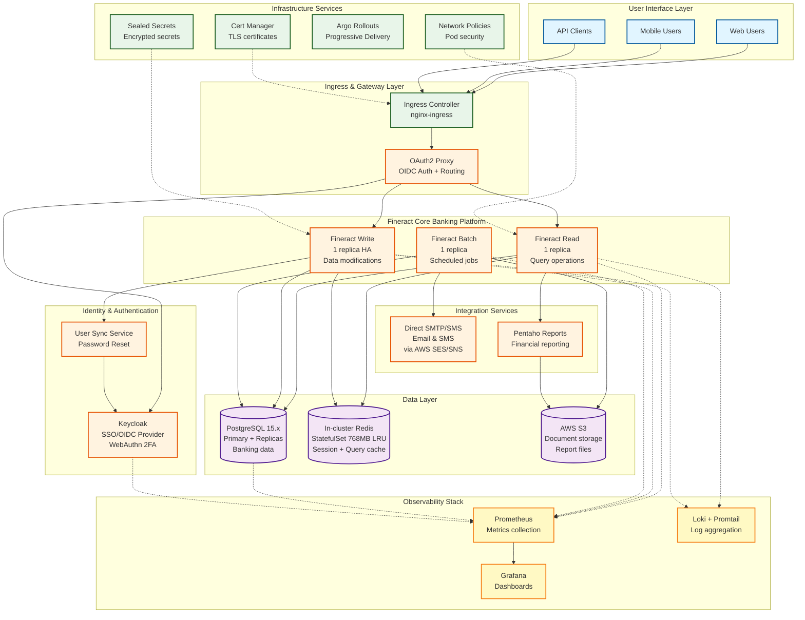
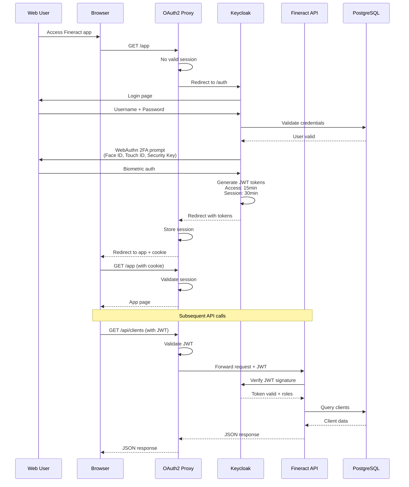
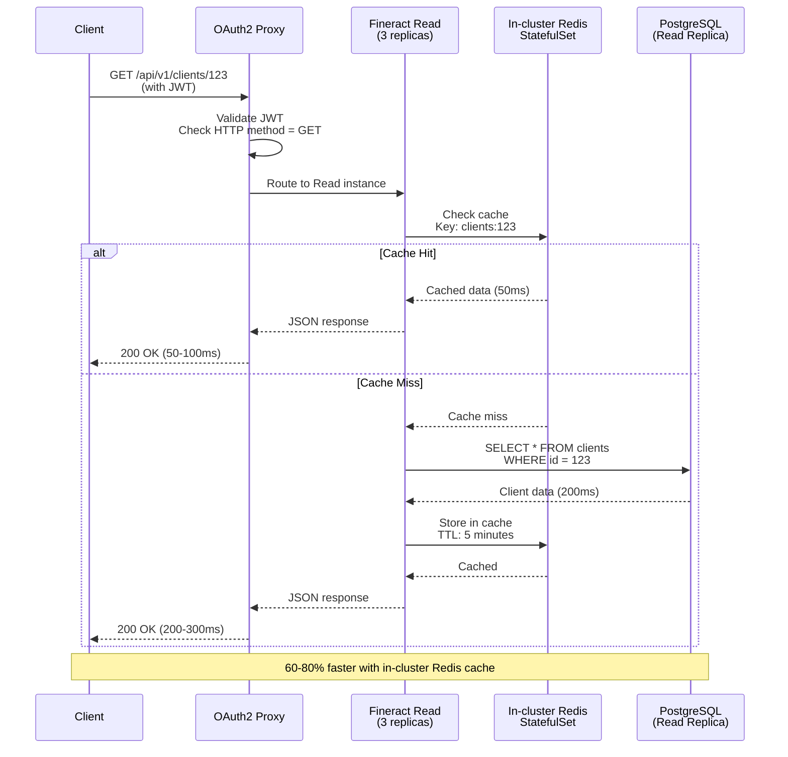
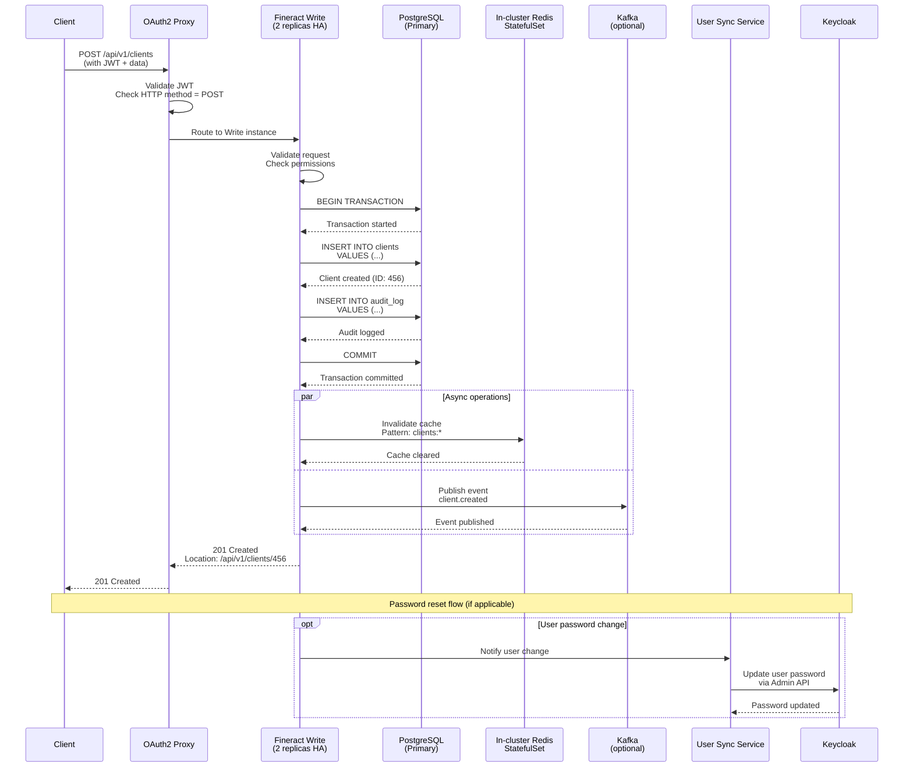
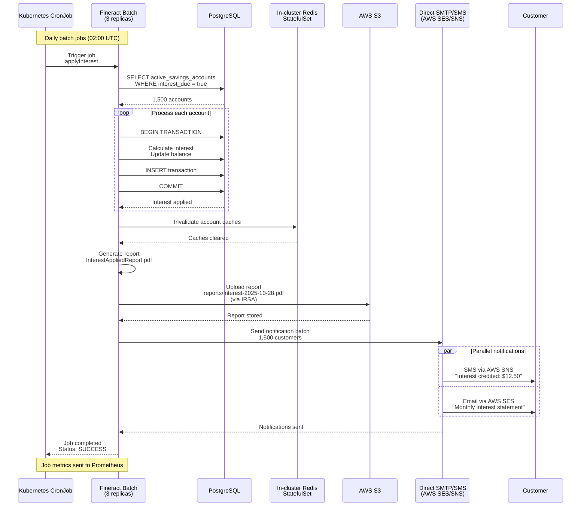
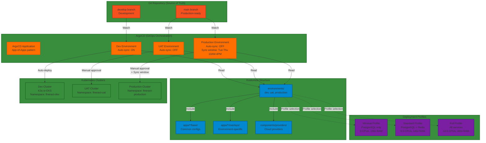
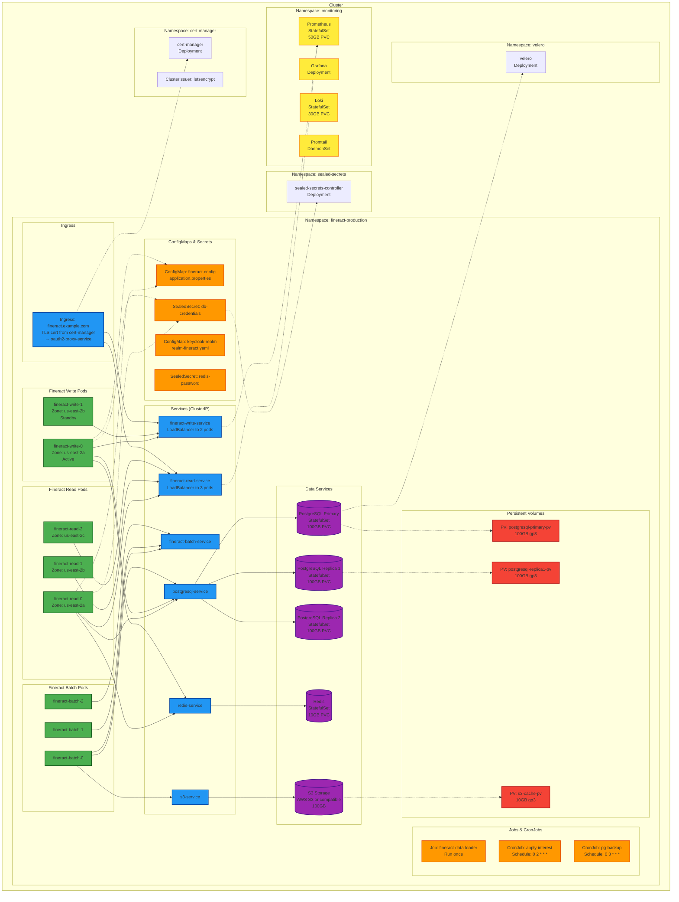

# Fineract GitOps Architecture

This document provides a comprehensive overview of the fineract-gitops architecture, including system components, network flows, multi-cloud deployment options, and Kubernetes resource topology.

## Table of Contents

- [Overview](#overview)
- [High-Level System Architecture](#high-level-system-architecture)
- [Network Flow Diagrams](#network-flow-diagrams)
  - [Authentication Flow](#authentication-flow)
  - [Read Operation Flow](#read-operation-flow)
  - [Write Operation Flow](#write-operation-flow)
  - [Batch Job Flow](#batch-job-flow)
- [Multi-Cloud Provider Comparison](#multi-cloud-provider-comparison)
- [Deployment Architecture](#deployment-architecture)
- [Kubernetes Resource Topology](#kubernetes-resource-topology)
- [Deployment Profiles](#deployment-profiles)
- [Environment Configurations](#environment-configurations)
- [Related Documentation](#related-documentation)

---

## Overview

The fineract-gitops repository implements a **production-ready, multi-cloud GitOps infrastructure** for Apache Fineract with:

- **Multi-instance Fineract deployment** with read/write/batch separation for high availability
- **4 deployment profiles** (minimal, standard, full) per environment
- **4 infrastructure providers** (self-hosted, AWS, Azure, GCP)
- **Complete identity management** with Keycloak, OAuth2 Proxy, and WebAuthn 2FA
- **Full observability** with Prometheus, Grafana, and Loki
- **Disaster recovery** with Velero and automated backups
- **40-55% cost savings** with in-cluster Redis vs managed cache services
- **GitOps automation** with ArgoCD using the app-of-apps pattern

---

## High-Level System Architecture

The following diagram shows the main components of the Fineract system and their relationships:



---

## Network Flow Diagrams

### Authentication Flow

This diagram shows how users authenticate through Keycloak with WebAuthn 2FA support:



### Read Operation Flow

This diagram shows how read requests are routed and cached:



### Write Operation Flow

This diagram shows how write requests are processed and synchronized:



### Batch Job Flow

This diagram shows how scheduled batch jobs process transactions:



---

## Multi-Cloud Provider Comparison

This diagram compares the different infrastructure provider options:

```mermaid
graph TB
    subgraph "Self-Hosted (Kubernetes)"
        SH_PG[(PostgreSQL StatefulSet<br/>1 primary + 2 replicas<br/>50GB storage)]
        SH_Redis[(In-cluster Redis<br/>StatefulSet 768MB<br/>AOF persistence)]
        SH_S3[(S3-compatible storage<br/>Local object storage<br/>100GB)]
        SH_Cost[Cost: ~$30-40/month<br/>K3s cluster]
    end

    subgraph "AWS Managed Services"
        AWS_RDS[(RDS PostgreSQL 15.x<br/>db.t3.medium<br/>Multi-AZ)]
        AWS_Cache[(In-cluster Redis<br/>StatefulSet 768MB<br/>Cost: $0)]
        AWS_S3[(S3 Buckets<br/>Standard storage<br/>Lifecycle policies<br/>IRSA access)]
        AWS_Cost[Cost: ~$90-110/month<br/>EKS cluster<br/><br/>$40-50/month with K3s<br/>55% savings vs ElastiCache]
    end

    subgraph "Azure Managed Services"
        Azure_DB[(Azure Database<br/>PostgreSQL 15.x Flexible<br/>Multi-zone HA)]
        Azure_Cache[(In-cluster Redis<br/>StatefulSet 768MB<br/>Cost: $0)]
        Azure_Blob[(Azure Blob Storage<br/>Hot tier<br/>Geo-redundant)]
        Azure_Cost[Cost: ~$90-120/month<br/>AKS cluster<br/>36% savings vs managed cache]
    end

    subgraph "GCP Managed Services"
        GCP_SQL[(Cloud SQL<br/>PostgreSQL 15.x HA<br/>Regional instances)]
        GCP_Redis[(In-cluster Redis<br/>StatefulSet 768MB<br/>Cost: $0)]
        GCP_GCS[(Cloud Storage<br/>Standard class<br/>Multi-region)]
        GCP_Cost[Cost: ~$85-110/month<br/>GKE cluster<br/>34% savings vs Memorystore]
    end

    subgraph "Fineract Application Layer"
        Fineract[Fineract Instances<br/>Read + Write + Batch]
    end

    %% Connections
    Fineract -.->|Self-hosted| SH_PG
    Fineract -.->|Self-hosted| SH_Redis
    Fineract -.->|Self-hosted| SH_S3

    Fineract -.->|AWS| AWS_RDS
    Fineract -.->|AWS| AWS_Cache
    Fineract -.->|AWS| AWS_S3

    Fineract -.->|Azure| Azure_DB
    Fineract -.->|Azure| Azure_Cache
    Fineract -.->|Azure| Azure_Blob

    Fineract -.->|GCP| GCP_SQL
    Fineract -.->|GCP| GCP_Redis
    Fineract -.->|GCP| GCP_GCS

    classDef selfhosted fill:#e8f5e9,stroke:#1b5e20,stroke-width:2px
    classDef aws fill:#ff9800,stroke:#e65100,stroke-width:2px
    classDef azure fill:#2196f3,stroke:#0d47a1,stroke-width:2px
    classDef gcp fill:#f44336,stroke:#b71c1c,stroke-width:2px
    classDef app fill:#9c27b0,stroke:#4a148c,stroke-width:2px

    class SH_PG,SH_Redis,SH_S3,SH_Cost selfhosted
    class AWS_RDS,AWS_Cache,AWS_S3,AWS_Cost aws
    class Azure_DB,Azure_Cache,Azure_Blob,Azure_Cost azure
    class GCP_SQL,GCP_Redis,GCP_GCS,GCP_Cost gcp
    class Fineract app
```



### Provider Feature Comparison

| Feature | Self-Hosted | AWS | Azure | GCP |
|---------|-------------|-----|-------|-----|
| **Database** | PostgreSQL 15.x StatefulSet | RDS PostgreSQL 15.x Multi-AZ | Azure PostgreSQL 15.x Flexible | Cloud SQL PostgreSQL 15.x HA |
| **Automatic Backups** | Manual (Velero) | Automated (7-30 days) | Automated (7-35 days) | Automated (7-365 days) |
| **Cache** | In-cluster Redis StatefulSet | In-cluster Redis StatefulSet | In-cluster Redis StatefulSet | In-cluster Redis StatefulSet |
| **Object Storage** | S3-compatible | AWS S3 (IRSA) | Blob Storage | Cloud Storage |
| **HA Setup** | Manual replicas | Built-in Multi-AZ | Zone-redundant | Regional HA |
| **Monitoring** | Prometheus/Grafana | CloudWatch + Prometheus | Azure Monitor + Prometheus | Cloud Monitoring + Prometheus |
| **Secrets** | Sealed Secrets | Sealed Secrets + AWS Secrets Manager | Sealed Secrets + Key Vault | Sealed Secrets + Secret Manager |
| **Auth Integration** | None | IRSA (IAM Roles for Service Accounts) | Workload Identity | Workload Identity |
| **Cost (Dev)** | $30-40/month | $40-50 (K3s)<br/>$90-110 (EKS) | $90-120/month | $85-110/month |
| **Cost (Prod)** | $100-150/month | $400-500/month | $380-470/month | $370-460/month |
| **Setup Complexity** | Low (Kustomize) | Medium (Terraform + IRSA) | Medium (Terraform) | Medium (Terraform) |
| **Operational Overhead** | High | Low | Low | Low |

---

## Deployment Architecture

This diagram shows the GitOps workflow and Kustomize layering:



### Kustomize Layering Example

```
environments/dev-aws/
├── kustomization.yaml              # Environment root
│   ├── resources:
│   │   ├── apps/fineract/base      # Base Fineract config
│   │   ├── apps/postgresql/base    # PostgreSQL (scaled to 0)
│   │   ├── apps/redis/base         # In-cluster Redis StatefulSet
│   │   └── apps/keycloak/base      # Keycloak config
│   └── components:
│       └── providers/aws-managed   # AWS provider patches
│           ├── Patch PostgreSQL → use RDS PostgreSQL 15.x
│           ├── Patch S3 access → add IRSA annotations
│           └── Enable in-cluster Redis (no ElastiCache)
└── Output: Fully configured AWS deployment with in-cluster Redis
```

---

## Kubernetes Resource Topology

This diagram shows how resources are organized in Kubernetes:



### Resource Allocation by Profile

| Resource Type | Minimal | Standard (Recommended) | Full |
|--------------|---------|------------------------|------|
| **Total CPUs** | 5 CPUs | 5.5 CPUs | 14.5 CPUs |
| **Total Memory** | 13Gi | 14Gi | 40Gi |
| **Deployment Time** | ~5 min | ~6 min | ~15 min |
| **Concurrent Users** | 50-200 | 200-1000 | 1000-5000+ |
| **Services** | PostgreSQL only | PostgreSQL + Redis | All services |
| **Performance** | Baseline | 60-80% faster | Enterprise-grade |
| **Use Case** | Testing, CI/CD | Production (most cases) | High-volume production |

---

## Deployment Profiles

### Minimal Profile
- **Services**: PostgreSQL only
- **Resources**: 5 CPUs, 13Gi RAM
- **Storage**: 100GB (PostgreSQL)
- **Use case**: Development, testing, CI/CD pipelines
- **Limitations**: No caching, no event streaming, slower response times

### Standard Profile (Recommended)
- **Services**: PostgreSQL + In-cluster Redis
- **Resources**: 5.5 CPUs, 14Gi RAM
- **Storage**: 110GB (PostgreSQL + Redis)
- **Use case**: Most production deployments
- **Performance**: 60-80% faster than minimal due to in-cluster Redis caching
- **Cost**: $60-80/month (self-hosted) or $110-140/month (managed with in-cluster Redis)

### Full Profile
- **Services**: PostgreSQL + Redis + Kafka + S3 (via IRSA) + OAuth2 Proxy
- **Resources**: 14.5 CPUs, 40Gi RAM
- **Storage**: 310GB (all services)
- **Use case**: Enterprise with event streaming needs
- **Features**: Event-driven architecture, S3 document storage, OAuth2 authentication
- **Cost**: $150-200/month (self-hosted) or $400-500/month (managed with in-cluster Redis)

---

## Environment Configurations

| Environment | Namespace | Auto-Sync | Source Branch | Approval Required | Retry Limit | Sync Window |
|-------------|-----------|-----------|---------------|-------------------|-------------|-------------|
| **dev** | fineract-dev | ✅ Enabled | develop | ❌ No | 5 | Always |
| **dev-aws** | fineract-dev | ✅ Enabled | develop | ❌ No | 5 | Always |
| **dev-azure** | fineract-dev | ✅ Enabled | develop | ❌ No | 5 | Always |
| **dev-gcp** | fineract-dev | ✅ Enabled | develop | ❌ No | 5 | Always |
| **uat** | fineract-uat | ❌ Disabled | main | ✅ Yes | 5 | Always |
| **production** | fineract-production | ❌ Disabled | main (tagged) | ✅ Yes | 3 | Tue-Thu 10AM-4PM |
| **production-aws** | fineract-production | ❌ Disabled | main (tagged) | ✅ Yes | 3 | Tue-Thu 10AM-4PM |
| **production-azure** | fineract-production | ❌ Disabled | main (tagged) | ✅ Yes | 3 | Tue-Thu 10AM-4PM |
| **production-gcp** | fineract-production | ❌ Disabled | main (tagged) | ✅ Yes | 3 | Tue-Thu 10AM-4PM |

### Environment Selection Guide

**Use Dev environments when:**
- Testing new features
- Experimenting with configurations
- Learning the system
- Running CI/CD tests

**Use UAT environments when:**
- User acceptance testing
- Pre-production validation
- Stakeholder demos
- Performance testing

**Use Production environments when:**
- Serving real customers
- Processing actual transactions
- Requiring SLAs and support
- Need for audit trails and compliance

---

## Related Documentation

- [AWS Quick-Start Guide](./AWS_QUICK_START.md) - Deploy to AWS in 30 minutes
- [Mifos Web App Setup](./MIFOS_WEB_APP_SETUP.md) - Configure the Angular web interface
- [Mifos Web App Implementation](./MIFOS_WEB_APP_IMPLEMENTATION_SUMMARY.md) - Technical implementation details
- [PostgreSQL HA Deployment](./POSTGRESQL_HA_DEPLOYMENT.md) - High-availability database setup
- [AWS IAM Setup Guide](./AWS_IAM_SETUP_GUIDE.md) - Configure IAM roles for AWS integration
- [Keycloak Configuration](../operations/keycloak-config/README.md) - Identity provider setup

---

## Architecture Principles

The fineract-gitops architecture follows these key principles:

1. **GitOps-First**: All configuration is versioned in Git and deployed via ArgoCD
2. **Multi-Cloud**: Abstract infrastructure providers for portability
3. **High Availability**: Multi-instance deployments with pod anti-affinity
4. **Observability**: Built-in monitoring, logging, and alerting
5. **Security**: Sealed secrets, network policies, RBAC, WebAuthn 2FA
6. **Cost Optimization**: Multiple deployment profiles and K3s option
7. **Developer Experience**: Simple Kustomize overlays, clear documentation
8. **Production-Ready**: Backup/restore, disaster recovery, sync windows

---

## Contributing

To modify the architecture:

1. Update base configurations in `apps/*/base/`
2. Add environment-specific overlays in `apps/*/overlays/`
3. Create provider patches in `components/providers/`
4. Update environment kustomizations in `environments/`
5. Test in dev environment before promoting to UAT/production
6. Update this documentation with any architectural changes

For questions or discussions about the architecture, please open an issue or discussion in the repository.
