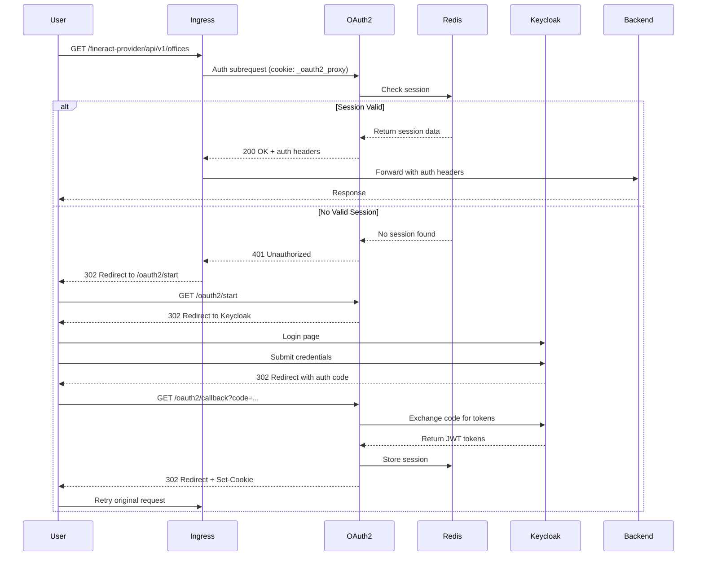

# OAuth2 Proxy + Ingress NGINX Integration Guide

**Last Updated:** 2025-10-30
**Version:** 1.0
**Status:** Production Ready

---

## Table of Contents

1. [Overview](#overview)
2. [Architecture](#architecture)
3. [Components](#components)
4. [Authentication Flow](#authentication-flow)
5. [Configuration](#configuration)
6. [Session Management](#session-management)
7. [RBAC Implementation](#rbac-implementation)
8. [Protected Services](#protected-services)
9. [Security Features](#security-features)
10. [Monitoring](#monitoring)
11. [Troubleshooting](#troubleshooting)
12. [Comparison to Apache Gateway](#comparison-to-apache-gateway)

---

## Overview

The Fineract GitOps infrastructure implements a **cloud-native authentication architecture** using:

- **OAuth2 Proxy** (v7.5.1) - External authentication gateway
- **Ingress NGINX** - Kubernetes ingress controller with auth_request integration
- **Keycloak** - OpenID Connect (OIDC) identity provider
- **Redis** - Distributed session storage for high availability

This architecture provides:
- ✅ **Zero-trust authentication** - All requests validated before reaching backends
- ✅ **Single Sign-On (SSO)** - Authenticate once, access all services
- ✅ **Role-Based Access Control** - Fine-grained authorization at ingress level
- ✅ **High Availability** - Stateless OAuth2 Proxy with shared Redis session store
- ✅ **Cloud-Native** - Kubernetes-native using ingress annotations

---

## Architecture

### High-Level Architecture

```
┌─────────────┐
│   User      │
│  (Browser)  │
└──────┬──────┘
       │
       │ 1. Request
       ▼
┌─────────────────────────────────────┐
│  Ingress NGINX Controller           │
│  - Receives all incoming traffic    │
│  - Checks auth-url annotation       │
│  - Makes subrequest to OAuth2 Proxy │
└──────┬──────────────────────────────┘
       │
       │ 2. Auth Subrequest
       ▼
┌─────────────────────────────────────┐
│  OAuth2 Proxy (2 replicas)          │
│  - Validates session cookie         │
│  - Checks Redis for session data    │
│  - Validates JWT token expiry       │
└──────┬──────────────────────────────┘
       │
       │ 3. Session Lookup
       ▼
┌─────────────────────────────────────┐
│  Redis (Session Store)              │
│  - Stores session data (HA)         │
│  - TTL: 4 hours                     │
└─────────────────────────────────────┘
       │
       │ 4. OIDC Token Exchange (if needed)
       ▼
┌─────────────────────────────────────┐
│  Keycloak (OIDC Provider)           │
│  - Authenticates users              │
│  - Issues JWT tokens                │
│  - Custom Fineract claims           │
└─────────────────────────────────────┘
       │
       │ 5. Authenticated Request
       ▼
┌─────────────────────────────────────┐
│  Backend Services                   │
│  - Fineract API                     │
│  - Mifos Web App                    │
│  - Admin/Cashier Apps               │
└─────────────────────────────────────┘
```

### Network Flow



---

## Components

### 1. OAuth2 Proxy

**Deployment Location:** `apps/oauth2-proxy/base/deployment.yaml`

**Specifications:**
```yaml
Image: quay.io/oauth2-proxy/oauth2-proxy:v7.5.1
Replicas: 2
Resources:
  requests:
    memory: 128Mi
    cpu: 100m
  limits:
    memory: 256Mi
    cpu: 200m
Ports:
  - 4180 (HTTP - Authentication)
  - 9090 (Metrics - Prometheus)
```

**Key Features:**
- **High Availability**: 2 replicas with pod anti-affinity
- **Rolling Updates**: Zero downtime deployments (maxSurge: 1, maxUnavailable: 0)
- **Health Checks**: Liveness (`/ping`) and Readiness (`/ready`) probes
- **Security**: Non-root user, read-only filesystem, no privilege escalation

### 2. Ingress NGINX

**Critical Annotations:**

```yaml
# Authentication URL - Where to validate requests
nginx.ingress.kubernetes.io/auth-url:
  "http://oauth2-proxy.fineract-dev.svc.cluster.local:4180/oauth2/auth"

# Sign-in URL - Where to redirect unauthenticated users
nginx.ingress.kubernetes.io/auth-signin:
  "https://apps.fineract.example.com/oauth2/start?rd=$escaped_request_uri"

# Response Headers - Headers to pass from OAuth2 Proxy to backend
nginx.ingress.kubernetes.io/auth-response-headers:
  "X-Auth-Request-User,X-Auth-Request-Email,X-Auth-Request-Roles,
   X-Auth-Request-Access-Token,X-Fineract-User-Id,X-Office-Id,X-Employee-Id"

# Auth Caching - Cache authentication decisions for 5 minutes
nginx.ingress.kubernetes.io/auth-cache-key: "$cookie_oauth2_proxy"
nginx.ingress.kubernetes.io/auth-cache-duration: "200 202 5m"
```

**How It Works:**

1. Ingress receives request
2. Makes internal HTTP subrequest to `auth-url`
3. If OAuth2 Proxy returns **200**: Forward request with auth headers
4. If OAuth2 Proxy returns **401**: Redirect to `auth-signin` URL
5. Cache decision for 5 minutes using cookie as key

### 3. Keycloak

**Configuration Location:** `operations/keycloak-config/config/realm-fineract.yaml`

**OAuth2 Proxy Client Settings:**
```javascript
{
  clientId: "oauth2-proxy",
  protocol: "openid-connect",
  publicClient: false,
  standardFlowEnabled: true,
  redirectUris: [
    "https://apps.fineract.example.com/oauth2/callback"
  ],
  defaultClientScopes: ["openid", "profile", "email", "roles"],
  accessTokenLifespan: 900  // 15 minutes
}
```

**Custom Protocol Mappers:**
- `fineract-user-id-mapper` → JWT claim: `fineract_user_id`
- `office-id-mapper` → JWT claim: `office_id`
- `employee-id-mapper` → JWT claim: `employee_id`

These custom claims are extracted from Keycloak user attributes and included in JWT tokens for Fineract-specific authorization.

### 4. Redis Session Store

**Purpose:** Distributed session storage for OAuth2 Proxy replicas

**Configuration:**
```yaml
Connection: redis://redis-service:6379
Storage Format:
  Key: oauth2:<SESSION_ID>
  Value: {
    user, email, groups,
    access_token, refresh_token,
    expires_at
  }
  TTL: 14400 seconds (4 hours)
```

**Why Redis:**
- Enables multiple OAuth2 Proxy replicas (stateless)
- Fast session lookups (in-memory)
- Automatic session expiry (TTL)
- HA ready (can use Redis Sentinel or Cluster)

---

## Authentication Flow

### Complete Step-by-Step Flow

#### **Scenario: User accesses protected endpoint for the first time**

**1. Initial Request**

```http
GET https://apps.fineract.example.com/fineract-provider/api/v1/offices HTTP/1.1
Host: apps.fineract.example.com
```

**2. Ingress NGINX → OAuth2 Proxy (Auth Subrequest)**

```http
GET http://oauth2-proxy:4180/oauth2/auth HTTP/1.1
Host: oauth2-proxy
X-Original-URL: https://apps.fineract.example.com/fineract-provider/api/v1/offices
X-Forwarded-Proto: https
X-Forwarded-Host: apps.fineract.example.com
```

**3. OAuth2 Proxy Checks Session**

```
- Look for cookie: _oauth2_proxy
- Cookie not found → No session
- Return 401 Unauthorized
```

**4. OAuth2 Proxy → Ingress NGINX**

```http
HTTP/1.1 401 Unauthorized
```

**5. Ingress NGINX → User (Redirect to Sign-In)**

```http
HTTP/1.1 302 Found
Location: https://apps.fineract.example.com/oauth2/start?rd=/fineract-provider/api/v1/offices
```

**6. User → OAuth2 Proxy (Start OAuth Flow)**

```http
GET /oauth2/start?rd=/fineract-provider/api/v1/offices HTTP/1.1
```

**7. OAuth2 Proxy → User (Redirect to Keycloak)**

```http
HTTP/1.1 302 Found
Location: http://keycloak-service:8080/realms/fineract/protocol/openid-connect/auth
         ?client_id=oauth2-proxy
         &redirect_uri=https://apps.fineract.example.com/oauth2/callback
         &response_type=code
         &scope=openid+profile+email+roles
         &state=random_state_string
         &nonce=random_nonce
```

**8. User Authenticates with Keycloak**

```
User enters credentials on Keycloak login page
Keycloak validates credentials
Keycloak creates SSO session
```

**9. Keycloak → User (Redirect with Authorization Code)**

```http
HTTP/1.1 302 Found
Location: https://apps.fineract.example.com/oauth2/callback
         ?code=AUTHORIZATION_CODE
         &state=random_state_string
```

**10. User → OAuth2 Proxy (Callback)**

```http
GET /oauth2/callback?code=AUTHORIZATION_CODE&state=random_state_string HTTP/1.1
```

**11. OAuth2 Proxy → Keycloak (Token Exchange)**

```http
POST http://keycloak-service:8080/realms/fineract/protocol/openid-connect/token HTTP/1.1
Content-Type: application/x-www-form-urlencoded

grant_type=authorization_code
&code=AUTHORIZATION_CODE
&client_id=oauth2-proxy
&client_secret=CLIENT_SECRET
&redirect_uri=https://apps.fineract.example.com/oauth2/callback
```

**12. Keycloak → OAuth2 Proxy (Tokens)**

```json
{
  "access_token": "eyJhbGciOiJSUzI1NiIsInR5cCI6IkpXVCJ9...",
  "token_type": "Bearer",
  "expires_in": 900,
  "refresh_token": "eyJhbGciOiJIUzI1NiIsInR5cCI6IkpXVCJ9...",
  "id_token": "eyJhbGciOiJSUzI1NiIsInR5cCI6IkpXVCJ9...",
  "scope": "openid profile email roles"
}
```

**13. OAuth2 Proxy Extracts JWT Claims**

```json
{
  "sub": "f47ac10b-58cc-4372-a567-0e02b2c3d479",
  "preferred_username": "admin",
  "email": "admin@example.com",
  "email_verified": true,
  "roles": ["admin", "staff"],
  "fineract_user_id": "1",
  "office_id": "1",
  "employee_id": "1",
  "exp": 1698765432,
  "iat": 1698764532
}
```

**14. OAuth2 Proxy → Redis (Store Session)**

```
Key: oauth2:abc123def456
Value: {
  "user": "admin",
  "email": "admin@example.com",
  "groups": ["admin", "staff"],
  "access_token": "eyJhbGc...",
  "refresh_token": "eyJhbGc...",
  "id_token": "eyJhbGc...",
  "expires_at": 1698765432,
  "fineract_user_id": "1",
  "office_id": "1",
  "employee_id": "1"
}
TTL: 14400 seconds
```

**15. OAuth2 Proxy → User (Set Cookie & Redirect)**

```http
HTTP/1.1 302 Found
Location: /fineract-provider/api/v1/offices
Set-Cookie: _oauth2_proxy=abc123def456;
            Secure; HttpOnly; SameSite=Lax;
            Max-Age=14400;
            Domain=.fineract.example.com;
            Path=/
```

**16. User → Ingress NGINX (Retry Original Request with Cookie)**

```http
GET /fineract-provider/api/v1/offices HTTP/1.1
Cookie: _oauth2_proxy=abc123def456
```

**17. Ingress NGINX → OAuth2 Proxy (Auth Subrequest)**

```http
GET /oauth2/auth HTTP/1.1
Cookie: _oauth2_proxy=abc123def456
```

**18. OAuth2 Proxy → Redis (Lookup Session)**

```
GET oauth2:abc123def456
→ Returns session data
```

**19. OAuth2 Proxy Validates Session**

```
- Session exists in Redis ✓
- Token not expired (expires_at > now) ✓
- Return 200 OK with auth headers
```

**20. OAuth2 Proxy → Ingress NGINX (Auth Success)**

```http
HTTP/1.1 200 OK
X-Auth-Request-User: admin
X-Auth-Request-Email: admin@example.com
X-Auth-Request-Roles: admin,staff
X-Auth-Request-Access-Token: eyJhbGc...
X-Fineract-User-Id: 1
X-Office-Id: 1
X-Employee-Id: 1
```

**21. Ingress NGINX Enforces RBAC**

```nginx
# Check endpoint category
$request_uri = /fineract-provider/api/v1/offices
$endpoint_category = "management"

# Check user roles
$http_x_auth_request_roles = "admin,staff"

# RBAC rule: management endpoints require admin or branch-manager
$rbac_allowed = 1 (admin role matches)
```

**22. Ingress NGINX → Backend (Proxied Request)**

```http
GET /fineract-provider/api/v1/offices HTTP/1.1
Host: fineract-read-service:8080
X-Auth-Request-User: admin
X-Auth-Request-Email: admin@example.com
X-Auth-Request-Roles: admin,staff
X-Fineract-User-Id: 1
X-Office-Id: 1
X-Employee-Id: 1
X-Forwarded-For: 10.0.1.50
X-Forwarded-Proto: https
```

**23. Backend → Ingress → User (Response)**

```http
HTTP/1.1 200 OK
Content-Type: application/json

[
  {"id": 1, "name": "Head Office", ...},
  {"id": 2, "name": "Branch 1", ...}
]
```

### Subsequent Requests

For subsequent requests within the 4-hour session:

1. User sends request with `_oauth2_proxy` cookie
2. Ingress makes auth subrequest
3. OAuth2 Proxy looks up session in Redis (cached for 5 min by Nginx)
4. Returns 200 OK with headers
5. Request forwarded to backend

**No redirect to Keycloak needed** - Session is already established.

---

## Configuration

### OAuth2 Proxy Configuration

**File:** `apps/oauth2-proxy/base/configmap.yaml`

```ini
# Provider Configuration
provider = "oidc"
provider_display_name = "Fineract Keycloak"
oidc_issuer_url = "http://keycloak-service:8080/realms/fineract"
client_id = "oauth2-proxy"
# client_secret from Kubernetes secret

# Redirect Configuration
redirect_url = "https://apps.fineract.example.com/oauth2/callback"
whitelist_domains = ".fineract.example.com"

# Scope Configuration
scope = "openid profile email roles"
oidc_email_claim = "email"
oidc_groups_claim = "roles"

# Cookie Configuration
cookie_name = "_oauth2_proxy"
cookie_secret = # 32-byte random string
cookie_domains = ".fineract.example.com"
cookie_secure = true
cookie_httponly = true
cookie_samesite = "lax"
cookie_expire = "4h"
cookie_refresh = "30m"

# Session Configuration
session_store_type = "redis"
redis_connection_url = "redis://redis-service:6379"
# redis_password from Kubernetes secret

# Upstream Configuration (auth-only mode)
upstreams = ["static://202"]

# Skip Auth for OAuth2 endpoints
skip_auth_routes = [
  "^/health$",
  "^/ping$",
  "^/oauth2/",
]

# Logging
logging_format = "json"
auth_logging = true
request_logging = true
standard_logging = true
```

### Ingress Resource Example

**File:** `apps/ingress/fineract-oauth2-ingress.yaml`

```yaml
apiVersion: networking.k8s.io/v1
kind: Ingress
metadata:
  name: fineract-oauth2
  namespace: fineract-dev
  annotations:
    # OAuth2 Proxy Integration
    nginx.ingress.kubernetes.io/auth-url: "http://oauth2-proxy.fineract-dev.svc.cluster.local:4180/oauth2/auth"
    nginx.ingress.kubernetes.io/auth-signin: "https://apps.fineract.example.com/oauth2/start?rd=$escaped_request_uri"
    nginx.ingress.kubernetes.io/auth-response-headers: "X-Auth-Request-User,X-Auth-Request-Email,X-Auth-Request-Roles,X-Auth-Request-Access-Token,X-Fineract-User-Id,X-Office-Id,X-Employee-Id"

    # Auth Caching (5 minutes)
    nginx.ingress.kubernetes.io/auth-cache-key: "$cookie_oauth2_proxy"
    nginx.ingress.kubernetes.io/auth-cache-duration: "200 202 5m"

    # Rate Limiting
    nginx.ingress.kubernetes.io/limit-rps: "100"
    nginx.ingress.kubernetes.io/limit-connections: "50"

    # SSL
    nginx.ingress.kubernetes.io/force-ssl-redirect: "true"
    nginx.ingress.kubernetes.io/ssl-protocols: "TLSv1.2 TLSv1.3"

    # Configuration Snippet for RBAC
    nginx.ingress.kubernetes.io/configuration-snippet: |
      if ($rbac_allowed = 0) {
        return 403;
      }
spec:
  ingressClassName: nginx
  rules:
  - host: apps.fineract.example.com
    http:
      paths:
      - path: /fineract-provider
        pathType: Prefix
        backend:
          service:
            name: fineract-read-service
            port:
              number: 8080
      - path: /mifos
        pathType: Prefix
        backend:
          service:
            
            port:
              number: 80
```

### Keycloak Client Creation Script

**File:** `scripts/setup-oauth2-proxy-keycloak-client.sh`

```bash
#!/bin/bash
# Create OAuth2 Proxy client in Keycloak

KEYCLOAK_URL="http://keycloak-service:8080"
REALM="fineract"
CLIENT_ID="oauth2-proxy"
CLIENT_SECRET=$(openssl rand -base64 32 | tr -d "=+/" | cut -c1-32)

# Get admin token
ADMIN_TOKEN=$(curl -s -X POST "${KEYCLOAK_URL}/realms/master/protocol/openid-connect/token" \
  -d "client_id=admin-cli" \
  -d "username=${KEYCLOAK_ADMIN}" \
  -d "password=${KEYCLOAK_ADMIN_PASSWORD}" \
  -d "grant_type=password" | jq -r '.access_token')

# Create client
curl -X POST "${KEYCLOAK_URL}/admin/realms/${REALM}/clients" \
  -H "Authorization: Bearer ${ADMIN_TOKEN}" \
  -H "Content-Type: application/json" \
  -d '{
    "clientId": "'${CLIENT_ID}'",
    "enabled": true,
    "clientAuthenticatorType": "client-secret",
    "secret": "'${CLIENT_SECRET}'",
    "protocol": "openid-connect",
    "publicClient": false,
    "standardFlowEnabled": true,
    "directAccessGrantsEnabled": false,
    "redirectUris": [
      "https://apps.fineract.example.com/oauth2/callback",
      "http://localhost:4180/oauth2/callback"
    ],
    "webOrigins": ["*"],
    "defaultClientScopes": ["openid", "profile", "email", "roles"],
    "attributes": {
      "access.token.lifespan": "900"
    }
  }'

echo "Client secret: ${CLIENT_SECRET}"
echo "Update OAuth2 Proxy secret with this value"
```

---

## Session Management

### Session Lifecycle

**1. Session Creation**

When user completes OAuth flow:
- OAuth2 Proxy receives tokens from Keycloak
- Extracts claims from JWT
- Generates random session ID
- Stores in Redis with 4-hour TTL
- Sets cookie with session ID

**2. Session Storage**

```
Redis Key: oauth2:<SESSION_ID>
Redis Value: JSON object with user info and tokens
Redis TTL: 14400 seconds (4 hours)
```

**3. Session Validation**

On each authenticated request:
- OAuth2 Proxy reads session ID from cookie
- Looks up session in Redis
- Validates access token expiry
- If within 30 min of expiry, uses refresh token to get new access token

**4. Session Refresh**

```
Cookie Expiry: 4 hours
Cookie Refresh Interval: 30 minutes
Token Refresh: Automatic (OAuth2 Proxy handles)
```

OAuth2 Proxy automatically refreshes the access token using the refresh token when it's close to expiring, keeping the user's session alive without requiring re-authentication.

**5. Session Termination**

Sessions end when:
- Cookie expires (4 hours max age)
- Redis key expires (4 hours TTL)
- User logs out (`/oauth2/sign_out`)
- User clears cookies

### Session Security

**Cookie Attributes:**
```
Name: _oauth2_proxy
Secure: true           # HTTPS only
HttpOnly: true         # No JavaScript access
SameSite: Lax         # CSRF protection
Domain: .fineract.example.com
Path: /
Max-Age: 14400        # 4 hours
```

**Session Storage:**
- Stored in Redis (not in cookie)
- Cookie only contains session ID
- Session data includes sensitive tokens
- Redis requires authentication
- Network policies restrict Redis access

---

## RBAC Implementation

### Endpoint Categorization

**File:** `apps/ingress-nginx/base/configmap.yaml`

```nginx
map $request_uri $endpoint_category {
    default                                            "general";

    # Admin-only endpoints
    "~^/fineract-provider/api/v1/users"               "admin-only";
    "~^/fineract-provider/api/v1/staff"               "admin-only";
    "~^/fineract-provider/api/v1/permissions"         "admin-only";
    "~^/fineract-provider/api/v1/roles"               "admin-only";
    "~^/fineract-provider/api/v1/codes"               "admin-only";
    "~^/fineract-provider/api/v1/hooks"               "admin-only";
    "~^/fineract-provider/api/v1/jobs"                "admin-only";
    "~^/fineract-provider/api/v1/configurations"      "admin-only";

    # Accounting endpoints (accountant or admin)
    "~^/fineract-provider/api/v1/savingsaccounts"     "accounting";
    "~^/fineract-provider/api/v1/savingsproducts"     "accounting";
    "~^/fineract-provider/api/v1/glaccounts"          "accounting";
    "~^/fineract-provider/api/v1/journalentries"      "accounting";
    "~^/fineract-provider/api/v1/accountingrules"     "accounting";
    "~^/fineract-provider/api/v1/accountingclosures"  "accounting";

    # Management endpoints (branch-manager or admin)
    "~^/fineract-provider/api/v1/offices"             "management";
    "~^/fineract-provider/api/v1/clients"             "management";

    # Teller endpoints (teller only)
    "~^/fineract-provider/api/v1/tellers"             "teller-ops";
    "~^/fineract-provider/api/v1/paymenttypes"        "teller-ops";
}
```

### RBAC Authorization Map

```nginx
map "$endpoint_category:$http_x_auth_request_roles" $rbac_allowed {
    default                                            1;  # Allow if authenticated

    # Admin-only endpoints
    "~^admin-only:.*admin.*"                          1;  # Allow admin
    "~^admin-only:.*"                                 0;  # Deny others

    # Accounting endpoints
    "~^accounting:.*(admin|accountant).*"             1;  # Allow admin or accountant
    "~^accounting:.*"                                 0;  # Deny others

    # Management endpoints
    "~^management:.*(admin|branch-manager).*"         1;  # Allow admin or branch-manager
    "~^management:.*"                                 0;  # Deny others

    # Teller endpoints
    "~^teller-ops:.*teller.*"                         1;  # Allow teller
    "~^teller-ops:.*"                                 0;  # Deny others (unless admin)
    "~^teller-ops:.*admin.*"                          1;  # Admin can access everything
}
```

### RBAC Enforcement

In ingress configuration snippet:
```nginx
if ($rbac_allowed = 0) {
    return 403;
}
```

### Example RBAC Decisions

| Endpoint | User Roles | Endpoint Category | RBAC Allowed | Result |
|----------|------------|-------------------|--------------|---------|
| `/api/v1/users` | `admin` | `admin-only` | ✅ 1 | Allow |
| `/api/v1/users` | `accountant` | `admin-only` | ❌ 0 | 403 Forbidden |
| `/api/v1/glaccounts` | `accountant` | `accounting` | ✅ 1 | Allow |
| `/api/v1/glaccounts` | `teller` | `accounting` | ❌ 0 | 403 Forbidden |
| `/api/v1/offices` | `branch-manager` | `management` | ✅ 1 | Allow |
| `/api/v1/offices` | `teller` | `management` | ❌ 0 | 403 Forbidden |
| `/api/v1/tellers` | `teller` | `teller-ops` | ✅ 1 | Allow |
| `/api/v1/tellers` | `admin` | `teller-ops` | ✅ 1 | Allow |

---

## Protected Services

### Services Requiring Authentication

All services accessed through the main ingress require OAuth2 authentication:

| Path | Backend Service | Description |
|------|----------------|-------------|
| `/fineract-provider` | `fineract-read-service:8080` | Fineract API (read operations) |
| `/fineract-provider` (POST/PUT/DELETE) | `fineract-write-service:8080` | Fineract API (write operations) |

| `/admin` | `mifos-admin-app:80` | Admin Interface |
| `/cashier` | `mifos-cashier-app:80` | Cashier Interface |
| `/user-sync` | `user-sync-service:8080` | User Sync Service |

**All require:**
- Valid `_oauth2_proxy` session cookie
- Active session in Redis
- Non-expired access token
- Appropriate role for endpoint (RBAC)

### Public Endpoints (No Authentication)

**File:** `apps/ingress/fineract-public-ingress.yaml`

These endpoints bypass OAuth2 Proxy:

| Path | Purpose |
|------|---------|
| `/fineract-provider/actuator/health` | Health checks (monitoring) |
| `/fineract-provider/api/v1/self/registration` | Self-service registration |
| `/fineract-provider/api/v1/self/password` | Password reset |

### OAuth2 Proxy Endpoints

OAuth2 Proxy endpoints are exempt from authentication to allow the OAuth flow:

| Path | Purpose |
|------|---------|
| `/oauth2/auth` | Auth validation (internal, used by Nginx) |
| `/oauth2/start` | Initiate OAuth flow |
| `/oauth2/callback` | OAuth callback from Keycloak |
| `/oauth2/sign_out` | Sign out (clear session) |
| `/oauth2/userinfo` | Get current user info |

---

## Security Features

### 1. TLS/HTTPS

**Ingress Annotations:**
```yaml
nginx.ingress.kubernetes.io/force-ssl-redirect: "true"
nginx.ingress.kubernetes.io/ssl-protocols: "TLSv1.2 TLSv1.3"
cert-manager.io/cluster-issuer: "letsencrypt-prod"
```

**Cookie Security:**
- `Secure` flag ensures cookie only sent over HTTPS
- Prevents man-in-the-middle attacks

### 2. Cookie Security

```
_oauth2_proxy cookie attributes:
- Secure: true       → HTTPS only
- HttpOnly: true     → No JavaScript access (XSS protection)
- SameSite: Lax     → CSRF protection (no cross-site requests)
- Domain: .fineract.example.com → Subdomain sharing
```

### 3. Secret Management

**Secrets Used:**
```yaml
# apps/oauth2-proxy/base/secret.yaml
apiVersion: v1
kind: Secret
metadata:
  name: oauth2-proxy-secret
type: Opaque
stringData:
  client-id: oauth2-proxy
  client-secret: <keycloak-client-secret>
  cookie-secret: <32-byte-random-string>
  redis-password: <redis-password>
```

**Generate Cookie Secret:**
```bash
python3 -c 'import os,base64; print(base64.urlsafe_b64encode(os.urandom(32)).decode())'
```

### 4. Rate Limiting

**Per-IP Limits:**
```yaml
nginx.ingress.kubernetes.io/limit-rps: "100"          # 100 requests/second
nginx.ingress.kubernetes.io/limit-connections: "50"   # 50 concurrent connections
```

**For Public Endpoints:**
```yaml
nginx.ingress.kubernetes.io/limit-rps: "10"           # Stricter for public
```

### 5. Brute Force Protection

**Configured in Keycloak:**
```yaml
bruteForceProtected: true
failureFactor: 3                    # Max failed attempts
waitIncrementSeconds: 60            # Lockout time increase
maxFailureWaitSeconds: 1800         # Max lockout: 30 minutes
permanentLockout: false
```

### 6. Network Policies

**File:** `apps/network-policies/oauth2-proxy-network-policy.yaml`

**Ingress Rules (Who can access OAuth2 Proxy):**
- Ingress NGINX controller (port 4180)
- Fineract pods (port 4180, for callbacks)

**Egress Rules (What OAuth2 Proxy can access):**
- Keycloak pods (port 8080, OIDC provider)
- Redis (port 6379, session storage)
- DNS (port 53, for service discovery)
- HTTPS (port 443, for OIDC discovery)

### 7. Token Security

**Access Token:**
- Short-lived: 15 minutes
- JWT format (signed by Keycloak)
- Contains user claims and roles
- Validated on each request

**Refresh Token:**
- Longer-lived: Matches session (4 hours)
- Used to get new access tokens
- Revoked on logout
- One-time use (revoke on use enabled)

**ID Token:**
- OpenID Connect identity token
- Contains user profile information
- Used for SSO

### 8. Session Security

- Sessions stored in Redis, not in cookies
- Cookie only contains session ID
- Redis requires authentication
- Network policies restrict Redis access
- TTL ensures automatic session cleanup

---

## Monitoring

### Prometheus Metrics

**ServiceMonitor:** `apps/monitoring/base/servicemonitor-oauth2-proxy.yaml`

```yaml
apiVersion: monitoring.coreos.com/v1
kind: ServiceMonitor
metadata:
  name: oauth2-proxy
spec:
  selector:
    matchLabels:
      app: oauth2-proxy
  endpoints:
  - port: metrics
    path: /metrics
    interval: 30s
    scrapeTimeout: 10s
```

**Key Metrics:**

| Metric | Type | Description |
|--------|------|-------------|
| `oauth2_proxy_requests_total` | Counter | Total HTTP requests |
| `oauth2_proxy_authentication_attempts_total` | Counter | Total auth attempts |
| `oauth2_proxy_authentication_success_total` | Counter | Successful authentications |
| `oauth2_proxy_authentication_failure_total` | Counter | Failed authentications |
| `oauth2_proxy_authentication_latency_seconds` | Histogram | Auth latency distribution |
| `oauth2_proxy_redis_connection_errors_total` | Counter | Redis connection errors |
| `oauth2_proxy_redis_connection_success_total` | Counter | Successful Redis connections |

**Example Prometheus Queries:**

```promql
# Authentication success rate
rate(oauth2_proxy_authentication_success_total[5m]) /
rate(oauth2_proxy_authentication_attempts_total[5m]) * 100

# 95th percentile auth latency
histogram_quantile(0.95,
  rate(oauth2_proxy_authentication_latency_seconds_bucket[5m])
)

# Redis connection error rate
rate(oauth2_proxy_redis_connection_errors_total[5m])

# Request rate per status code
rate(oauth2_proxy_requests_total[5m])
```

### Logging

**Log Configuration:**
```ini
logging_format = "json"
auth_logging = true
request_logging = true
standard_logging = true
silence_ping_logging = true
```

**Log Fields:**
```json
{
  "@timestamp": "2025-10-30T10:30:00.000Z",
  "level": "info",
  "msg": "Authenticated request",
  "user": "admin",
  "email": "admin@example.com",
  "groups": ["admin", "staff"],
  "method": "GET",
  "path": "/fineract-provider/api/v1/offices",
  "status": 200,
  "duration_ms": 45,
  "user_agent": "Mozilla/5.0...",
  "remote_addr": "10.0.1.50"
}
```

**Log Aggregation:**
- Logs collected by Fluent Bit
- Stored in Loki
- Queried via Grafana

**Example Loki Queries:**
```logql
# Failed authentication attempts
{app="oauth2-proxy"} |= "authentication failed"

# High latency requests
{app="oauth2-proxy"} | json | duration_ms > 1000

# Requests by user
{app="oauth2-proxy"} | json | user="admin"
```

### Alerts

**Recommended Alerts:**

```yaml
# High authentication failure rate
- alert: OAuth2ProxyHighFailureRate
  expr: |
    rate(oauth2_proxy_authentication_failure_total[5m]) > 10
  annotations:
    summary: High OAuth2 Proxy authentication failure rate

# High authentication latency
- alert: OAuth2ProxyHighLatency
  expr: |
    histogram_quantile(0.95,
      rate(oauth2_proxy_authentication_latency_seconds_bucket[5m])
    ) > 2
  annotations:
    summary: OAuth2 Proxy authentication latency is high

# Redis connection errors
- alert: OAuth2ProxyRedisErrors
  expr: |
    rate(oauth2_proxy_redis_connection_errors_total[5m]) > 1
  annotations:
    summary: OAuth2 Proxy having Redis connection errors

# OAuth2 Proxy down
- alert: OAuth2ProxyDown
  expr: up{job="oauth2-proxy"} == 0
  for: 5m
  annotations:
    summary: OAuth2 Proxy is down
```

### Dashboards

**Grafana Dashboard Metrics:**
- Authentication rate (success/failure)
- Authentication latency (p50, p95, p99)
- Redis connection health
- Session count (active sessions in Redis)
- Request rate by endpoint
- Top users by request count
- Geographic distribution of requests
- Browser/user agent statistics

---

## Troubleshooting

### Common Issues

#### 1. Authentication Loop (Redirect Loop)

**Symptoms:**
- Browser keeps redirecting between `/oauth2/start` and Keycloak
- Users never successfully authenticate
- Console shows endless redirects

**Possible Causes:**
1. Cookie domain mismatch
2. Redirect URI not whitelisted in Keycloak
3. State parameter validation failure
4. Cookie not being set (HTTP instead of HTTPS)

**Troubleshooting Steps:**

```bash
# Check OAuth2 Proxy logs
kubectl logs -n fineract-dev deployment/oauth2-proxy -f | grep -i "redirect\|cookie\|state"

# Check cookie domain
kubectl get configmap oauth2-proxy-config -n fineract-dev -o yaml | grep cookie_domains

# Check Keycloak client redirect URIs
kubectl exec -n fineract-dev deployment/keycloak -- \
  /opt/keycloak/bin/kcadm.sh get clients -r fineract --filter "clientId=oauth2-proxy"

# Test redirect URI manually
curl -v "https://apps.fineract.example.com/oauth2/start"
```

**Solutions:**
- Ensure `cookie_domains` matches your ingress host: `.fineract.example.com`
- Add redirect URI to Keycloak client: `https://apps.fineract.example.com/oauth2/callback`
- Ensure HTTPS is enforced (check `cookie_secure = true`)
- Verify `whitelist_domains` includes your domain

#### 2. 401 Unauthorized (Session Not Found)

**Symptoms:**
- Users get 401 after successful login
- Session seems to disappear immediately
- Re-authentication required on every request

**Possible Causes:**
1. Redis connection failure
2. Redis password incorrect
3. Session TTL too short
4. Clock skew between OAuth2 Proxy and Redis

**Troubleshooting Steps:**

```bash
# Check Redis connectivity
kubectl exec -n fineract-dev deployment/oauth2-proxy -- \
  redis-cli -h redis-service ping

# Check Redis authentication
kubectl get secret oauth2-proxy-secret -n fineract-dev -o jsonpath='{.data.redis-password}' | base64 -d

# Check Redis session keys
kubectl exec -n fineract-dev deployment/redis-0 -- \
  redis-cli --scan --pattern "oauth2:*" | wc -l

# Check Redis memory
kubectl exec -n fineract-dev deployment/redis-0 -- \
  redis-cli info memory

# Check OAuth2 Proxy logs for Redis errors
kubectl logs -n fineract-dev deployment/oauth2-proxy | grep -i redis
```

**Solutions:**
- Verify Redis password in OAuth2 Proxy secret matches Redis secret
- Ensure Redis has sufficient memory (check `maxmemory` and eviction policy)
- Check network policies allow OAuth2 Proxy → Redis communication
- Verify Redis service is healthy: `kubectl get pods -n fineract-dev -l app=redis`

#### 3. 403 Forbidden (RBAC Denial)

**Symptoms:**
- User authenticated successfully
- Specific endpoints return 403
- User has valid session

**Possible Causes:**
1. User lacks required role for endpoint
2. RBAC map misconfiguration
3. Roles claim not in JWT
4. Header not being passed from OAuth2 Proxy

**Troubleshooting Steps:**

```bash
# Check user's JWT token claims
kubectl exec -n fineract-dev deployment/oauth2-proxy -- \
  curl -H "Cookie: _oauth2_proxy=<session-id>" \
  http://localhost:4180/oauth2/userinfo

# Check Nginx RBAC map
kubectl get configmap ingress-nginx-controller -n ingress-nginx -o yaml | grep -A 50 "rbac_allowed"

# Check headers received by backend
kubectl logs -n fineract-dev deployment/fineract-read -f | grep "X-Auth-Request"

# Test auth headers from OAuth2 Proxy
kubectl exec -n fineract-dev deployment/oauth2-proxy -- \
  curl -H "Cookie: _oauth2_proxy=<session-id>" \
  http://localhost:4180/oauth2/auth -v
```

**Solutions:**
- Verify user has required role in Keycloak: Admin Console → Users → Role Mappings
- Check RBAC map matches your endpoint patterns
- Ensure `oidc_groups_claim = "roles"` in OAuth2 Proxy config
- Verify `auth-response-headers` annotation includes `X-Auth-Request-Roles`
- Check Keycloak protocol mapper includes `roles` claim in access token

#### 4. Headers Not Passed to Backend

**Symptoms:**
- Backend receives request but no auth headers
- Backend sees anonymous/unauthenticated requests
- Fineract returns 401

**Troubleshooting Steps:**

```bash
# Check ingress annotations
kubectl get ingress fineract-oauth2 -n fineract-dev -o yaml | grep auth-response-headers

# Check backend logs for headers
kubectl logs -n fineract-dev deployment/fineract-read -f

# Test with curl through ingress
curl -v https://apps.fineract.example.com/fineract-provider/api/v1/offices \
  -H "Cookie: _oauth2_proxy=<session-id>"

# Check Nginx config
kubectl exec -n ingress-nginx deployment/ingress-nginx-controller -- \
  cat /etc/nginx/nginx.conf | grep -A 10 "auth_request"
```

**Solutions:**
- Add missing headers to `auth-response-headers` annotation
- Ensure header names match between OAuth2 Proxy and backend expectations
- Check for typos in header names (case-sensitive)
- Verify Nginx reloaded config after annotation change

#### 5. Keycloak Connection Failure

**Symptoms:**
- OAuth2 Proxy can't reach Keycloak
- Error: "failed to connect to OIDC provider"
- Users stuck at OAuth2 Proxy redirect

**Troubleshooting Steps:**

```bash
# Test connectivity from OAuth2 Proxy to Keycloak
kubectl exec -n fineract-dev deployment/oauth2-proxy -- \
  curl http://keycloak-service:8080/realms/fineract/.well-known/openid-configuration

# Check DNS resolution
kubectl exec -n fineract-dev deployment/oauth2-proxy -- \
  nslookup keycloak-service

# Check network policy
kubectl get networkpolicy -n fineract-dev oauth2-proxy-network-policy -o yaml

# Check Keycloak logs
kubectl logs -n fineract-dev deployment/keycloak -f
```

**Solutions:**
- Verify Keycloak service exists: `kubectl get svc -n fineract-dev keycloak-service`
- Check network policy allows OAuth2 Proxy → Keycloak (port 8080)
- Ensure `oidc_issuer_url` uses correct service name and port
- Verify Keycloak is ready: `kubectl get pods -n fineract-dev -l app=keycloak`

#### 6. Token Expired

**Symptoms:**
- Session exists but requests fail
- Error: "token expired"
- Works immediately after login, fails later

**Possible Causes:**
1. Access token expired and refresh failed
2. Refresh token expired
3. Session in Redis expired
4. Clock skew between services

**Troubleshooting Steps:**

```bash
# Check token expiry in session
kubectl exec -n fineract-dev deployment/redis-0 -- \
  redis-cli GET "oauth2:<session-id>"

# Check token lifespan in Keycloak
# Admin Console → Realm Settings → Tokens

# Check OAuth2 Proxy refresh settings
kubectl get configmap oauth2-proxy-config -n fineract-dev -o yaml | grep refresh

# Check OAuth2 Proxy logs for refresh errors
kubectl logs -n fineract-dev deployment/oauth2-proxy | grep -i "refresh\|expired"
```

**Solutions:**
- Ensure `cookie_refresh` interval < access token lifespan
- Verify refresh token is valid and not revoked
- Align token lifespans: OAuth2 Proxy `cookie_expire` should match Keycloak `ssoSessionMaxLifespan`
- Check system clocks are synchronized (NTP)

### Debug Mode

**Enable debug logging in OAuth2 Proxy:**

```yaml
# Temporary: Edit deployment
kubectl edit deployment oauth2-proxy -n fineract-dev

# Add/modify:
env:
- name: OAUTH2_PROXY_LOGGING_FORMAT
  value: "json"
- name: OAUTH2_PROXY_STANDARD_LOGGING
  value: "true"
- name: OAUTH2_PROXY_REQUEST_LOGGING
  value: "true"
- name: OAUTH2_PROXY_AUTH_LOGGING
  value: "true"
```

**View detailed logs:**
```bash
kubectl logs -n fineract-dev deployment/oauth2-proxy -f --tail=100
```

### Useful Commands

```bash
# Check all OAuth2 Proxy resources
kubectl get all -n fineract-dev -l app=oauth2-proxy

# Describe OAuth2 Proxy service
kubectl describe svc oauth2-proxy -n fineract-dev

# Get OAuth2 Proxy metrics
kubectl port-forward -n fineract-dev svc/oauth2-proxy 9090:9090
curl http://localhost:9090/metrics

# Test OAuth2 Proxy health
kubectl port-forward -n fineract-dev svc/oauth2-proxy 4180:4180
curl http://localhost:4180/ping
curl http://localhost:4180/ready

# Check ingress annotations
kubectl describe ingress fineract-oauth2 -n fineract-dev

# Test authentication flow manually
curl -v -L https://apps.fineract.example.com/fineract-provider/api/v1/offices

# Count active sessions in Redis
kubectl exec -n fineract-dev deployment/redis-0 -- \
  redis-cli --scan --pattern "oauth2:*" | wc -l

# View session data
kubectl exec -n fineract-dev deployment/redis-0 -- \
  redis-cli GET "oauth2:<session-id>" | jq .
```

---

## Comparison to Apache Gateway

### Architecture Comparison

| Feature | Apache mod_auth_openidc | OAuth2 Proxy + Ingress NGINX |
|---------|------------------------|------------------------------|
| **Integration** | Apache config files | Kubernetes Ingress annotations |
| **Session Storage** | Shared memory (shm) | Redis (distributed) |
| **Scalability** | Vertical (limited by shared memory) | Horizontal (stateless) |
| **HA** | Active-passive (shared memory limits) | Active-active (Redis backend) |
| **Cloud Native** | No (traditional server) | Yes (Kubernetes-native) |
| **Configuration** | httpd.conf files | ConfigMaps + Annotations |
| **Deployment** | Manual or Ansible | GitOps (ArgoCD) |
| **Monitoring** | Apache logs | Prometheus metrics + JSON logs |
| **Session Affinity** | Required (sticky sessions) | Not required (Redis) |
| **Rolling Updates** | Downtime required | Zero downtime |
| **Request Validation** | In-process (Apache module) | External (OAuth2 Proxy service) |

### Session Management Comparison

**Apache mod_auth_openidc:**
```
Session stored in: Shared memory (/dev/shm)
Session limit: Fixed (OIDCCacheShmMax)
Session sharing: Not possible across pods
Scaling: Limited by memory
```

**OAuth2 Proxy + Redis:**
```
Session stored in: Redis (external)
Session limit: Redis memory (scalable)
Session sharing: All replicas share sessions
Scaling: Unlimited (horizontal)
```

### RBAC Comparison

**Apache mod_auth_openidc:**
```apache
<Location /admin>
  Require claim roles:admin
</Location>
```

**OAuth2 Proxy + Nginx:**
```nginx
map $request_uri:$http_x_auth_request_roles $rbac_allowed {
  "~^/admin:.*admin.*"  1;
  default                0;
}
```

### Migration Benefits

**Why OAuth2 Proxy + Ingress NGINX is Better:**

1. **Cloud Native**
   - Kubernetes-native resource definitions
   - GitOps-friendly (declarative config)
   - Works with any ingress controller

2. **Scalability**
   - Horizontal scaling (add more OAuth2 Proxy replicas)
   - No session affinity required
   - Distributed session storage

3. **High Availability**
   - Active-active replicas
   - No single point of failure
   - Rolling updates with zero downtime

4. **Operations**
   - Simpler deployment (no custom Apache image)
   - Better monitoring (Prometheus metrics)
   - Structured logging (JSON)
   - Easier troubleshooting

5. **Flexibility**
   - Can use different ingress controllers
   - RBAC at ingress level (not application)
   - Easier to add/modify protected services

---

## Best Practices

### 1. Security

- ✅ Use HTTPS only (`cookie_secure = true`)
- ✅ Enable `HttpOnly` cookies (prevent XSS)
- ✅ Set `SameSite=Lax` (CSRF protection)
- ✅ Use strong cookie secret (32 bytes random)
- ✅ Rotate secrets regularly
- ✅ Enable rate limiting
- ✅ Use network policies to restrict traffic
- ✅ Keep OAuth2 Proxy and dependencies updated
- ✅ Enable audit logging in Keycloak
- ✅ Use short-lived access tokens (15 minutes)

### 2. Performance

- ✅ Enable auth caching (5 minutes)
- ✅ Use Redis for session storage (fast lookups)
- ✅ Set appropriate resource limits
- ✅ Use horizontal pod autoscaling
- ✅ Monitor authentication latency
- ✅ Tune Redis maxmemory and eviction policy
- ✅ Use connection pooling for Redis
- ✅ Cache OIDC discovery document

### 3. Reliability

- ✅ Run 2+ OAuth2 Proxy replicas
- ✅ Use pod anti-affinity (spread across nodes)
- ✅ Set appropriate health checks
- ✅ Configure PodDisruptionBudget
- ✅ Use Redis Sentinel or Cluster for HA
- ✅ Implement proper monitoring and alerts
- ✅ Regular backup of Redis (if using persistent storage)
- ✅ Test failover scenarios

### 4. Operations

- ✅ Use GitOps for configuration management
- ✅ Store secrets in Sealed Secrets or external secret store
- ✅ Document custom RBAC rules
- ✅ Maintain runbooks for common issues
- ✅ Implement comprehensive monitoring
- ✅ Set up log aggregation
- ✅ Perform regular security audits
- ✅ Keep detailed architecture documentation (like this guide!)

---

## References

### Documentation
- [OAuth2 Proxy Official Docs](https://oauth2-proxy.github.io/oauth2-proxy/)
- [Ingress NGINX External Auth](https://kubernetes.github.io/ingress-nginx/examples/auth/oauth-external-auth/)
- [Keycloak Documentation](https://www.keycloak.org/documentation)
- [OpenID Connect Specification](https://openid.net/specs/openid-connect-core-1_0.html)

### Configuration Files
- OAuth2 Proxy: `apps/oauth2-proxy/base/`
- Ingress Resources: `apps/ingress/`
- Keycloak Config: `operations/keycloak-config/`
- Network Policies: `apps/network-policies/`
- Monitoring: `apps/monitoring/base/servicemonitor-oauth2-proxy.yaml`

### Setup Scripts
- Keycloak Client Setup: `scripts/setup-oauth2-proxy-keycloak-client.sh`
- Sealed Secrets: `scripts/create-all-sealed-secrets.sh`

---

## Changelog

**Version 1.0 (2025-10-30)**
- Initial documentation
- Complete OAuth2 Proxy + Ingress NGINX integration guide
- Architecture diagrams and flow charts
- Configuration examples
- Troubleshooting guide
- Comparison to Apache Gateway

---

## Support

For issues related to:
- **OAuth2 Proxy**: Check logs and metrics, review this guide
- **Keycloak**: Check Keycloak admin console and logs
- **Ingress NGINX**: Check ingress controller logs
- **Redis**: Check Redis logs and memory usage

For infrastructure questions, refer to:
- Main project README: `/README.md`
- Architecture docs: `/docs/ARCHITECTURE.md`
- Deployment guides: `/docs/guides/QUICKSTART-*.md`

---

**Document maintained by:** Platform Team
**Last reviewed:** 2025-10-30
**Next review:** 2026-01-30
