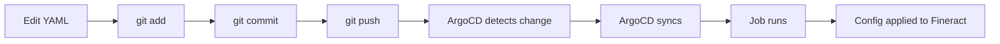

# Fineract GitOps - Quick Reference

## 📁 Repository Layout

```
fineract-gitops/
├── README.md                    # Start here - complete documentation
├── IMPLEMENTATION_GUIDE.md      # Step-by-step extension guide
├── PROJECT_STATUS.md            # What's been created
├── QUICK_REFERENCE.md           # This file - quick commands
│
├── operations/fineract-data/    # ⭐ YOUR DATA CONFIGURATION
│   ├── schemas/                 # JSON schemas for validation
│   ├── data/                    # YAML configuration files
│   │   ├── base/                # Shared across all environments
│   │   ├── dev/                 # Development data + demo data
│   │   ├── uat/                 # UAT data + test data
│   │   └── production/          # Production config ONLY (no demo data)
│   │
│   ├── jobs/                    # Kubernetes Jobs to load data
│   └── scripts/                 # Python scripts to convert YAML → API
│
├── apps/                        # Core Fineract deployment
│   └── fineract/
│       ├── base/                # Base Kubernetes manifests
│       └── overlays/            # Environment-specific patches
│
└── argocd/                      # ArgoCD GitOps configuration
```

## 🎯 Common Tasks

### 1. Add a New Loan Product

```bash
# Copy template
cp operations/fineract-data/data/dev/products/loan-products/personal-loan.yaml \
   operations/fineract-data/data/production/products/loan-products/new-product.yaml

# Edit file
vim operations/fineract-data/data/production/products/loan-products/new-product.yaml

# Validate
python3 scripts/validate-data.py

# Commit
git add operations/fineract-data/data/production/products/loan-products/new-product.yaml
git commit -m "ops: add new loan product"
git push

# ArgoCD will auto-sync within 3 minutes
# Job will run to create product in Fineract
```

### 2. Update Interest Rates

```bash
# Edit file
vim operations/fineract-data/data/production/products/loan-products/personal-loan.yaml

# Change:
#   interestRate:
#     default: 15.0  # Changed from 14.0

# See what changed
git diff operations/fineract-data/data/production/products/loan-products/personal-loan.yaml

# Commit
git add operations/fineract-data/data/production/products/loan-products/personal-loan.yaml
git commit -m "ops: increase personal loan rate from 14% to 15%"
git push
```

### 3. Add a New Office/Branch

```bash
# Copy template
cp operations/fineract-data/data/dev/offices/head-office.yaml \
   operations/fineract-data/data/production/offices/nairobi-branch.yaml

# Edit
vim operations/fineract-data/data/production/offices/nairobi-branch.yaml

# Change:
# - name: Nairobi Branch
# - parentOffice: head-office
# - address: ...

# Commit and push
git add operations/fineract-data/data/production/offices/nairobi-branch.yaml
git commit -m "ops: add Nairobi branch office"
git push
```

### 4. View Configuration Changes (Git Diff)

```bash
# See what changed in last commit
git diff HEAD~1 operations/fineract-data/data/production/

# See history of a specific product
git log --oneline operations/fineract-data/data/production/products/loan-products/personal-loan.yaml

# See specific change
git show abc123 operations/fineract-data/data/production/products/loan-products/personal-loan.yaml
```

### 5. Deploy to Development

```bash
# Create namespace
kubectl create namespace fineract-dev

# Deploy ArgoCD app-of-apps
kubectl apply -f argocd/applications/dev/app-of-apps.yaml

# Monitor
argocd app list
argocd app sync fineract-dev
kubectl get pods -n fineract-dev -w
```

### 6. Promote from UAT to Production

```bash
# Run promotion script
./scripts/promote-env.sh uat production v1.2.3

# This creates a PR with:
# - Updated image tags
# - Environment-specific patches
# - Approval checklist

# Review PR, approve, merge
# ArgoCD auto-deploys to production
```

### 7. Rollback Production

```bash
# Rollback to previous version
./scripts/rollback.sh production v1.2.2

# OR use Git revert
git revert HEAD
git push

# ArgoCD will sync the revert
```

### 8. Validate All YAML Files

```bash
# Validate all configurations
python3 scripts/validate-data.py

# Validate specific file
python3 scripts/validate-data.py operations/fineract-data/data/production/products/loan-products/personal-loan.yaml
```

## 📊 YAML File Structure

### Loan Product Template

```yaml
apiVersion: fineract.apache.org/v1
kind: LoanProduct
metadata:
  name: product-name        # Unique ID (kebab-case)
  labels:
    category: personal      # personal, business, agriculture

spec:
  name: Display Name        # Human-readable name
  currency: KES             # ISO 4217 code

  principal:
    min: 10000
    default: 50000
    max: 500000

  interestRate:
    min: 12.0
    default: 15.0
    max: 18.0
    type: DECLINING_BALANCE  # or FLAT

  numberOfRepayments:
    min: 6
    default: 12
    max: 36

  repaymentEvery: 1
  repaymentFrequency: MONTHS  # DAYS, WEEKS, MONTHS, YEARS
```

### Office Template

```yaml
apiVersion: fineract.apache.org/v1
kind: Office
metadata:
  name: office-name

spec:
  name: Display Name
  externalId: BR-001
  parentOffice: head-office  # Or null for root
  openingDate: "2024-01-01"

  address:
    street: Main Street
    city: Nairobi
    postalCode: "00100"
    country: Kenya

  contact:
    phone: "+254-20-1234567"
    email: info@example.com
```

### Code Value Template

```yaml
apiVersion: fineract.apache.org/v1
kind: CodeValue
metadata:
  name: code-name

spec:
  codeName: DisplayCodeName
  description: Description of this code

  values:
    - name: Option 1
      position: 1
      active: true

    - name: Option 2
      position: 2
      active: true
```

## 🔍 Key Directories

### Where to Add Data

| Entity Type | Directory |
|-------------|-----------|
| Loan Products | `data/{env}/products/loan-products/` |
| Savings Products | `data/{env}/products/savings-products/` |
| Offices | `data/{env}/offices/` |
| Fees/Charges | `data/{env}/charges/` |
| Code Values | `data/base/codes-and-values/` |
| Staff | `data/{env}/staff/` |
| Roles | `data/{env}/roles-permissions/` |
| GL Accounts | `data/{env}/accounting/chart-of-accounts/` |

### Environment-Specific

| Type | Dev | UAT | Production |
|------|-----|-----|------------|
| Configuration | ✅ | ✅ | ✅ |
| Demo/Test Data | ✅ | ✅ | ❌ |
| Clients | ✅ | ✅ | ❌ |
| Loan Accounts | ✅ | ✅ | ❌ |
| Transactions | ✅ | ✅ | ❌ |

## 🚀 Deployment Workflow



## 📋 All 44 Entity Types

**System Configuration (18):**
Offices, Staff, Configuration, Global Configuration, Currency Config, Working Days, Account Number Preferences, Maker Checker Config, Roles Permissions, Scheduler Jobs, SMS Email Config, Notification Templates, Data Tables, Tellers, Teller Cashier Mapping, Codes and Values, Financial Reports, COBAC Reports

**Products (7):**
Loan Products, Savings Products, Charges, Collateral Types, Guarantor Types, Floating Rates, Delinquency Buckets

**Accounting (8):**
Chart of Accounts, Fund Sources, Payment Types, Tax Groups, Loan Provisioning, Loan Product Accounting, Savings Product Accounting, Payment Type Accounting, Financial Activity Mapping

**Entities (5 - dev/uat only):**
Clients, Loan Accounts, Savings Accounts, Loan Collateral, Loan Guarantors

**Transactions (4 - dev/uat only):**
Savings Deposits, Savings Withdrawals, Loan Repayments, Inter-Branch Transfers

**Calendar (1):**
Holidays

## 🎓 Learning Path

1. **Start:** Read `README.md`
2. **Understand:** Review example YAML files
3. **Extend:** Follow `IMPLEMENTATION_GUIDE.md`
4. **Reference:** Use this file for common tasks

## 💡 Tips

1. **Always validate before committing:**
   ```bash
   python3 scripts/validate-data.py
   ```

2. **Use meaningful commit messages:**
   ```bash
   git commit -m "ops: add SME loan product with 14% interest"
   ```

3. **Review diffs before pushing:**
   ```bash
   git diff
   ```

4. **Test in dev first:**
   - Make changes in `data/dev/`
   - Deploy and test
   - Copy to `data/production/` when ready

5. **Keep production clean:**
   - Only configuration data
   - No demo/test data
   - No client/transaction data

## 🔗 Useful Commands

```bash
# Git
git status
git diff
git log --oneline
git show <commit-hash>

# Kubernetes
kubectl get pods -n fineract-dev
kubectl logs -n fineract-dev <pod-name>
kubectl describe pod -n fineract-dev <pod-name>

# ArgoCD
argocd app list
argocd app get fineract-dev
argocd app sync fineract-dev
argocd app history fineract-dev

# Validation
python3 scripts/validate-data.py
python3 scripts/yaml-to-api.py --help
```

## 📧 Need Help?

1. Check `README.md` for architecture
2. Check `IMPLEMENTATION_GUIDE.md` for detailed steps
3. Check example YAML files for patterns
4. Check Fineract API docs for field mappings

---

**Quick Reference for Daily Operations**
