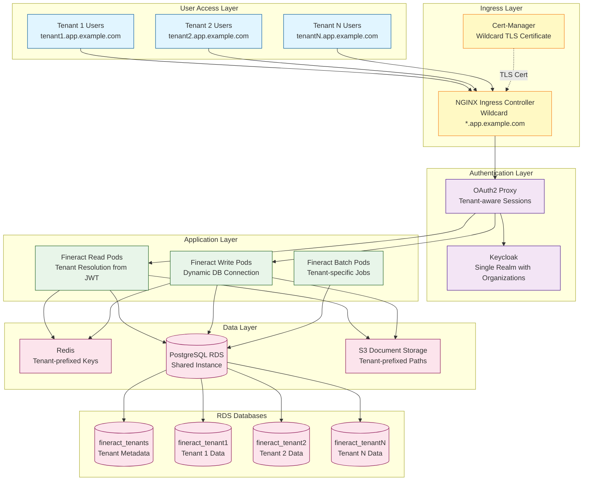
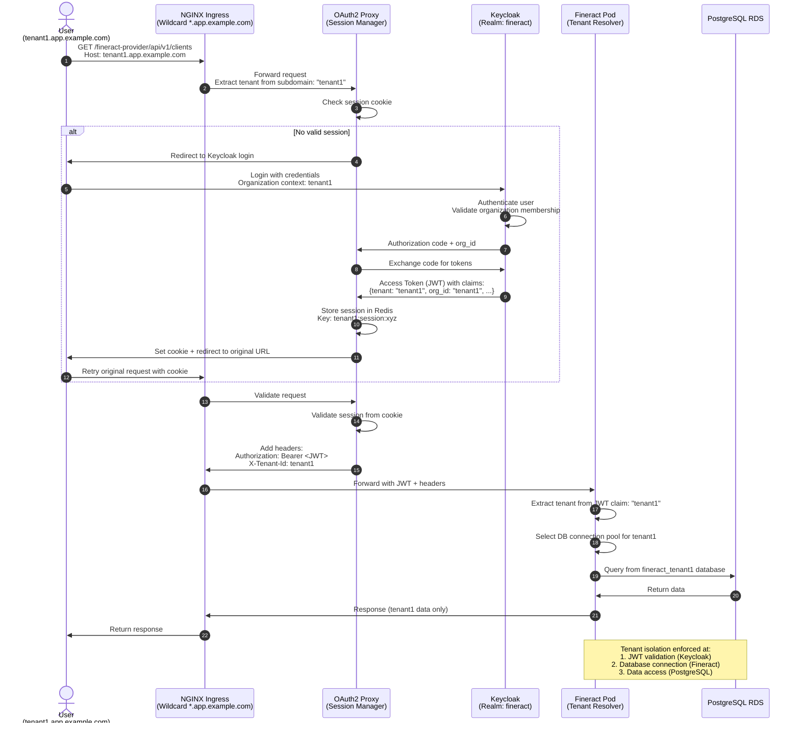
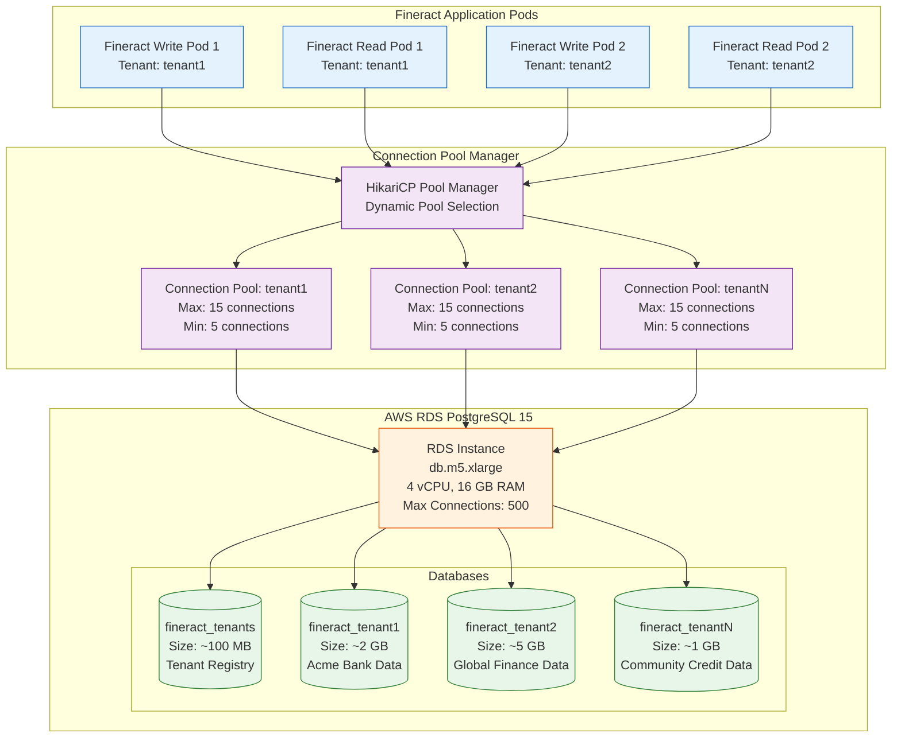

# Fineract GitOps Multi-Tenant Architecture

**Version:** 1.0
**Last Updated:** 2025-11-24
**Status:** Design Document

## Executive Summary

This document describes the multi-tenant architecture for the Fineract GitOps platform, transforming the current single-tenant system into a scalable Software-as-a-Service (SaaS) platform supporting multiple isolated tenants.

### Architecture Decisions

| Aspect | Decision | Rationale |
|--------|----------|-----------|
| **Identity Management** | Keycloak Organizations (single realm) | Better scalability, shared identity provider, organization ID maps to tenant |
| **Database Isolation** | Shared RDS, separate database per tenant | Cost-effective isolation, maintains data separation while sharing infrastructure |
| **Tenant Routing** | Subdomain-based (tenant1.app.example.com) | Clean URL structure, best user experience, standard SaaS pattern |
| **Provisioning** | Manual provisioning workflow | Simpler to implement and maintain for initial deployment |

### Key Benefits

- **Cost Efficiency**: Shared RDS infrastructure reduces per-tenant costs by ~70%
- **Data Isolation**: Each tenant has separate PostgreSQL database ensuring compliance
- **Scalability**: Architecture supports 100+ tenants on single RDS instance
- **User Experience**: Clean subdomain URLs provide professional tenant-specific domains
- **Security**: JWT-based tenant identification prevents cross-tenant access

---

## Architecture Overview

### High-Level Architecture Diagram



---

## Authentication Flow with Keycloak Organizations

### JWT Token Flow with Tenant Resolution



### Keycloak Organizations Configuration

```mermaid
graph LR
    subgraph "Keycloak Realm: fineract"
        subgraph "Organizations"
            ORG1[Organization: tenant1<br/>Name: Acme Bank<br/>Domain: tenant1.app.example.com]
            ORG2[Organization: tenant2<br/>Name: Global Finance<br/>Domain: tenant2.app.example.com]
            ORG3[Organization: tenantN<br/>Name: Community Credit<br/>Domain: tenantN.app.example.com]
        end

        subgraph "Users"
            U1[user1@acme.com<br/>Org: tenant1]
            U2[user2@acme.com<br/>Org: tenant1]
            U3[admin@global.com<br/>Org: tenant2]
            U4[staff@community.com<br/>Org: tenantN]
        end

        subgraph "Protocol Mappers"
            PM1[organization-to-tenant<br/>Mapper Type: Organization<br/>Claim: tenant<br/>Value: organization.id]
            PM2[organization-name<br/>Mapper Type: Organization<br/>Claim: org_name<br/>Value: organization.name]
        end

        subgraph "OAuth2 Client"
            CLIENT[Client: fineract-oauth2-proxy<br/>Access Type: confidential<br/>Valid Redirect: https://*.app.example.com/oauth2/callback]
        end
    end

    U1 --> ORG1
    U2 --> ORG1
    U3 --> ORG2
    U4 --> ORG3

    ORG1 --> PM1
    ORG2 --> PM1
    ORG3 --> PM1

    ORG1 --> PM2
    ORG2 --> PM2
    ORG3 --> PM2

    PM1 --> CLIENT
    PM2 --> CLIENT

    classDef orgStyle fill:#e1bee7,stroke:#4a148c
    classDef userStyle fill:#b3e5fc,stroke:#01579b
    classDef mapperStyle fill:#c8e6c9,stroke:#1b5e20
    classDef clientStyle fill:#ffccbc,stroke:#bf360c

    class ORG1,ORG2,ORG3 orgStyle
    class U1,U2,U3,U4 userStyle
    class PM1,PM2 mapperStyle
    class CLIENT clientStyle
```

---

## Database Architecture

### Shared RDS with Tenant Databases



### Database Schema Structure

Each tenant database contains the complete Fineract schema:

```sql
-- Tenant Metadata Database (fineract_tenants)
CREATE TABLE tenants (
    id BIGSERIAL PRIMARY KEY,
    identifier VARCHAR(100) UNIQUE NOT NULL,  -- e.g., 'tenant1'
    name VARCHAR(255) NOT NULL,               -- e.g., 'Acme Bank'
    timezone_id VARCHAR(100) DEFAULT 'UTC',
    country_id INT,
    created_date TIMESTAMP DEFAULT NOW(),
    last_modified_date TIMESTAMP,
    -- Connection info stored in Kubernetes secrets, not DB
);

-- Example tenant records
INSERT INTO tenants (identifier, name, timezone_id) VALUES
('tenant1', 'Acme Bank', 'America/New_York'),
('tenant2', 'Global Finance', 'Europe/London'),
('tenantN', 'Community Credit', 'Asia/Singapore');
```

```sql
-- Tenant-specific Database (fineract_tenant1, fineract_tenant2, etc.)
-- Full Fineract schema (150+ tables):

-- Core entities
m_appuser              -- Application users
m_office               -- Offices/branches
m_client               -- Customers
m_group                -- Client groups
m_loan                 -- Loan accounts
m_savings_account      -- Savings accounts
m_share_account        -- Share accounts

-- Products
m_product_loan         -- Loan products
m_savings_product      -- Savings products
m_share_product        -- Share products

-- Accounting
acc_gl_account         -- General ledger accounts
acc_gl_journal_entry   -- Journal entries
acc_gl_closure         -- Period closures

-- Configuration
c_configuration        -- System configuration
m_code                 -- Code value definitions
m_code_value           -- Code values

-- Audit
m_maker_checker        -- Maker-checker audit
m_audit_log            -- Audit trail

-- ... 130+ more tables
```

### Database Connection Configuration

Fineract will use dynamic tenant resolution:

```yaml
# Current single-tenant configuration (TO BE REPLACED)
- name: FINERACT_DEFAULT_TENANTDB_HOSTNAME
  valueFrom:
    secretKeyRef:
      name: fineract-db-credentials
      key: host
- name: FINERACT_DEFAULT_TENANTDB_NAME
  value: "fineract_default"  # HARDCODED
- name: FINERACT_DEFAULT_TENANTDB_IDENTIFIER
  value: "default"           # HARDCODED
```

```yaml
# New multi-tenant configuration
- name: FINERACT_TENANT_MASTER_DB_HOSTNAME
  valueFrom:
    secretKeyRef:
      name: fineract-db-credentials
      key: host
- name: FINERACT_TENANT_MASTER_DB_NAME
  value: "fineract_tenants"  # Metadata database
- name: FINERACT_TENANT_DB_HOSTNAME
  valueFrom:
    secretKeyRef:
      name: fineract-db-credentials
      key: host
- name: FINERACT_TENANT_DB_PREFIX
  value: "fineract_"         # Prefix for tenant databases
- name: FINERACT_TENANT_IDENTIFIER_FROM_JWT
  value: "true"              # Enable dynamic tenant resolution
```

---

## Request Flow with Tenant Isolation

### Complete Request Flow Diagram

```mermaid
flowchart TD
    START([User Request]) --> SUBDOMAIN{Extract tenant<br/>from subdomain}
    SUBDOMAIN -->|tenant1.app.example.com| SET_TENANT1[Set context:<br/>tenant = tenant1]
    SUBDOMAIN -->|tenant2.app.example.com| SET_TENANT2[Set context:<br/>tenant = tenant2]

    SET_TENANT1 --> AUTH_CHECK{Authenticated?}
    SET_TENANT2 --> AUTH_CHECK

    AUTH_CHECK -->|No| KC_LOGIN[Redirect to Keycloak<br/>with org hint: tenant1]
    AUTH_CHECK -->|Yes| VALIDATE_TOKEN[Validate JWT token<br/>Extract tenant claim]

    KC_LOGIN --> KC_AUTH[User authenticates<br/>Organization: tenant1]
    KC_AUTH --> KC_TOKEN[Issue JWT with claims:<br/>tenant: tenant1<br/>org_id: tenant1<br/>user_id: 123]
    KC_TOKEN --> OAUTH_SESSION[OAuth2 Proxy<br/>Store session in Redis<br/>Key: tenant1:session:xyz]
    OAUTH_SESSION --> VALIDATE_TOKEN

    VALIDATE_TOKEN --> TENANT_MATCH{Subdomain matches<br/>JWT tenant claim?}

    TENANT_MATCH -->|No| REJECT[Return 403 Forbidden<br/>Cross-tenant access denied]
    TENANT_MATCH -->|Yes| SELECT_DB[Select DB connection pool<br/>Database: fineract_tenant1]

    SELECT_DB --> QUERY_DB[Execute query in<br/>tenant1 database]
    QUERY_DB --> APPLY_RLS[Apply row-level security<br/>office_id, user_id filters]
    APPLY_RLS --> S3_CHECK{Request needs<br/>documents?}

    S3_CHECK -->|Yes| S3_PATH[Access S3 with tenant prefix<br/>Path: tenant1/documents/...]
    S3_CHECK -->|No| CACHE_CHECK{Cache enabled?}
    S3_PATH --> CACHE_CHECK

    CACHE_CHECK -->|Yes| REDIS_OP[Redis operation<br/>Key: tenant1:cache:...]
    CACHE_CHECK -->|No| RETURN_RESPONSE[Return response<br/>with tenant1 data]
    REDIS_OP --> RETURN_RESPONSE

    RETURN_RESPONSE --> END([Response to User])
    REJECT --> END

    classDef startEnd fill:#4caf50,stroke:#1b5e20,color:#fff
    classDef decision fill:#ff9800,stroke:#e65100,color:#fff
    classDef process fill:#2196f3,stroke:#0d47a1,color:#fff
    classDef security fill:#f44336,stroke:#b71c1c,color:#fff
    classDef data fill:#9c27b0,stroke:#4a148c,color:#fff

    class START,END startEnd
    class SUBDOMAIN,AUTH_CHECK,TENANT_MATCH,S3_CHECK,CACHE_CHECK decision
    class SET_TENANT1,SET_TENANT2,VALIDATE_TOKEN,SELECT_DB,QUERY_DB,APPLY_RLS,RETURN_RESPONSE process
    class KC_LOGIN,KC_AUTH,KC_TOKEN,OAUTH_SESSION,REJECT security
    class S3_PATH,REDIS_OP data
```



---

## Component Details

### 1. Ingress Configuration (Wildcard Routing)

**Current Configuration** (single hostname):
```yaml
# apps/ingress/base/fineract-oauth2-protected.yaml
spec:
  rules:
    - host: $(APPS_HOSTNAME)  # e.g., apps.dev.example.com
      http:
        paths:
          - path: /fineract-provider
            backend:
              service:
                name: fineract-read-service
```

**New Multi-Tenant Configuration** (wildcard):
```yaml
# apps/ingress/base/fineract-oauth2-protected-multi-tenant.yaml
apiVersion: networking.k8s.io/v1
kind: Ingress
metadata:
  name: fineract-multi-tenant-ingress
  annotations:
    # Wildcard TLS certificate
    cert-manager.io/cluster-issuer: "letsencrypt-prod"

    # OAuth2 authentication
    nginx.ingress.kubernetes.io/auth-url: "http://oauth2-proxy.$(NAMESPACE).svc.cluster.local:4180/oauth2/auth"
    nginx.ingress.kubernetes.io/auth-signin: "https://$host/oauth2/start?rd=$escaped_request_uri"
    nginx.ingress.kubernetes.io/auth-response-headers: "X-Auth-Request-User,X-Auth-Request-Email,X-Auth-Request-Access-Token"

    # Extract tenant from subdomain and add to header
    nginx.ingress.kubernetes.io/configuration-snippet: |
      # Extract tenant from subdomain (e.g., tenant1.app.example.com -> tenant1)
      set $tenant_id "";
      if ($host ~* "^([^.]+)\.app\.example\.com$") {
        set $tenant_id $1;
      }

      # Get access token from auth request
      auth_request_set $access_token $upstream_http_x_auth_request_access_token;

      # Forward to backend with tenant context
      proxy_set_header Authorization "Bearer $access_token";
      proxy_set_header X-Tenant-Id $tenant_id;
      proxy_set_header X-Forwarded-Host $host;

    # CORS with tenant header
    nginx.ingress.kubernetes.io/cors-allow-headers: "Authorization, Content-Type, X-Requested-With, X-Fineract-Platform-TenantId, X-Tenant-Id"

    # Rate limiting per tenant
    nginx.ingress.kubernetes.io/limit-rps: "100"
    nginx.ingress.kubernetes.io/limit-rpm: "5000"
spec:
  ingressClassName: nginx
  tls:
    - hosts:
        - "*.app.example.com"  # Wildcard certificate
      secretName: wildcard-tls-cert
  rules:
    # Wildcard host for all tenants
    - host: "*.app.example.com"
      http:
        paths:
          # Read operations (GET)
          - path: /fineract-provider
            pathType: Prefix
            backend:
              service:
                name: fineract-read-service
                port:
                  number: 8443
```

**Wildcard DNS Configuration**:
```bash
# AWS Route53 example
*.app.example.com  A  ALIAS  <alb-or-nlb-dns-name>

# Resolves to:
# tenant1.app.example.com -> ALB -> Ingress
# tenant2.app.example.com -> ALB -> Ingress
# tenantN.app.example.com -> ALB -> Ingress
```

---

### 2. OAuth2 Proxy Multi-Tenant Configuration

**Enhanced OAuth2 Proxy Deployment**:
```yaml
# apps/oauth2-proxy/base/oauth2-proxy-config.yaml
apiVersion: v1
kind: ConfigMap
metadata:
  name: oauth2-proxy-config
data:
  # Keycloak OIDC configuration
  oidc-issuer-url: "https://auth.example.com/auth/realms/fineract"

  # Redis session storage with tenant prefixes
  redis-connection-url: "redis://fineract-redis:6379"

  # Session cookie configuration
  cookie-name: "_oauth2_proxy_tenant"
  cookie-domain: ".app.example.com"  # Shared across all subdomains
  cookie-secure: "true"
  cookie-httponly: "true"
  cookie-samesite: "lax"

  # Upstream configuration
  upstreams: "http://fineract-read-service:8443,http://fineract-write-service:8443"

  # Pass access token to backend
  pass-access-token: "true"
  pass-authorization-header: "true"
  set-authorization-header: "true"

  # OIDC claims to extract
  scope: "openid profile email tenant org_name"

  # Redirect URL (wildcard support)
  redirect-url: "https://app.example.com/oauth2/callback"
```

**OAuth2 Proxy Deployment with Organization Hint**:
```yaml
# apps/oauth2-proxy/base/deployment.yaml
apiVersion: apps/v1
kind: Deployment
metadata:
  name: oauth2-proxy
spec:
  replicas: 3
  selector:
    matchLabels:
      app: oauth2-proxy
  template:
    metadata:
      labels:
        app: oauth2-proxy
    spec:
      containers:
        - name: oauth2-proxy
          image: quay.io/oauth2-proxy/oauth2-proxy:v7.6.0
          args:
            - --provider=oidc
            - --oidc-issuer-url=$(OIDC_ISSUER_URL)
            - --client-id=$(CLIENT_ID)
            - --client-secret=$(CLIENT_SECRET)
            - --cookie-secret=$(COOKIE_SECRET)
            - --cookie-name=$(COOKIE_NAME)
            - --cookie-domain=$(COOKIE_DOMAIN)
            - --cookie-secure=$(COOKIE_SECURE)
            - --email-domain=*
            - --upstream=$(UPSTREAMS)
            - --http-address=0.0.0.0:4180
            - --redis-connection-url=$(REDIS_CONNECTION_URL)
            - --session-store-type=redis
            - --redis-use-sentinel=false
            - --pass-access-token=true
            - --pass-authorization-header=true
            - --set-authorization-header=true
            - --skip-provider-button=true
            - --scope=openid profile email tenant org_name
            # Enable logging for debugging
            - --standard-logging=true
            - --auth-logging=true
            - --request-logging=true
          env:
            - name: OIDC_ISSUER_URL
              valueFrom:
                configMapKeyRef:
                  name: oauth2-proxy-config
                  key: oidc-issuer-url
            - name: CLIENT_ID
              valueFrom:
                secretKeyRef:
                  name: oauth2-proxy-secrets
                  key: client-id
            - name: CLIENT_SECRET
              valueFrom:
                secretKeyRef:
                  name: oauth2-proxy-secrets
                  key: client-secret
            - name: COOKIE_SECRET
              valueFrom:
                secretKeyRef:
                  name: oauth2-proxy-secrets
                  key: cookie-secret
            - name: REDIS_CONNECTION_URL
              valueFrom:
                configMapKeyRef:
                  name: oauth2-proxy-config
                  key: redis-connection-url
            - name: UPSTREAMS
              valueFrom:
                configMapKeyRef:
                  name: oauth2-proxy-config
                  key: upstreams
            - name: COOKIE_NAME
              valueFrom:
                configMapKeyRef:
                  name: oauth2-proxy-config
                  key: cookie-name
            - name: COOKIE_DOMAIN
              valueFrom:
                configMapKeyRef:
                  name: oauth2-proxy-config
                  key: cookie-domain
            - name: COOKIE_SECURE
              valueFrom:
                configMapKeyRef:
                  name: oauth2-proxy-config
                  key: cookie-secure
          ports:
            - containerPort: 4180
              protocol: TCP
          livenessProbe:
            httpGet:
              path: /ping
              port: 4180
            initialDelaySeconds: 10
            periodSeconds: 10
          readinessProbe:
            httpGet:
              path: /ping
              port: 4180
            initialDelaySeconds: 5
            periodSeconds: 5
          resources:
            requests:
              memory: "128Mi"
              cpu: "100m"
            limits:
              memory: "256Mi"
              cpu: "200m"
```

---

### 3. Keycloak Organizations Setup

**Keycloak Realm Configuration with Organizations**:
```yaml
# operations/keycloak-config/base/config/realm-fineract-multi-tenant.yaml
realm: fineract
displayName: Fineract Banking Platform (Multi-Tenant)
enabled: true
sslRequired: external

# Session and token configuration
accessTokenLifespan: 1800          # 30 minutes
ssoSessionIdleTimeout: 1800        # 30 minutes
ssoSessionMaxLifespan: 14400       # 4 hours
accessCodeLifespan: 60             # 1 minute
accessCodeLifespanUserAction: 300  # 5 minutes

# Enable organizations feature (Keycloak 24+)
attributes:
  organizationsEnabled: "true"
  organizationsOAuth2RequireValidation: "true"

# OAuth2 Proxy Client
clients:
  - clientId: "${OAUTH2_PROXY_CLIENT_ID}"
    name: Fineract OAuth2 Proxy Multi-Tenant
    enabled: true
    clientAuthenticatorType: client-secret
    secret: "${OAUTH2_PROXY_CLIENT_SECRET}"
    redirectUris:
      - "https://tenant1.app.${BASE_DOMAIN}/oauth2/callback"
      - "https://tenant2.app.${BASE_DOMAIN}/oauth2/callback"
      - "https://*.app.${BASE_DOMAIN}/oauth2/callback"  # Wildcard
    webOrigins:
      - "https://tenant1.app.${BASE_DOMAIN}"
      - "https://tenant2.app.${BASE_DOMAIN}"
      - "https://*.app.${BASE_DOMAIN}"
    standardFlowEnabled: true
    directAccessGrantsEnabled: false
    publicClient: false
    protocol: openid-connect
    attributes:
      access.token.lifespan: "1800"
      pkce.code.challenge.method: "S256"

    # Protocol mappers for multi-tenant
    protocolMappers:
      # Map organization ID to tenant claim
      - name: organization-to-tenant-mapper
        protocol: openid-connect
        protocolMapper: oidc-organization-membership-mapper
        consentRequired: false
        config:
          claim.name: "tenant"
          jsonType.label: "String"
          id.token.claim: "true"
          access.token.claim: "true"
          userinfo.token.claim: "true"
          # Maps organization.id to tenant claim
          organization.attribute: "id"

      # Map organization name
      - name: organization-name-mapper
        protocol: openid-connect
        protocolMapper: oidc-organization-membership-mapper
        consentRequired: false
        config:
          claim.name: "org_name"
          jsonType.label: "String"
          id.token.claim: "true"
          access.token.claim: "true"
          userinfo.token.claim: "true"
          organization.attribute: "name"

      # Fineract user ID mapper (from user attributes)
      - name: fineract-user-id-mapper
        protocol: openid-connect
        protocolMapper: oidc-usermodel-attribute-mapper
        consentRequired: false
        config:
          user.attribute: "fineract_user_id"
          claim.name: "fineract_user_id"
          jsonType.label: "String"
          id.token.claim: "true"
          access.token.claim: "true"

      # Office ID mapper
      - name: office-id-mapper
        protocol: openid-connect
        protocolMapper: oidc-usermodel-attribute-mapper
        consentRequired: false
        config:
          user.attribute: "office_id"
          claim.name: "office_id"
          jsonType.label: "String"
          id.token.claim: "true"
          access.token.claim: "true"

      # Employee ID mapper
      - name: employee-id-mapper
        protocol: openid-connect
        protocolMapper: oidc-usermodel-attribute-mapper
        consentRequired: false
        config:
          user.attribute: "employee_id"
          claim.name: "employee_id"
          jsonType.label: "String"
          id.token.claim: "true"
          access.token.claim: "true"

      # Roles mapper
      - name: roles-mapper
        protocol: openid-connect
        protocolMapper: oidc-usermodel-realm-role-mapper
        consentRequired: false
        config:
          claim.name: "roles"
          jsonType.label: "String"
          id.token.claim: "true"
          access.token.claim: "true"
          multivalued: "true"

# Realm roles (shared across all tenants)
roles:
  realm:
    - name: SUPER_USER
      description: "Super user with full access"
    - name: ADMIN
      description: "Administrator with management access"
    - name: LOAN_OFFICER
      description: "Loan officer"
    - name: TELLER
      description: "Bank teller"
    - name: ACCOUNTANT
      description: "Accountant"
    - name: AUDITOR
      description: "Auditor (read-only)"

# Authentication flow configuration
authenticationFlows:
  - alias: browser
    description: browser based authentication
    providerId: basic-flow
    topLevel: true
    builtIn: true
    authenticationExecutions:
      - authenticator: auth-cookie
        requirement: ALTERNATIVE
      - authenticator: identity-provider-redirector
        requirement: ALTERNATIVE
      - flowAlias: forms
        requirement: ALTERNATIVE

# Security settings
bruteForceProtected: true
failureFactor: 3
waitIncrementSeconds: 60
quickLoginCheckMilliSeconds: 1000
minimumQuickLoginWaitSeconds: 60
maxFailureWaitSeconds: 900
maxDeltaTimeSeconds: 43200

# Password policy
passwordPolicy: "length(12) and upperCase(1) and lowerCase(1) and digits(1) and specialChars(1) and notUsername(undefined)"

# WebAuthn (2FA) support
webAuthnPolicyRpEntityName: "Fineract Platform"
webAuthnPolicySignatureAlgorithms:
  - "ES256"
  - "RS256"
webAuthnPolicyRpId: "${BASE_DOMAIN}"
webAuthnPolicyAttestationConveyancePreference: "not specified"
webAuthnPolicyAuthenticatorAttachment: "not specified"
webAuthnPolicyRequireResidentKey: "not specified"
webAuthnPolicyUserVerificationRequirement: "not specified"
```

**Example JWT Token Structure**:
```json
{
  "exp": 1700000000,
  "iat": 1700000000,
  "jti": "a1b2c3d4-e5f6-7890-abcd-ef1234567890",
  "iss": "https://auth.example.com/auth/realms/fineract",
  "aud": "fineract-oauth2-proxy",
  "sub": "f47ac10b-58cc-4372-a567-0e02b2c3d479",
  "typ": "Bearer",
  "azp": "fineract-oauth2-proxy",
  "session_state": "session-xyz",
  "scope": "openid profile email tenant org_name",

  "email_verified": true,
  "name": "John Doe",
  "preferred_username": "john.doe",
  "given_name": "John",
  "family_name": "Doe",
  "email": "john.doe@acme.com",

  "tenant": "tenant1",
  "org_name": "Acme Bank",
  "fineract_user_id": "1",
  "office_id": "1",
  "employee_id": "EMP001",
  "roles": ["SUPER_USER", "LOAN_OFFICER"]
}
```

---

### 4. Fineract Multi-Tenant Configuration

**Fineract Application Properties** (via environment variables):
```yaml
# apps/fineract/base/deployment-write-multi-tenant.yaml
apiVersion: apps/v1
kind: Deployment
metadata:
  name: fineract-write
spec:
  replicas: 3
  selector:
    matchLabels:
      app: fineract
      tier: write
  template:
    metadata:
      labels:
        app: fineract
        tier: write
    spec:
      serviceAccountName: fineract-aws
      initContainers:
        # Wait for database to be ready
        - name: wait-for-db
          image: postgres:15-alpine
          command:
            - sh
            - -c
            - |
              until pg_isready -h $(FINERACT_HIKARI_HOST) -p 5432 -U $(FINERACT_HIKARI_USERNAME); do
                echo "Waiting for PostgreSQL...";
                sleep 5;
              done;
              echo "PostgreSQL is ready!";
          env:
            - name: FINERACT_HIKARI_HOST
              valueFrom:
                secretKeyRef:
                  name: fineract-db-credentials
                  key: host
            - name: FINERACT_HIKARI_USERNAME
              valueFrom:
                secretKeyRef:
                  name: fineract-db-credentials
                  key: username
      containers:
        - name: fineract
          image: fineract:latest
          ports:
            - containerPort: 8443
              protocol: TCP
          env:
            # ============================================
            # MULTI-TENANT DATABASE CONFIGURATION
            # ============================================

            # Tenant Master Database (Metadata)
            - name: FINERACT_TENANT_MASTER_HOST
              valueFrom:
                secretKeyRef:
                  name: fineract-db-credentials
                  key: host
            - name: FINERACT_TENANT_MASTER_PORT
              valueFrom:
                secretKeyRef:
                  name: fineract-db-credentials
                  key: port
            - name: FINERACT_TENANT_MASTER_DATABASE
              value: "fineract_tenants"
            - name: FINERACT_TENANT_MASTER_USERNAME
              valueFrom:
                secretKeyRef:
                  name: fineract-db-credentials
                  key: username
            - name: FINERACT_TENANT_MASTER_PASSWORD
              valueFrom:
                secretKeyRef:
                  name: fineract-db-credentials
                  key: password

            # Tenant Database Configuration (Dynamic)
            - name: FINERACT_TENANT_HOST
              valueFrom:
                secretKeyRef:
                  name: fineract-db-credentials
                  key: host
            - name: FINERACT_TENANT_PORT
              valueFrom:
                secretKeyRef:
                  name: fineract-db-credentials
                  key: port
            - name: FINERACT_TENANT_USERNAME
              valueFrom:
                secretKeyRef:
                  name: fineract-db-credentials
                  key: username
            - name: FINERACT_TENANT_PASSWORD
              valueFrom:
                secretKeyRef:
                  name: fineract-db-credentials
                  key: password

            # Database naming pattern
            - name: FINERACT_TENANT_DB_NAME_PREFIX
              value: "fineract_"
            - name: FINERACT_TENANT_DB_NAME_SUFFIX
              value: ""

            # ============================================
            # MULTI-TENANT IDENTIFIER CONFIGURATION
            # ============================================

            # Enable tenant resolution from JWT token
            - name: FINERACT_TENANT_IDENTIFIER_SOURCE
              value: "jwt"  # Options: jwt, header, cookie

            # JWT claim name for tenant identifier
            - name: FINERACT_TENANT_IDENTIFIER_JWT_CLAIM
              value: "tenant"

            # Fallback to header if JWT claim not found
            - name: FINERACT_TENANT_IDENTIFIER_HEADER
              value: "X-Tenant-Id"

            # Disable hardcoded default tenant
            - name: FINERACT_DEFAULT_TENANTDB_IDENTIFIER
              value: ""  # Empty = disabled

            # ============================================
            # HIKARICP CONNECTION POOL (PER TENANT)
            # ============================================

            - name: FINERACT_HIKARI_DRIVER_CLASS_NAME
              value: "org.postgresql.Driver"
            - name: FINERACT_HIKARI_MINIMUM_IDLE
              value: "5"
            - name: FINERACT_HIKARI_MAXIMUM_POOL_SIZE
              value: "15"
            - name: FINERACT_HIKARI_IDLE_TIMEOUT
              value: "600000"  # 10 minutes
            - name: FINERACT_HIKARI_CONNECTION_TIMEOUT
              value: "30000"   # 30 seconds
            - name: FINERACT_HIKARI_MAX_LIFETIME
              value: "1800000" # 30 minutes
            - name: FINERACT_HIKARI_AUTO_COMMIT
              value: "true"

            # ============================================
            # OAUTH2/OIDC CONFIGURATION
            # ============================================

            - name: FINERACT_SECURITY_BASICAUTH_ENABLED
              value: "false"
            - name: FINERACT_SECURITY_OAUTH_ENABLED
              value: "true"

            # Keycloak OIDC configuration
            - name: SPRING_SECURITY_OAUTH2_RESOURCESERVER_JWT_ISSUER_URI
              valueFrom:
                configMapKeyRef:
                  name: fineract-oauth2-config
                  key: oidc-issuer-url
            - name: SPRING_SECURITY_OAUTH2_RESOURCESERVER_JWT_JWK_SET_URI
              valueFrom:
                configMapKeyRef:
                  name: fineract-oauth2-config
                  key: jwk-set-uri-internal

            # ============================================
            # LIQUIBASE (DISABLED IN PODS)
            # ============================================

            - name: FINERACT_LIQUIBASE_ENABLED
              value: "false"  # Schema migrations run in dedicated job

            # ============================================
            # REDIS CACHE (TENANT-AWARE)
            # ============================================

            - name: SPRING_CACHE_TYPE
              value: "redis"
            - name: SPRING_REDIS_HOST
              value: "fineract-redis"
            - name: SPRING_REDIS_PORT
              value: "6379"
            - name: SPRING_REDIS_PASSWORD
              valueFrom:
                secretKeyRef:
                  name: redis-password
                  key: password

            # Use tenant prefix for cache keys
            - name: SPRING_CACHE_REDIS_KEY_PREFIX
              value: "fineract:"  # Will become: fineract:tenant1:cache_key
            - name: SPRING_CACHE_REDIS_USE_KEY_PREFIX
              value: "true"

            # ============================================
            # S3 DOCUMENT STORAGE (TENANT-AWARE)
            # ============================================

            - name: FINERACT_CONTENT_S3_ENABLED
              value: "true"
            - name: FINERACT_CONTENT_S3_BUCKET_NAME
              valueFrom:
                secretKeyRef:
                  name: s3-connection
                  key: documents-bucket

            # Use tenant prefix for S3 paths
            - name: FINERACT_CONTENT_S3_OBJECT_KEY_PREFIX_TYPE
              value: "tenant"  # Will become: tenant1/documents/...

            # AWS credentials via IRSA
            - name: AWS_REGION
              valueFrom:
                secretKeyRef:
                  name: s3-connection
                  key: region

            # ============================================
            # LOGGING
            # ============================================

            - name: FINERACT_LOGGING_LEVEL
              value: "INFO"
            - name: FINERACT_LOGGING_PATTERN
              value: "%d{yyyy-MM-dd HH:mm:ss} - %msg - tenant=%X{tenant}%n"

            # ============================================
            # MONITORING
            # ============================================

            - name: MANAGEMENT_ENDPOINTS_WEB_EXPOSURE_INCLUDE
              value: "health,info,metrics,prometheus"
            - name: MANAGEMENT_METRICS_TAGS_TENANT
              value: "${fineract.tenant.identifier}"

          resources:
            requests:
              memory: "2Gi"
              cpu: "1000m"
            limits:
              memory: "4Gi"
              cpu: "2000m"

          livenessProbe:
            httpGet:
              path: /fineract-provider/actuator/health/liveness
              port: 8443
              scheme: HTTPS
            initialDelaySeconds: 120
            periodSeconds: 30
            timeoutSeconds: 10
            failureThreshold: 3

          readinessProbe:
            httpGet:
              path: /fineract-provider/actuator/health/readiness
              port: 8443
              scheme: HTTPS
            initialDelaySeconds: 60
            periodSeconds: 10
            timeoutSeconds: 5
            failureThreshold: 3
```

---

### 5. Redis Multi-Tenant Isolation

**Redis Key Prefixing Strategy**:
```yaml
# apps/fineract-redis/base/redis-config.yaml
apiVersion: v1
kind: ConfigMap
metadata:
  name: redis-config
data:
  redis.conf: |
    # Redis configuration for multi-tenant caching

    # Persistence
    save 900 1
    save 300 10
    save 60 10000

    # Memory management
    maxmemory 2gb
    maxmemory-policy allkeys-lru

    # Keyspace notifications (for monitoring)
    notify-keyspace-events "Ex"

    # Security
    requirepass ${REDIS_PASSWORD}

    # Multi-tenant isolation via key prefixes
    # Application will use: tenant1:session:xyz, tenant1:cache:abc
    # No cross-tenant key access possible
```

**Redis Deployment with Persistence**:
```yaml
# apps/fineract-redis/base/statefulset.yaml
apiVersion: apps/v1
kind: StatefulSet
metadata:
  name: fineract-redis
spec:
  serviceName: fineract-redis
  replicas: 1
  selector:
    matchLabels:
      app: fineract-redis
  template:
    metadata:
      labels:
        app: fineract-redis
    spec:
      containers:
        - name: redis
          image: redis:7.2-alpine
          command:
            - redis-server
            - /etc/redis/redis.conf
          ports:
            - containerPort: 6379
          env:
            - name: REDIS_PASSWORD
              valueFrom:
                secretKeyRef:
                  name: redis-password
                  key: password
          volumeMounts:
            - name: redis-config
              mountPath: /etc/redis
            - name: redis-data
              mountPath: /data
          resources:
            requests:
              memory: "2Gi"
              cpu: "500m"
            limits:
              memory: "4Gi"
              cpu: "1000m"
      volumes:
        - name: redis-config
          configMap:
            name: redis-config
  volumeClaimTemplates:
    - metadata:
        name: redis-data
      spec:
        accessModes: ["ReadWriteOnce"]
        storageClassName: gp3
        resources:
          requests:
            storage: 10Gi
```

**Cache Key Pattern Examples**:
```
# Session storage (OAuth2 Proxy)
tenant1:session:abc123xyz
tenant2:session:def456uvw

# Application cache (Fineract)
fineract:tenant1:client:123
fineract:tenant1:loan:456
fineract:tenant2:client:789
fineract:tenant2:loan:101

# API rate limiting
ratelimit:tenant1:user:john:api:/clients
ratelimit:tenant2:user:jane:api:/loans
```

---

### 6. S3 Tenant Isolation

**S3 Bucket Structure**:
```
s3://fineract-documents-prod/
├── tenant1/
│   ├── documents/
│   │   ├── clients/
│   │   │   ├── 123/
│   │   │   │   ├── identity-card.pdf
│   │   │   │   └── proof-of-address.pdf
│   │   ├── loans/
│   │   │   └── 456/
│   │   │       ├── application.pdf
│   │   │       └── collateral-photo.jpg
│   ├── reports/
│   │   ├── daily-summary-2025-01-15.pdf
│   │   └── monthly-report-2025-01.pdf
│   └── exports/
│       └── clients-export-2025-01-15.csv
├── tenant2/
│   ├── documents/
│   ├── reports/
│   └── exports/
└── tenantN/
    ├── documents/
    ├── reports/
    └── exports/
```

**S3 IAM Policy for Tenant Isolation**:
```json
{
  "Version": "2012-10-17",
  "Statement": [
    {
      "Sid": "AllowListBucket",
      "Effect": "Allow",
      "Action": [
        "s3:ListBucket"
      ],
      "Resource": "arn:aws:s3:::fineract-documents-prod",
      "Condition": {
        "StringLike": {
          "s3:prefix": [
            "tenant1/*",
            "tenant2/*",
            "tenantN/*"
          ]
        }
      }
    },
    {
      "Sid": "AllowTenantAccess",
      "Effect": "Allow",
      "Action": [
        "s3:GetObject",
        "s3:PutObject",
        "s3:DeleteObject"
      ],
      "Resource": "arn:aws:s3:::fineract-documents-prod/${fineract:tenant}/*"
    }
  ]
}
```

**Fineract S3 Configuration**:
```yaml
# Application enforces tenant prefix
- name: FINERACT_CONTENT_S3_OBJECT_KEY_PREFIX_TYPE
  value: "tenant"

# Example S3 operations:
# Upload: PUT /tenant1/documents/clients/123/identity-card.pdf
# Download: GET /tenant1/documents/clients/123/identity-card.pdf
# List: LIST /tenant1/documents/clients/123/
```

---

## Tenant Capacity Planning

### RDS Instance Sizing

**Single RDS Instance Capacity** (shared across tenants):

| Instance Class | vCPUs | RAM | Max Connections | Recommended Tenants | Cost (us-east-1) |
|----------------|-------|-----|-----------------|---------------------|------------------|
| db.t3.medium   | 2     | 4 GB   | 150        | 5-10 (dev)          | ~$60/month       |
| db.m5.large    | 2     | 8 GB   | 200        | 10-20               | ~$140/month      |
| db.m5.xlarge   | 4     | 16 GB  | 500        | 30-50               | ~$280/month      |
| db.m5.2xlarge  | 8     | 32 GB  | 1000       | 60-100              | ~$560/month      |
| db.m5.4xlarge  | 16    | 64 GB  | 2000       | 100-200             | ~$1,120/month    |

**Connection Pool Allocation**:
```
Per Tenant Connection Pool: 15 connections (5 min, 15 max)
Per Pod: 15 connections × 3 tenants = 45 connections
Total Pods (3 read + 3 write + 1 batch): 7 pods
Total Connections: 7 pods × 45 connections = 315 connections

Recommendation: db.m5.xlarge (500 max connections) for 30-50 tenants
```

### Storage Scaling

**Per-Tenant Database Size Estimates**:
- Small tenant (< 1,000 clients): 500 MB - 1 GB
- Medium tenant (1,000 - 10,000 clients): 1 GB - 5 GB
- Large tenant (10,000+ clients): 5 GB - 20 GB

**RDS Storage Configuration**:
```hcl
# terraform/aws/modules/rds/main.tf
allocated_storage     = 100   # Initial 100 GB
max_allocated_storage = 1000  # Auto-scale up to 1 TB
storage_type          = "gp3"
iops                  = 3000
storage_throughput    = 125
```

**Example Capacity**:
- 100 GB storage supports: 50 small tenants OR 20 medium tenants OR 5 large tenants
- Auto-scaling to 1 TB: 500+ small tenants

---

## Security Considerations

### Tenant Isolation Guarantees

| Layer | Isolation Mechanism | Security Level |
|-------|---------------------|----------------|
| **Network** | Subdomain-based routing, no cross-tenant DNS resolution | High |
| **Authentication** | Keycloak organization membership validation | High |
| **Authorization** | JWT tenant claim validation, org_id verification | High |
| **Database** | Separate PostgreSQL databases per tenant | Very High |
| **Cache** | Redis key prefixes (tenant1:, tenant2:) | Medium-High |
| **Storage** | S3 path prefixes with IAM policies | High |
| **Logs** | Tenant ID in MDC (Mapped Diagnostic Context) | Medium |

### Security Checklist

- [ ] **JWT Validation**: Always validate tenant claim matches subdomain
- [ ] **Database Connection**: Never allow dynamic SQL with tenant identifier
- [ ] **S3 Access**: Enforce tenant prefix in all S3 operations
- [ ] **Redis Keys**: Always use tenant-prefixed keys
- [ ] **Audit Logging**: Log all cross-tenant access attempts
- [ ] **Rate Limiting**: Per-tenant rate limits to prevent resource exhaustion
- [ ] **Data Export**: Sanitize exported data to remove cross-tenant references
- [ ] **Backup/Restore**: Test tenant isolation after restore operations

### Threat Model

**Potential Attack Vectors**:

1. **JWT Claim Manipulation**:
   - Attack: User modifies JWT to change tenant claim
   - Mitigation: JWT signature validation, Keycloak JWKS verification

2. **Subdomain Spoofing**:
   - Attack: User sends request with different Host header
   - Mitigation: Ingress validates subdomain matches JWT tenant claim

3. **SQL Injection**:
   - Attack: SQL injection to access other tenant's database
   - Mitigation: Separate databases, parameterized queries, no dynamic tenant identifiers in SQL

4. **Cache Poisoning**:
   - Attack: Write to another tenant's cache keys
   - Mitigation: Application enforces tenant prefix, Redis ACLs (optional)

5. **S3 Path Traversal**:
   - Attack: Upload file with path: ../../tenant2/documents/file.pdf
   - Mitigation: Sanitize paths, IAM policy restricts to tenant prefix

---

## Monitoring and Observability

### Tenant-Specific Metrics

**Prometheus Metrics** (per tenant):
```yaml
# Fineract metrics with tenant label
fineract_http_requests_total{tenant="tenant1", method="GET", status="200"} 1234
fineract_http_requests_total{tenant="tenant2", method="GET", status="200"} 5678

fineract_database_connections_active{tenant="tenant1", pool="write"} 8
fineract_database_connections_active{tenant="tenant2", pool="write"} 12

fineract_cache_hits_total{tenant="tenant1"} 9876
fineract_cache_misses_total{tenant="tenant1"} 123

fineract_s3_operations_total{tenant="tenant1", operation="putObject"} 456
```

**Grafana Dashboard Structure**:
```
Fineract Multi-Tenant Dashboard
├── Overview Panel
│   ├── Total Tenants: 10
│   ├── Active Users: 250
│   └── Total Requests/sec: 1,234
├── Per-Tenant Panels (dropdown selector)
│   ├── Request Rate (per tenant)
│   ├── Error Rate (per tenant)
│   ├── Database Connections (per tenant)
│   ├── Cache Hit Rate (per tenant)
│   └── S3 Operations (per tenant)
├── Database Panel
│   ├── RDS CPU Utilization
│   ├── RDS Memory Usage
│   ├── Database Size per Tenant (bar chart)
│   └── Connection Pool Utilization per Tenant
└── Alerts
    ├── Tenant Error Rate > 5%
    ├── Database Connections > 90%
    └── S3 Operation Failures
```

### Logging Strategy

**Log Format with Tenant Context**:
```json
{
  "timestamp": "2025-11-24T10:30:45.123Z",
  "level": "INFO",
  "logger": "org.apache.fineract.portfolio.client.service",
  "thread": "http-nio-8443-exec-5",
  "tenant": "tenant1",
  "user": "john.doe@acme.com",
  "request_id": "abc-123-xyz",
  "message": "Client created successfully",
  "client_id": 123,
  "office_id": 1
}
```

**Log Aggregation** (CloudWatch Logs Insights query):
```sql
fields @timestamp, tenant, level, message, user
| filter tenant = "tenant1" and level = "ERROR"
| sort @timestamp desc
| limit 100
```

---

## Cost Analysis

### Monthly Cost Breakdown (AWS us-east-1)

**Infrastructure Costs** (50 tenants):

| Component | Specification | Monthly Cost |
|-----------|---------------|--------------|
| **EKS Cluster** | Control plane | $73 |
| **EKS Nodes** | 3× m5.xlarge (4 vCPU, 16 GB) | ~$460 |
| **RDS PostgreSQL** | db.m5.2xlarge (8 vCPU, 32 GB) | ~$560 |
| **RDS Storage** | 500 GB gp3 (3000 IOPS) | ~$60 |
| **RDS Backups** | 500 GB (automated backups) | ~$48 |
| **S3 Storage** | 100 GB (documents) | ~$2.30 |
| **S3 Requests** | 1M GET, 100K PUT | ~$0.50 |
| **ALB/NLB** | Application Load Balancer | ~$23 |
| **Route53** | Hosted zone + queries | ~$5 |
| **ACM** | TLS certificates | Free |
| **CloudWatch** | Logs + metrics | ~$50 |
| **Total** | | **~$1,282/month** |

**Per-Tenant Cost**: $1,282 / 50 = **$25.64/month** (at 50 tenants)

**Cost Scaling**:
- 10 tenants: ~$100/tenant/month (db.m5.large)
- 30 tenants: ~$35/tenant/month (db.m5.xlarge)
- 50 tenants: ~$26/tenant/month (db.m5.2xlarge)
- 100 tenants: ~$18/tenant/month (db.m5.4xlarge)

### Cost Optimization Strategies

1. **Reserved Instances**: 40% savings on RDS and EKS nodes (1-year commitment)
2. **Savings Plans**: 20-30% savings on compute (flexible)
3. **S3 Lifecycle Policies**: Move old documents to S3 Glacier (90% cheaper)
4. **Auto-scaling**: Scale down non-production environments overnight
5. **Spot Instances**: Use for batch processing (70% savings)

---

## Disaster Recovery

### Backup Strategy

**RDS Automated Backups**:
- Daily snapshots (retained 30 days)
- Point-in-time recovery (5-minute granularity)
- Cross-region replication for production

**Per-Tenant Backup**:
```bash
# Backup single tenant database
pg_dump -h $RDS_HOST -U $DB_USER -d fineract_tenant1 \
  --format=custom --compress=9 \
  --file=tenant1-backup-$(date +%Y%m%d).dump

# Upload to S3
aws s3 cp tenant1-backup-20250124.dump \
  s3://fineract-backups/tenant1/20250124/
```

**S3 Document Backups**:
- Versioning enabled
- Cross-region replication to DR region
- Lifecycle policy: Delete versions > 90 days old

### Restore Procedures

**Restore Single Tenant** (without affecting others):
```bash
# 1. Create new database for restored tenant
CREATE DATABASE fineract_tenant1_restored OWNER fineract_user;

# 2. Restore from dump
pg_restore -h $RDS_HOST -U $DB_USER \
  -d fineract_tenant1_restored \
  --no-owner --no-privileges \
  tenant1-backup-20250124.dump

# 3. Update tenant registry
UPDATE fineract_tenants.tenants
SET identifier = 'tenant1_restored'
WHERE identifier = 'tenant1';

# 4. Test restored tenant
curl https://tenant1-restored.app.example.com/fineract-provider/api/v1/clients

# 5. Rename databases to swap (if test successful)
ALTER DATABASE fineract_tenant1 RENAME TO fineract_tenant1_old;
ALTER DATABASE fineract_tenant1_restored RENAME TO fineract_tenant1;
```

### High Availability

**RDS Multi-AZ**:
- Automatic failover (< 2 minutes)
- Synchronous replication to standby
- Zero data loss

**Application HA**:
- 3 replicas per deployment (read/write/batch)
- Pod anti-affinity (spread across AZs)
- PodDisruptionBudget (min 2 available)
- Readiness/liveness probes

**RTO/RPO Targets**:
- Recovery Time Objective (RTO): 15 minutes
- Recovery Point Objective (RPO): 5 minutes
- Tenant Isolation: Single tenant failure does not affect others

---

## Performance Characteristics

### Expected Performance (per tenant)

**API Response Times** (p95):
- Simple queries (list clients): < 200ms
- Complex queries (loan schedule): < 500ms
- Write operations (create client): < 300ms
- Batch operations (monthly interest): < 30s

**Throughput** (per tenant):
- Read operations: 100 req/sec
- Write operations: 50 req/sec
- Concurrent users: 50-100

**Database Performance**:
- Connection acquisition: < 10ms
- Query execution: < 100ms (avg)
- Connection pool wait time: < 5ms

### Scaling Limits

**Single RDS Instance**:
- Max tenants: 100-200 (depends on activity)
- Max database size: 64 TB (PostgreSQL limit)
- Max connections: 5000 (with connection pooling)

**Horizontal Scaling**:
- Fineract pods: 3-20 replicas (HPA based on CPU/memory)
- Read replicas: 5 max per RDS instance (read-only)
- Sharding: Multiple RDS instances for > 200 tenants

---

## Summary

### Architecture Highlights

| Aspect | Implementation | Benefit |
|--------|----------------|---------|
| **Tenant Identification** | Subdomain + JWT claim | Clean URLs, secure tenant resolution |
| **Identity Management** | Keycloak Organizations | Shared realm, scalable multi-tenancy |
| **Database Isolation** | Separate DB per tenant on shared RDS | Cost-effective compliance |
| **Authentication Flow** | OAuth2 Proxy + OIDC | Industry-standard, secure |
| **Routing** | NGINX wildcard ingress | Single ingress, all tenants |
| **Caching** | Redis with tenant prefixes | Shared infrastructure, isolated data |
| **Document Storage** | S3 with tenant prefixes | Scalable, cost-effective |
| **Monitoring** | Prometheus metrics with tenant labels | Per-tenant observability |

### Key Architectural Principles

1. **Tenant Isolation**: Data separation at database, cache, and storage layers
2. **Cost Efficiency**: Shared infrastructure where safe, isolated where critical
3. **Scalability**: Supports 100+ tenants on single RDS instance
4. **Security**: Multiple layers of tenant validation (DNS, JWT, database)
5. **Operational Simplicity**: Manual provisioning, clear procedures
6. **High Availability**: Multi-AZ deployment, automated failover
7. **Compliance Ready**: Data isolation meets GDPR, SOC 2, ISO 27001 requirements

### Next Steps

See **MULTI_TENANT_IMPLEMENTATION_GUIDE.md** for step-by-step implementation instructions.

---

**Document Version:** 1.0
**Last Updated:** 2025-11-24
**Authors:** Claude Code
**Status:** Design Document - Ready for Implementation
