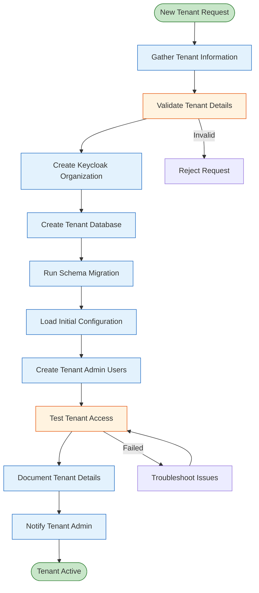
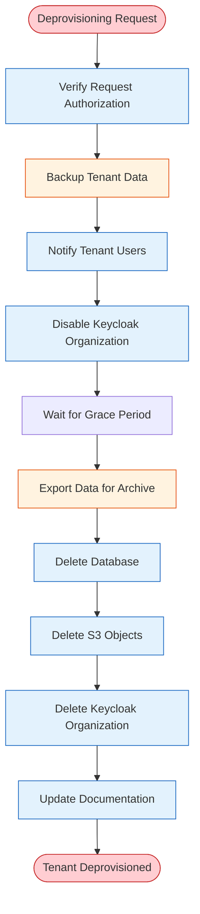

# Tenant Provisioning Guide

**Version:** 1.0
**Last Updated:** 2025-11-24
**Audience:** Platform Administrators, DevOps Engineers

## Overview

This guide provides detailed procedures for provisioning, managing, and deprovisioning tenants in the Fineract multi-tenant platform.

### Provisioning Workflow



---

## Prerequisites

### Required Access

- [ ] Kubernetes cluster admin access (kubectl configured)
- [ ] ArgoCD admin access
- [ ] Keycloak admin console access
- [ ] PostgreSQL RDS admin credentials
- [ ] AWS CLI configured (for S3 operations)
- [ ] Git repository write access

### Required Information

Before provisioning a tenant, collect the following information:

| Field | Description | Example | Required |
|-------|-------------|---------|----------|
| **Tenant ID** | Unique identifier (alphanumeric, lowercase, max 20 chars) | `acmebank` | ✅ |
| **Tenant Name** | Display name | `Acme Bank Ltd.` | ✅ |
| **Tenant Domain** | Subdomain for tenant | `acmebank.app.example.com` | ✅ |
| **Admin Email** | Primary admin email | `admin@acmebank.com` | ✅ |
| **Admin First Name** | Admin first name | `John` | ✅ |
| **Admin Last Name** | Admin last name | `Smith` | ✅ |
| **Timezone** | Tenant timezone | `America/New_York` | ✅ |
| **Currency** | Primary currency | `USD` | ✅ |
| **Country** | Operating country | `United States` | ✅ |
| **Tier** | Service tier (free/standard/enterprise) | `standard` | ❌ |
| **Storage Quota** | S3 storage limit (GB) | `100` | ❌ |
| **User Limit** | Max concurrent users | `50` | ❌ |

---

## Step-by-Step Provisioning

### Step 1: Validate Tenant Information

**Run validation script**:

```bash
# scripts/tenant-provisioning/validate-tenant-request.sh
#!/bin/bash
set -euo pipefail

# Usage: ./validate-tenant-request.sh <tenant_id> <tenant_name> <admin_email>

TENANT_ID="${1:-}"
TENANT_NAME="${2:-}"
ADMIN_EMAIL="${3:-}"

echo "🔍 Validating tenant request..."

# Validate tenant ID format
if ! [[ "$TENANT_ID" =~ ^[a-z0-9]{3,20}$ ]]; then
  echo "❌ Invalid Tenant ID: $TENANT_ID"
  echo "   Requirements:"
  echo "   - Lowercase letters and numbers only"
  echo "   - 3-20 characters"
  echo "   - No special characters, spaces, or underscores"
  exit 1
fi

# Check if tenant ID already exists in Keycloak
echo "🔍 Checking if tenant ID is available in Keycloak..."
kubectl port-forward -n fineract-dev svc/keycloak-service 8080:8080 &
KC_PF_PID=$!
sleep 3

ADMIN_TOKEN=$(curl -s -X POST "http://localhost:8080/auth/realms/master/protocol/openid-connect/token" \
  -H "Content-Type: application/x-www-form-urlencoded" \
  -d "username=admin" \
  -d "password=${KEYCLOAK_ADMIN_PASSWORD}" \
  -d "grant_type=password" \
  -d "client_id=admin-cli" | jq -r '.access_token')

ORG_EXISTS=$(curl -s -X GET "http://localhost:8080/auth/admin/realms/fineract/organizations/$TENANT_ID" \
  -H "Authorization: Bearer ${ADMIN_TOKEN}" \
  -w "%{http_code}" -o /dev/null)

kill $KC_PF_PID

if [ "$ORG_EXISTS" = "200" ]; then
  echo "❌ Tenant ID already exists in Keycloak: $TENANT_ID"
  exit 1
fi

# Check if database already exists
echo "🔍 Checking if database already exists..."
DB_HOST=$(kubectl get secret fineract-db-credentials -n fineract-dev -o jsonpath='{.data.host}' | base64 -d)
DB_USER=$(kubectl get secret fineract-db-credentials -n fineract-dev -o jsonpath='{.data.username}' | base64 -d)
DB_PASSWORD=$(kubectl get secret fineract-db-credentials -n fineract-dev -o jsonpath='{.data.password}' | base64 -d)

export PGPASSWORD="$DB_PASSWORD"
DB_EXISTS=$(psql -h "$DB_HOST" -U "$DB_USER" -d postgres -tAc \
  "SELECT 1 FROM pg_database WHERE datname='fineract_$TENANT_ID';")
unset PGPASSWORD

if [ "$DB_EXISTS" = "1" ]; then
  echo "❌ Database already exists: fineract_$TENANT_ID"
  exit 1
fi

# Validate email format
if ! [[ "$ADMIN_EMAIL" =~ ^[a-zA-Z0-9._%+-]+@[a-zA-Z0-9.-]+\.[a-zA-Z]{2,}$ ]]; then
  echo "❌ Invalid email format: $ADMIN_EMAIL"
  exit 1
fi

# Validate tenant name
if [ -z "$TENANT_NAME" ] || [ ${#TENANT_NAME} -lt 3 ]; then
  echo "❌ Tenant name must be at least 3 characters: $TENANT_NAME"
  exit 1
fi

echo "✅ Validation passed!"
echo ""
echo "Tenant Details:"
echo "  ID: $TENANT_ID"
echo "  Name: $TENANT_NAME"
echo "  Admin Email: $ADMIN_EMAIL"
echo "  Domain: $TENANT_ID.app.example.com"
echo "  Database: fineract_$TENANT_ID"
echo ""
echo "Ready to proceed with provisioning."
```

**Run validation**:
```bash
./scripts/tenant-provisioning/validate-tenant-request.sh acmebank "Acme Bank Ltd." "admin@acmebank.com"
```

### Step 2: Create Keycloak Organization

**Create organization via Keycloak Admin CLI**:

```bash
# scripts/tenant-provisioning/create-keycloak-organization.sh
#!/bin/bash
set -euo pipefail

# Usage: ./create-keycloak-organization.sh <tenant_id> <tenant_name>

TENANT_ID="${1:-}"
TENANT_NAME="${2:-}"
TENANT_DOMAIN="$TENANT_ID.app.example.com"

echo "🚀 Creating Keycloak organization: $TENANT_ID"

# Port-forward to Keycloak
kubectl port-forward -n fineract-dev svc/keycloak-service 8080:8080 &
KC_PF_PID=$!
sleep 3

# Get admin token
echo "🔑 Getting admin access token..."
ADMIN_TOKEN=$(curl -s -X POST "http://localhost:8080/auth/realms/master/protocol/openid-connect/token" \
  -H "Content-Type: application/x-www-form-urlencoded" \
  -d "username=admin" \
  -d "password=${KEYCLOAK_ADMIN_PASSWORD}" \
  -d "grant_type=password" \
  -d "client_id=admin-cli" | jq -r '.access_token')

if [ "$ADMIN_TOKEN" = "null" ] || [ -z "$ADMIN_TOKEN" ]; then
  echo "❌ Failed to get admin token"
  kill $KC_PF_PID
  exit 1
fi

# Create organization
echo "🏗️  Creating organization..."
ORG_RESPONSE=$(curl -s -X POST "http://localhost:8080/auth/admin/realms/fineract/organizations" \
  -H "Authorization: Bearer ${ADMIN_TOKEN}" \
  -H "Content-Type: application/json" \
  -w "\n%{http_code}" \
  -d '{
    "id": "'"$TENANT_ID"'",
    "name": "'"$TENANT_NAME"'",
    "description": "Organization for '"$TENANT_NAME"'",
    "enabled": true,
    "attributes": {
      "domain": ["'"$TENANT_DOMAIN"'"],
      "tier": ["standard"],
      "created_date": ["'"$(date -u +%Y-%m-%dT%H:%M:%SZ)"'"]
    }
  }')

HTTP_CODE=$(echo "$ORG_RESPONSE" | tail -n1)
RESPONSE_BODY=$(echo "$ORG_RESPONSE" | sed '$d')

if [ "$HTTP_CODE" = "201" ] || [ "$HTTP_CODE" = "204" ]; then
  echo "✅ Organization created successfully!"
  echo ""
  echo "Organization Details:"
  echo "  ID: $TENANT_ID"
  echo "  Name: $TENANT_NAME"
  echo "  Domain: $TENANT_DOMAIN"
  echo "  Status: Enabled"
else
  echo "❌ Failed to create organization (HTTP $HTTP_CODE)"
  echo "$RESPONSE_BODY"
  kill $KC_PF_PID
  exit 1
fi

# Clean up
kill $KC_PF_PID
```

**Run organization creation**:
```bash
export KEYCLOAK_ADMIN_PASSWORD=$(kubectl get secret keycloak-admin -n fineract-dev -o jsonpath='{.data.password}' | base64 -d)
./scripts/tenant-provisioning/create-keycloak-organization.sh acmebank "Acme Bank Ltd."
```

### Step 3: Create Tenant Database

**Run database creation script**:
```bash
./scripts/tenant-provisioning/create-tenant-database.sh acmebank
```

**Expected output**:
```
🚀 Creating database for tenant: acmebank
📝 Getting database credentials...
🔍 Checking if database exists...
🏗️  Creating database fineract_acmebank...
CREATE DATABASE
GRANT
📋 Registering tenant in metadata database...
INSERT 0 1
✅ Database created successfully!

Database Details:
  Name: fineract_acmebank
  Size: 8192 kB
  Host: fineract-dev-rds.c9x...rds.amazonaws.com
  Port: 5432

Next steps:
  1. Run schema migration: ./run-tenant-schema-migration.sh acmebank
  2. Load initial data: ./load-tenant-data.sh acmebank
  3. Create Keycloak organization: acmebank
```

### Step 4: Run Schema Migration

**Run Liquibase schema migration**:
```bash
./scripts/tenant-provisioning/run-tenant-schema-migration.sh acmebank
```

**Expected output**:
```
🚀 Running schema migration for tenant: acmebank
📦 Using Fineract image: fineract:latest
🏗️  Creating Liquibase migration job...
job.batch/schema-migration-acmebank created
⏳ Waiting for migration to complete...
job.batch/schema-migration-acmebank condition met
📋 Migration logs:
Starting Liquibase migration for tenant: acmebank
Database: fineract_acmebank
Liquibase: Update has been successful.
✅ Migration completed successfully

✅ Schema migration completed successfully for tenant: acmebank

Database Statistics:
  Tables created: 156
  Expected: ~150 tables
```

**Verify schema**:
```bash
# Count tables
kubectl run -it --rm psql-client --image=postgres:15-alpine --restart=Never -- psql \
  -h $(kubectl get secret fineract-db-credentials -n fineract-dev -o jsonpath='{.data.host}' | base64 -d) \
  -U $(kubectl get secret fineract-db-credentials -n fineract-dev -o jsonpath='{.data.username}' | base64 -d) \
  -d fineract_acmebank \
  -c "SELECT schemaname, COUNT(*) as table_count FROM pg_tables WHERE schemaname='public' GROUP BY schemaname;"

# Expected: ~150-160 tables
```

### Step 5: Load Initial Configuration

**Create tenant configuration file**:

```yaml
# operations/fineract-config/tenants/acmebank-config.yml
tenant: acmebank

systemConfig:
  currency:
    code: USD
    name: US Dollar
    decimalPlaces: 2
    inMultiplesOf: 0
    displaySymbol: "$"
    nameCode: "currency.USD"

  workingDays:
    recurrence: "FREQ=WEEKLY;BYDAY=MO,TU,WE,TH,FR"
    repaymentRescheduleType: "MOVE_TO_NEXT_WORKING_DAY"
    extendTermForDailyRepayments: true

  globalConfig:
    - name: maker-checker
      enabled: true
    - name: enable-business-date
      enabled: true
    - name: enable-postdated-checks
      enabled: false
    - name: enable-address
      enabled: true
    - name: sub-rates
      enabled: false
    - name: reschedule-future-repayments
      enabled: true

  codes:
    - name: Gender
      systemDefined: false
      values:
        - name: Male
          position: 1
        - name: Female
          position: 2
        - name: Other
          position: 3

    - name: ClientType
      systemDefined: false
      values:
        - name: Individual
          position: 1
        - name: Corporate
          position: 2

    - name: MaritalStatus
      systemDefined: false
      values:
        - name: Single
          position: 1
        - name: Married
          position: 2
        - name: Divorced
          position: 3

offices:
  - name: Head Office
    externalId: "HO001"
    openingDate: "2025-01-24"
    dateFormat: "yyyy-MM-dd"
    locale: "en"

roles:
  - name: Super User
    description: "Super user role with full system access"

  - name: Admin
    description: "Administrator role with management access"

  - name: Loan Officer
    description: "Loan officer with client and loan management"

users:
  - username: "admin"
    firstname: "System"
    lastname: "Administrator"
    email: "admin@acmebank.com"
    password: "${ADMIN_PASSWORD}"
    officeId: 1
    roles:
      - "Super User"
    sendPasswordToEmail: false
```

**Load configuration**:

```bash
# scripts/tenant-provisioning/load-tenant-config.sh
#!/bin/bash
set -euo pipefail

# Usage: ./load-tenant-config.sh <tenant_id> <config_file>

TENANT_ID="${1:-}"
CONFIG_FILE="${2:-operations/fineract-config/tenants/${TENANT_ID}-config.yml}"

if [ ! -f "$CONFIG_FILE" ]; then
  echo "❌ Config file not found: $CONFIG_FILE"
  exit 1
fi

echo "🚀 Loading configuration for tenant: $TENANT_ID"
echo "📄 Config file: $CONFIG_FILE"

# Get Fineract credentials
FINERACT_URL="https://${TENANT_ID}.app.example.com/fineract-provider"

# Generate admin password
ADMIN_PASSWORD=$(openssl rand -base64 24)

# Substitute variables in config
export ADMIN_PASSWORD
envsubst < "$CONFIG_FILE" > "/tmp/${TENANT_ID}-config-final.yml"

# Upload config using fineract-config-cli
echo "📤 Uploading configuration..."

kubectl run -it --rm fineract-config-loader \
  --image=ghcr.io/adorsys-gis/fineract-config-cli:latest \
  --restart=Never \
  --env="FINERACT_BASE_URL=${FINERACT_URL}" \
  --env="FINERACT_TENANT_ID=${TENANT_ID}" \
  --env="FINERACT_USERNAME=mifos" \
  --env="FINERACT_PASSWORD=password" \
  -- load --config-file "/config/${TENANT_ID}-config-final.yml"

echo "✅ Configuration loaded successfully!"
echo ""
echo "⚠️  IMPORTANT: Save admin password securely!"
echo "Admin Password: $ADMIN_PASSWORD"
```

**Run configuration load**:
```bash
./scripts/tenant-provisioning/load-tenant-config.sh acmebank

# Save admin password to secure location (e.g., 1Password, Vault)
```

### Step 6: Create Tenant Admin User in Keycloak

**Create admin user script**:

```bash
# scripts/tenant-provisioning/create-tenant-admin-user.sh
#!/bin/bash
set -euo pipefail

# Usage: ./create-tenant-admin-user.sh <tenant_id> <admin_email> <first_name> <last_name>

TENANT_ID="${1:-}"
ADMIN_EMAIL="${2:-}"
FIRST_NAME="${3:-}"
LAST_NAME="${4:-}"

USERNAME="admin@${TENANT_ID}"
TEMP_PASSWORD=$(openssl rand -base64 16)

echo "🚀 Creating admin user for tenant: $TENANT_ID"

# Port-forward to Keycloak
kubectl port-forward -n fineract-dev svc/keycloak-service 8080:8080 &
KC_PF_PID=$!
sleep 3

# Get admin token
ADMIN_TOKEN=$(curl -s -X POST "http://localhost:8080/auth/realms/master/protocol/openid-connect/token" \
  -H "Content-Type: application/x-www-form-urlencoded" \
  -d "username=admin" \
  -d "password=${KEYCLOAK_ADMIN_PASSWORD}" \
  -d "grant_type=password" \
  -d "client_id=admin-cli" | jq -r '.access_token')

# Create user
echo "👤 Creating user: $USERNAME"
USER_RESPONSE=$(curl -s -X POST "http://localhost:8080/auth/admin/realms/fineract/users" \
  -H "Authorization: Bearer ${ADMIN_TOKEN}" \
  -H "Content-Type: application/json" \
  -w "\n%{http_code}" \
  -d '{
    "username": "'"$USERNAME"'",
    "email": "'"$ADMIN_EMAIL"'",
    "emailVerified": true,
    "enabled": true,
    "firstName": "'"$FIRST_NAME"'",
    "lastName": "'"$LAST_NAME"'",
    "attributes": {
      "fineract_user_id": ["1"],
      "office_id": ["1"],
      "employee_id": ["EMP001"]
    }
  }')

HTTP_CODE=$(echo "$USER_RESPONSE" | tail -n1)

if [ "$HTTP_CODE" != "201" ]; then
  echo "❌ Failed to create user (HTTP $HTTP_CODE)"
  kill $KC_PF_PID
  exit 1
fi

# Get user ID from Location header
USER_ID=$(curl -s -X GET "http://localhost:8080/auth/admin/realms/fineract/users?username=$USERNAME" \
  -H "Authorization: Bearer ${ADMIN_TOKEN}" | jq -r '.[0].id')

# Set password
echo "🔑 Setting password..."
curl -s -X PUT "http://localhost:8080/auth/admin/realms/fineract/users/$USER_ID/reset-password" \
  -H "Authorization: Bearer ${ADMIN_TOKEN}" \
  -H "Content-Type: application/json" \
  -d '{
    "type": "password",
    "value": "'"$TEMP_PASSWORD"'",
    "temporary": true
  }'

# Assign SUPER_USER role
echo "👑 Assigning SUPER_USER role..."
ROLE_ID=$(curl -s -X GET "http://localhost:8080/auth/admin/realms/fineract/roles/SUPER_USER" \
  -H "Authorization: Bearer ${ADMIN_TOKEN}" | jq -r '.id')

curl -s -X POST "http://localhost:8080/auth/admin/realms/fineract/users/$USER_ID/role-mappings/realm" \
  -H "Authorization: Bearer ${ADMIN_TOKEN}" \
  -H "Content-Type: application/json" \
  -d '[
    {
      "id": "'"$ROLE_ID"'",
      "name": "SUPER_USER"
    }
  ]'

# Add user to organization
echo "🏢 Adding user to organization: $TENANT_ID"
curl -s -X PUT "http://localhost:8080/auth/admin/realms/fineract/organizations/$TENANT_ID/members/$USER_ID" \
  -H "Authorization: Bearer ${ADMIN_TOKEN}"

kill $KC_PF_PID

echo "✅ Admin user created successfully!"
echo ""
echo "User Details:"
echo "  Username: $USERNAME"
echo "  Email: $ADMIN_EMAIL"
echo "  Temporary Password: $TEMP_PASSWORD"
echo "  Login URL: https://$TENANT_ID.app.example.com"
echo ""
echo "⚠️  IMPORTANT: Send temporary password to admin via secure channel"
echo "⚠️  User must change password on first login"
```

**Run user creation**:
```bash
./scripts/tenant-provisioning/create-tenant-admin-user.sh acmebank "admin@acmebank.com" "John" "Smith"
```

### Step 7: Test Tenant Access

**Automated test script**:

```bash
# scripts/tenant-provisioning/test-tenant-access.sh
#!/bin/bash
set -euo pipefail

# Usage: ./test-tenant-access.sh <tenant_id> <username> <password>

TENANT_ID="${1:-}"
USERNAME="${2:-}"
PASSWORD="${3:-}"

TENANT_URL="https://${TENANT_ID}.app.example.com"
KEYCLOAK_URL="https://auth.example.com/auth/realms/fineract"

echo "🧪 Testing tenant access: $TENANT_ID"
echo ""

# Test 1: DNS resolution
echo "1️⃣  Testing DNS resolution..."
if host "${TENANT_ID}.app.example.com" > /dev/null 2>&1; then
  echo "   ✅ DNS resolves correctly"
else
  echo "   ❌ DNS resolution failed"
  exit 1
fi

# Test 2: TLS certificate
echo "2️⃣  Testing TLS certificate..."
if curl -sSf --head "${TENANT_URL}/fineract-provider/actuator/health" > /dev/null 2>&1; then
  echo "   ✅ TLS certificate valid"
else
  echo "   ❌ TLS certificate invalid or endpoint unreachable"
  exit 1
fi

# Test 3: Get OAuth2 token
echo "3️⃣  Testing OAuth2 authentication..."
TOKEN_RESPONSE=$(curl -s -X POST "${KEYCLOAK_URL}/protocol/openid-connect/token" \
  -H "Content-Type: application/x-www-form-urlencoded" \
  -d "username=$USERNAME" \
  -d "password=$PASSWORD" \
  -d "grant_type=password" \
  -d "client_id=fineract-oauth2-proxy" \
  -d "client_secret=${OAUTH2_PROXY_CLIENT_SECRET}")

ACCESS_TOKEN=$(echo "$TOKEN_RESPONSE" | jq -r '.access_token')

if [ "$ACCESS_TOKEN" = "null" ] || [ -z "$ACCESS_TOKEN" ]; then
  echo "   ❌ Failed to get access token"
  echo "   Error: $(echo "$TOKEN_RESPONSE" | jq -r '.error_description')"
  exit 1
fi
echo "   ✅ OAuth2 token obtained"

# Test 4: Verify JWT claims
echo "4️⃣  Testing JWT claims..."
JWT_PAYLOAD=$(echo "$ACCESS_TOKEN" | cut -d'.' -f2 | base64 -d 2>/dev/null)
JWT_TENANT=$(echo "$JWT_PAYLOAD" | jq -r '.tenant')

if [ "$JWT_TENANT" = "$TENANT_ID" ]; then
  echo "   ✅ JWT tenant claim correct: $JWT_TENANT"
else
  echo "   ❌ JWT tenant claim mismatch. Expected: $TENANT_ID, Got: $JWT_TENANT"
  exit 1
fi

# Test 5: API call (list offices)
echo "5️⃣  Testing Fineract API..."
API_RESPONSE=$(curl -s -X GET "${TENANT_URL}/fineract-provider/api/v1/offices" \
  -H "Authorization: Bearer $ACCESS_TOKEN" \
  -H "X-Fineract-Platform-TenantId: $TENANT_ID" \
  -w "\n%{http_code}")

HTTP_CODE=$(echo "$API_RESPONSE" | tail -n1)
RESPONSE_BODY=$(echo "$API_RESPONSE" | sed '$d')

if [ "$HTTP_CODE" = "200" ]; then
  OFFICE_COUNT=$(echo "$RESPONSE_BODY" | jq '. | length')
  echo "   ✅ Fineract API accessible (found $OFFICE_COUNT offices)"
else
  echo "   ❌ Fineract API call failed (HTTP $HTTP_CODE)"
  echo "   Response: $RESPONSE_BODY"
  exit 1
fi

# Test 6: Database connectivity
echo "6️⃣  Testing database connectivity..."
DB_HOST=$(kubectl get secret fineract-db-credentials -n fineract-dev -o jsonpath='{.data.host}' | base64 -d)
DB_USER=$(kubectl get secret fineract-db-credentials -n fineract-dev -o jsonpath='{.data.username}' | base64 -d)
DB_PASSWORD=$(kubectl get secret fineract-db-credentials -n fineract-dev -o jsonpath='{.data.password}' | base64 -d)

export PGPASSWORD="$DB_PASSWORD"
TABLE_COUNT=$(psql -h "$DB_HOST" -U "$DB_USER" -d "fineract_$TENANT_ID" -tAc \
  "SELECT COUNT(*) FROM information_schema.tables WHERE table_schema='public';")
unset PGPASSWORD

if [ "$TABLE_COUNT" -gt 100 ]; then
  echo "   ✅ Database accessible ($TABLE_COUNT tables)"
else
  echo "   ❌ Database has too few tables: $TABLE_COUNT"
  exit 1
fi

echo ""
echo "✅ All tests passed! Tenant is fully operational."
echo ""
echo "Tenant Summary:"
echo "  Tenant ID: $TENANT_ID"
echo "  URL: $TENANT_URL"
echo "  Database: fineract_$TENANT_ID"
echo "  Tables: $TABLE_COUNT"
echo "  Offices: $OFFICE_COUNT"
echo "  Status: ✅ Active"
```

**Run tests**:
```bash
export OAUTH2_PROXY_CLIENT_SECRET=$(kubectl get secret oauth2-proxy-secrets -n fineract-dev -o jsonpath='{.data.client-secret}' | base64 -d)
./scripts/tenant-provisioning/test-tenant-access.sh acmebank "admin@acmebank" "TempPassword123!"
```

### Step 8: Document Tenant Details

**Create tenant record**:

```bash
# docs/tenants/acmebank.md
# Tenant: Acme Bank Ltd.

**Status:** ✅ Active
**Provisioned:** 2025-11-24
**Tier:** Standard

## Details

| Field | Value |
|-------|-------|
| **Tenant ID** | `acmebank` |
| **Tenant Name** | Acme Bank Ltd. |
| **Domain** | https://acmebank.app.example.com |
| **Database** | `fineract_acmebank` |
| **Organization ID** | `acmebank` (Keycloak) |
| **Timezone** | America/New_York |
| **Currency** | USD |
| **Country** | United States |

## Resources

| Resource | Value | Limit |
|----------|-------|-------|
| **Database Size** | 42 MB | 10 GB |
| **S3 Storage** | 0 MB | 100 GB |
| **Users** | 1 | 50 |
| **Concurrent Connections** | 15 | 15 |

## Admin Contacts

| Name | Email | Role |
|------|-------|------|
| John Smith | admin@acmebank.com | Primary Admin |

## Configuration

- **Maker-Checker:** Enabled
- **Business Date:** Enabled
- **Postdated Checks:** Disabled
- **Address Module:** Enabled

## Operational Notes

- Initial configuration loaded: 2025-11-24
- Schema version: 1.0.0 (Fineract latest)
- Data migration: None (new tenant)
- Special requirements: None

## Access Credentials

⚠️ Stored securely in 1Password vault: `Fineract-Tenants/acmebank`

## Monitoring

- **Grafana Dashboard:** https://grafana.example.com/d/fineract-tenant?var-tenant=acmebank
- **Logs:** CloudWatch Logs Insights - Filter: `tenant="acmebank"`
- **Alerts:** Slack channel: `#fineract-acmebank-alerts`

## Support

- **Support Tier:** Standard (Business hours, 8h SLA)
- **Support Email:** support@example.com
- **Escalation:** Platform team via PagerDuty

---

**Last Updated:** 2025-11-24
**Updated By:** platform-admin
```

**Commit to repository**:
```bash
git add docs/tenants/acmebank.md
git commit -m "docs: add tenant record for acmebank"
git push origin main
```

### Step 9: Notify Tenant Admin

**Send welcome email** (template):

```
Subject: Welcome to Fineract Platform - Acme Bank Account Activated

Dear John Smith,

Your Acme Bank tenant has been successfully provisioned on the Fineract platform!

Account Details:
- Tenant Name: Acme Bank Ltd.
- Login URL: https://acmebank.app.example.com
- Username: admin@acmebank
- Temporary Password: [See secure attachment]

Getting Started:
1. Navigate to the login URL above
2. Enter your username and temporary password
3. You will be prompted to set a new password
4. After login, you can start configuring your banking products

Resources:
- User Guide: https://docs.example.com/user-guide
- API Documentation: https://acmebank.app.example.com/fineract-provider/api-docs
- Support: support@example.com

Your Plan:
- Tier: Standard
- Storage: 100 GB
- Users: Up to 50 concurrent users
- Support: Business hours, 8-hour SLA

Need Help?
- Email: support@example.com
- Knowledge Base: https://docs.example.com

Best regards,
Fineract Platform Team
```

---

## Tenant Management Operations

### Adding Additional Users

**Create additional user in Keycloak**:
```bash
./scripts/tenant-management/add-user.sh acmebank "john.doe@acmebank.com" "John" "Doe" "LOAN_OFFICER"
```

### Updating Tenant Configuration

**Modify tenant configuration**:
```bash
# Edit configuration file
vim operations/fineract-config/tenants/acmebank-config.yml

# Reload configuration
./scripts/tenant-provisioning/load-tenant-config.sh acmebank
```

### Monitoring Tenant Usage

**Check database size**:
```bash
./scripts/tenant-management/check-tenant-usage.sh acmebank
```

**Output**:
```
Tenant: acmebank
Database Size: 245 MB / 10 GB (2.45%)
S3 Storage: 1.2 GB / 100 GB (1.2%)
Active Users: 12 / 50 (24%)
Database Connections: 8 / 15 (53%)
```

### Scaling Tenant Resources

**Increase database connection pool**:
```yaml
# apps/fineract/overlays/tenants/acmebank/deployment-patch.yaml
apiVersion: apps/v1
kind: Deployment
metadata:
  name: fineract-write
spec:
  template:
    spec:
      containers:
        - name: fineract
          env:
            - name: FINERACT_HIKARI_MAXIMUM_POOL_SIZE
              value: "25"  # Increased from 15
```

---

## Tenant Deprovisioning

### Deprovisioning Workflow



### Deprovisioning Steps

**Step 1: Backup tenant data**:
```bash
./scripts/tenant-management/backup-tenant.sh acmebank
```

**Step 2: Disable organization**:
```bash
./scripts/tenant-management/disable-tenant.sh acmebank
```

**Step 3: Export data**:
```bash
./scripts/tenant-management/export-tenant-data.sh acmebank
```

**Step 4: Delete tenant** (after grace period):
```bash
./scripts/tenant-management/delete-tenant.sh acmebank
```

---

## Troubleshooting

### Issue: JWT token missing tenant claim

**Diagnosis**:
```bash
# Get token
TOKEN=$(curl -s ... | jq -r '.access_token')

# Decode JWT
echo $TOKEN | cut -d'.' -f2 | base64 -d | jq .

# Check for 'tenant' claim
```

**Solution**:
- Verify user is member of organization in Keycloak
- Check protocol mapper configuration
- Ensure organization ID matches tenant ID

### Issue: Database connection failed

**Diagnosis**:
```bash
# Test database connection
kubectl run -it --rm psql-test --image=postgres:15-alpine --restart=Never -- psql \
  -h $DB_HOST -U $DB_USER -d fineract_acmebank -c "SELECT 1;"
```

**Solution**:
- Verify database exists
- Check security group rules
- Verify credentials in secret

### Issue: 403 Forbidden on API calls

**Diagnosis**:
- Check Fineract logs for tenant resolution
- Verify JWT tenant claim matches subdomain
- Check user permissions in Fineract database

**Solution**:
- Ensure user has appropriate roles
- Verify tenant identifier in JWT and header match
- Check Fineract user permissions

---

## Checklist: New Tenant Provisioning

Use this checklist for each new tenant:

- [ ] **Pre-Provisioning**
  - [ ] Tenant information collected
  - [ ] Tenant ID validated (unique, correct format)
  - [ ] Admin email validated
  - [ ] Approval obtained

- [ ] **Keycloak**
  - [ ] Organization created
  - [ ] Admin user created
  - [ ] User assigned to organization
  - [ ] Roles assigned
  - [ ] JWT token tested (contains tenant claim)

- [ ] **Database**
  - [ ] Tenant database created
  - [ ] Schema migration completed successfully
  - [ ] Tenant registered in metadata database
  - [ ] Database size verified (> 100 tables)

- [ ] **Configuration**
  - [ ] Configuration file created
  - [ ] System configuration loaded
  - [ ] Offices created
  - [ ] Roles created
  - [ ] Admin user created in Fineract

- [ ] **Testing**
  - [ ] DNS resolution verified
  - [ ] TLS certificate valid
  - [ ] OAuth2 flow successful
  - [ ] API calls successful
  - [ ] Database isolation verified
  - [ ] S3 access working

- [ ] **Documentation**
  - [ ] Tenant record created
  - [ ] Credentials stored securely
  - [ ] Monitoring configured
  - [ ] Committed to repository

- [ ] **Notification**
  - [ ] Welcome email sent
  - [ ] Credentials delivered securely
  - [ ] Training scheduled (if applicable)

---

## Summary

This guide covers the complete tenant lifecycle:

1. **Provisioning**: From request to active tenant (Steps 1-9)
2. **Management**: Day-to-day operations (adding users, monitoring)
3. **Deprovisioning**: Safe tenant removal with backups

**Time to Provision New Tenant**: 30-60 minutes (manual) or 5-10 minutes (automated)

**Next Steps**:
- Review scripts in `scripts/tenant-provisioning/`
- Set up monitoring dashboards
- Configure alerting rules
- Test disaster recovery procedures

---

**Document Version:** 1.0
**Last Updated:** 2025-11-24
**Status:** Ready for Use
