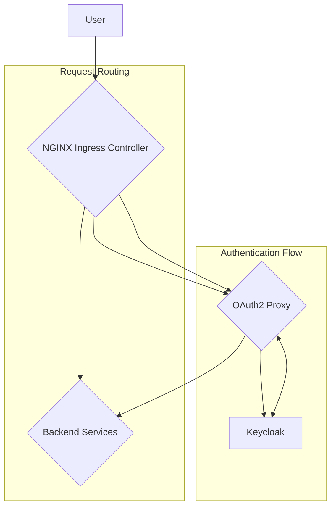

# Authentication and Routing

This document provides a detailed overview of the authentication and request routing mechanisms implemented in this GitOps repository.

## High-Level Architecture

The following diagram illustrates how user requests are processed, from the initial ingress to the backend services:

**Flow Description:**

1.  All incoming HTTPS requests are received by the **NGINX Ingress Controller**.
2.  The Ingress is configured to delegate authentication to **OAuth2 Proxy** for all protected endpoints.
3.  **OAuth2 Proxy** integrates with **Keycloak** using the OpenID Connect (OIDC) protocol to authenticate users.
4.  Once a user is authenticated, OAuth2 Proxy forwards the request, along with authentication headers (e.g., `X-Auth-Request-User`), to the appropriate backend service.

---

## Authentication Flow

The authentication process is as follows:

1.  **Initial Request:** An unauthenticated user attempts to access a protected endpoint (e.g., `https://apps.fineract.example.com/fineract-provider`).
2.  **Authentication Delegation:** The NGINX Ingress Controller intercepts the request and triggers the `auth-url` annotation, forwarding the request to the OAuth2 Proxy service.
3.  **Redirect to Keycloak:** OAuth2 Proxy determines that the user is not authenticated and redirects them to the Keycloak login page.
4.  **User Login:** The user enters their credentials in Keycloak.
5.  **OIDC Callback:** After a successful login, Keycloak redirects the user back to the OAuth2 Proxy callback URL (`/oauth2/callback`).
6.  **Session Creation:** OAuth2 Proxy validates the OIDC token from Keycloak, creates an encrypted session cookie (`_oauth2_proxy`), and stores the session information in Redis.
7.  **Authenticated Redirect:** The user is redirected back to the original URL they requested.
8.  **Authenticated Access:** The browser now has the session cookie. For all subsequent requests, the NGINX Ingress Controller validates the cookie with OAuth2 Proxy, and if valid, forwards the request to the backend service.

---

## Component Configuration

### `fineract-oauth2-ingress.yaml`

This Ingress manifest is the entry point for all authenticated traffic. Key annotations include:

-   `nginx.ingress.kubernetes.io/auth-url`: Specifies the internal service URL of OAuth2 Proxy for validating authentication.
-   `nginx.ingress.kubernetes.io/auth-signin`: The URL to redirect unauthenticated users to, which points to the OAuth2 Proxy start endpoint.
-   `nginx.ingress.kubernetes.io/auth-response-headers`: A list of headers to pass from OAuth2 Proxy to the backend services, containing user information.
-   `nginx.ingress.kubernetes.io/configuration-snippet`: Contains custom NGINX configuration for advanced routing logic based on the request method and path.

### `oauth2-proxy`

The OAuth2 Proxy deployment is configured with the following key environment variables:

-   `OAUTH2_PROXY_CLIENT_ID` & `OAUTH2_PROXY_CLIENT_SECRET`: The OIDC client credentials for communicating with Keycloak.
-   `OAUTH2_PROXY_COOKIE_SECRET`: A secret key used to encrypt the user's session cookie.
-   `OAUTH2_PROXY_REDIS_CONNECTION_URL`: The connection URL for the Redis instance used for session storage.
-   The configuration file `/etc/oauth2-proxy/oauth2_proxy.cfg` contains the OIDC provider details and other settings.

---

## Troubleshooting Guide

### Redirect Loops

-   **Symptom:** The browser gets stuck in a loop of redirects between the application and Keycloak.
-   **Cause:** Often caused by misconfigured `cookie_domain` or `whitelist_domain` in the OAuth2 Proxy configuration. Ensure that the cookie domain is set correctly for your Ingress host.
-   **Troubleshooting:** Check the logs for the `oauth2-proxy` pod for any error messages related to domain mismatches.

### 401 Unauthorized / 403 Forbidden Errors

-   **Symptom:** Users are unable to access the application and receive a 401 or 403 error page.
-   **Cause:**
    -   The user's role does not grant them access to the requested resource.
    -   The `auth-response-headers` are not being correctly passed to the backend service.
    -   The RBAC logic in the `configuration-snippet` is denying access.
-   **Troubleshooting:**
    -   Verify the user's roles in Keycloak.
    -   Inspect the NGINX Ingress Controller logs to see the headers being sent to the backend.
    -   Temporarily disable the RBAC check in the `configuration-snippet` to isolate the issue.
