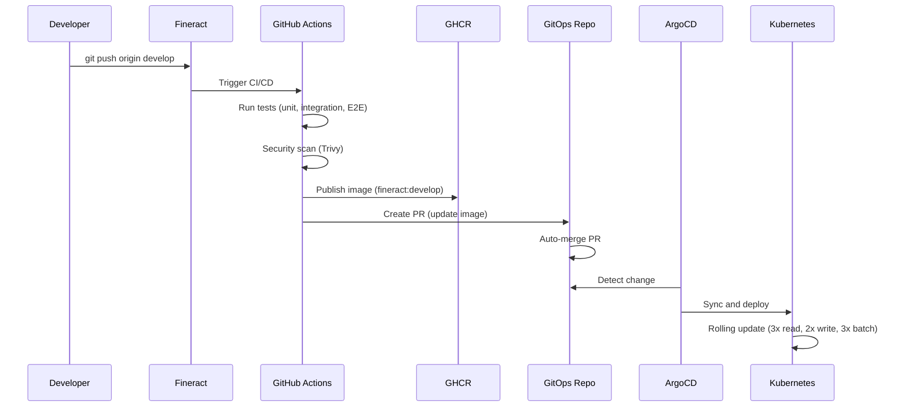
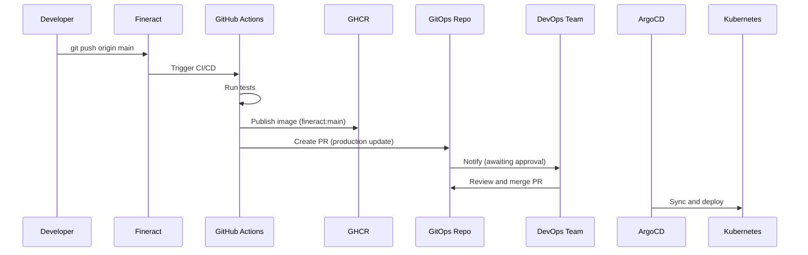
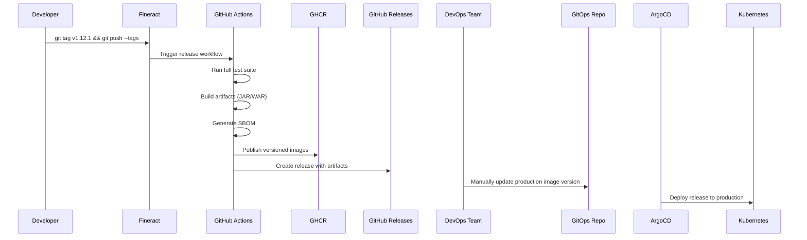

# Fineract CI/CD Integration Guide

Complete guide for the integrated CI/CD pipeline between Fineract source repository and this GitOps repository.

## Overview

This GitOps repository is integrated with the Fineract source repository to provide **fully automated continuous deployment** from code commit to Kubernetes.

```
┌──────────────────────────────────────────────────────────────────────┐
│                    Developer Workflow                                 │
│                                                                       │
│  Developer → Commits to Fineract → CI Tests → Build Image →         │
│              Auto-update GitOps → ArgoCD Sync → Deploy to K8s        │
│                                                                       │
└──────────────────────────────────────────────────────────────────────┘
```

---

## Architecture

### Repository Structure

**Fineract Source Repository** (`ADORSYS-GIS/fineract`):
- Application source code
- CI/CD workflows (`.github/workflows/`)
- Builds and publishes Docker images
- Creates PRs in GitOps repo

**GitOps Repository** (this repo, `ADORSYS-GIS/fineract-gitops`):
- Kubernetes manifests
- Environment configurations
- Deployment profiles
- ArgoCD applications

### Integration Points

| Fineract Branch | GitOps Environment | Deployment Type |
|-----------------|-------------------|-----------------|
| `develop` | `environments/dev/` | Automatic (auto-merge PR) |
| `main` | `environments/production/` | Manual (requires approval) |
| `v*.*.*` tags | Release artifacts | Manual (production upgrade) |

---

## Complete Workflow

### Development Workflow (develop branch)



**Timeline**: ~15-20 minutes from commit to deployment

**Steps**:
1. **Developer commits** to Fineract `develop` branch
2. **CI tests run** (`ci-build-and-test.yml`):
   - Unit tests
   - Integration tests (PostgreSQL + MySQL)
   - E2E tests
   - Security scanning
   - Code quality checks
3. **Image published** (`publish-images.yml`):
   - Build multi-arch image (AMD64 + ARM64)
   - Push to `ghcr.io/adorsys-gis/fineract:develop`
   - Tag with commit SHA
4. **GitOps update** (`update-gitops-repo.yml`):
   - Clone this GitOps repository
   - Create branch: `ci/update-fineract-image-{sha}`
   - Update `environments/dev/fineract-image-version.yaml`
   - Create Pull Request
   - **Auto-merge** (dev environment only)
5. **ArgoCD sync**:
   - Detects change in GitOps repo
   - Syncs to Kubernetes cluster
   - Performs rolling update of all Fineract pods

**Result**: Latest develop code deployed to dev environment automatically

---

### Production Workflow (main branch)



**Timeline**: Manual approval required

**Differences from develop**:
- ❌ No auto-merge (safety for production)
- ✅ Requires manual PR review and approval
- ✅ Production environment updates only after approval

---

### Release Workflow (version tags)



**Artifacts Created**:
- Docker images: `ghcr.io/adorsys-gis/fineract:1.12.1` (recommended for production), `ghcr.io/adorsys-gis/fineract:latest` (for development/testing only, **not for production**)
- JAR file: `fineract-provider-1.12.1.jar`
- WAR file: `fineract-war-1.12.1.war`
- SBOM: `sbom.spdx.json` (Software Bill of Materials)
- Checksums: `SHA256SUMS.txt`

---

## Image Version Management

### How Images Are Managed

Images are referenced in two places:

**1. Base Deployments** (`apps/fineract/base/deployment-*.yaml`):
```yaml
containers:
- name: fineract
  image: ghcr.io/adorsys-gis/fineract:develop  # Base default
```

**2. Environment Overlays** (`environments/{env}/fineract-image-version.yaml`):
```yaml
images:
  - name: ghcr.io/adorsys-gis/fineract
    newTag: develop  # Override with environment-specific tag
```

### Environment-Specific Versions

#### Dev Environment

**File**: `environments/dev/fineract-image-version.yaml`

```yaml
images:
  - name: ghcr.io/adorsys-gis/fineract
    newTag: develop  # Auto-updated by CI/CD
```

**Update Strategy**:
- ✅ Auto-updated on every `develop` branch merge
- ✅ Always uses latest `develop` tag
- ✅ CI/CD creates and auto-merges PRs

---

#### UAT Environment

**File**: `environments/uat/fineract-image-version.yaml`

```yaml
images:
  - name: ghcr.io/adorsys-gis/fineract
    newTag: a1b2c3d  # Specific tested commit SHA
```

**Update Strategy**:
- ⏸️ Manual updates only
- ✅ Use specific commit SHA for reproducibility
- ✅ Test thoroughly before promoting to production

How to Update:

To promote a tested commit from the `develop` branch to the UAT environment, use the `promote-to-uat.sh` script:

```bash
# 1. Identify the tested commit SHA from the dev environment or Fineract repository logs
git log --oneline develop | head -5

# 2. Run the promotion script with the desired commit SHA
./scripts/promote-to-uat.sh <commit_sha>

# Example:
./scripts/promote-to-uat.sh a1b2c3d
```

This script will:
1.  Update `environments/uat/fineract-image-version.yaml` with the specified commit SHA.
2.  Create a new branch.
3.  Commit the change.
4.  Push the new branch to the GitOps repository.
5.  Create a pull request to merge the changes into the `main` branch.

After the pull request is merged, ArgoCD will detect the change and deploy the new image version to the UAT environment.

---

#### Production Environment

**File**: `environments/production/fineract-image-version.yaml`

```yaml
images:
  - name: ghcr.io/adorsys-gis/fineract
    newTag: 1.12.1  # Specific release version
```

**Update Strategy**:
- ⏸️ Manual updates ONLY
- ✅ Use semantic versioned releases (e.g., `1.12.1`)
- ✅ Requires approval and change management
- ❌ Never use `develop`, `main`, or `latest` tags

**How to Update**:

To promote a new release to the production environment, use the `promote-to-prod.sh` script:

```bash
# 1. Ensure the release exists in GitHub
# Check: https://github.com/ADORSYS-GIS/fineract/releases

# 2. Run the promotion script with the desired release version
./scripts/promote-to-prod.sh <release_version>

# Example:
./scripts/promote-to-prod.sh 1.12.1
```

This script will:
1.  Update `environments/production/fineract-image-version.yaml` with the specified release version.
2.  Create a new branch.
3.  Commit the change.
4.  Push the new branch to the GitOps repository.
5.  Create a pull request to merge the changes into the `main` branch.

After the pull request is reviewed, approved, and merged, ArgoCD will detect the change and deploy the new release to the production environment.

---

## Setup Instructions

### Prerequisites

✅ Fineract repository: `ADORSYS-GIS/fineract`
✅ GitOps repository: `ADORSYS-GIS/fineract-gitops` (this repo)
✅ GitHub Container Registry (GHCR) access
✅ ArgoCD installed and configured

### Step 1: Configure GitHub App for GitOps Authentication

For enhanced security, the CI/CD pipeline uses a GitHub App to authenticate and create pull requests in this GitOps repository. This method is more secure than using a Personal Access Token (PAT) because it provides more granular permissions and does not rely on a personal account.

#### 1. Create the GitHub App

1.  **Navigate to GitHub App settings**:
    *   Go to your GitHub organization's settings.
    *   Click **Developer settings** > **GitHub Apps** > **New GitHub App**.
2.  **Fill in the App details**:
    *   **GitHub App name**: `Fineract GitOps Updater` (or a similar descriptive name).
    *   **Homepage URL**: Use the URL of the Fineract repository.
3.  **Define Permissions**:
    *   Under **Repository permissions**, grant the following:
        *   **Contents**: `Read & write`
        *   **Pull requests**: `Read & write`
4.  **Create the App**:
    *   Click **Create GitHub App**.

#### 2. Generate a Private Key and Note the App ID

1.  **Generate a private key**:
    *   On the app's settings page, under **Private keys**, click **Generate a private key**.
    *   A `.pem` file will be downloaded. **Store this file securely**, as it is your app's private key.
2.  **Note the App ID**:
    *   On the app's settings page, find and copy the **App ID**.

#### 3. Install the GitHub App

1.  **Install the app**:
    *   From your app's settings page, click **Install App**.
    *   Select your organization.
2.  **Configure repository access**:
    *   Choose **Only select repositories** and select both the `fineract` and `fineract-gitops` repositories.
    *   Click **Install**.

#### 4. Configure Secrets in the Fineract Repository

In the `ADORSYS-GIS/fineract` repository, navigate to **Settings** > **Secrets and variables** > **Actions** and add the following secrets:

1.  **`GITOPS_APP_ID`**: The App ID you noted earlier.
2.  **`GITOPS_APP_PRIVATE_KEY`**: The entire content of the `.pem` file you downloaded.

#### 5. Update the GitHub Actions Workflow

The `update-gitops-repo.yml` workflow in the `fineract` repository needs to be updated to use the GitHub App. The steps to generate a token and use it for the pull request should look like this:

```yaml
- name: Generate GitHub App Token
  id: generate_token
  uses: actions/create-github-app-token@v1
  with:
    app-id: ${{ secrets.GITOPS_APP_ID }}
    private-key: ${{ secrets.GITOPS_APP_PRIVATE_KEY }}
    owner: 'ADORSYS-GIS'
    repository: 'fineract-gitops'

- name: Create Pull Request
  uses: create-pull-request/cli@v4
  with:
    token: ${{ steps.generate_token.outputs.token }}
    # ... other parameters
```

### Step 2: Enable GitHub Actions (Fineract Repo)

1. Navigate to: `https://github.com/ADORSYS-GIS/fineract/settings/actions`
2. Under "Actions permissions":
   - ✅ Allow all actions and reusable workflows
3. Under "Workflow permissions":
   - ✅ Read and write permissions
   - ✅ Allow GitHub Actions to create and approve pull requests
4. Click "Save"

### Step 3: Enable Auto-Merge (GitOps Repo)

1. Navigate to: `https://github.com/ADORSYS-GIS/fineract-gitops/settings`
2. Scroll to "Pull Requests"
3. ✅ Enable "Allow auto-merge"
4. Click "Save"

### Step 4: Configure ArgoCD Applications

ArgoCD applications should already be configured. Verify:

```bash
# Check ArgoCD apps
kubectl get applications -n argocd

# Expected output:
# fineract-dev         Synced   Healthy
# fineract-uat         Synced   Healthy
# fineract-production  Synced   Healthy
```

If not configured, apply ArgoCD applications:

```bash
# Dev environment
kubectl apply -f argocd/applications/dev/

# UAT environment
kubectl apply -f argocd/applications/uat/

# Production environment
kubectl apply -f argocd/applications/production/
```

### Step 5: Test the Pipeline

#### Test CI/CD (Develop Branch)

```bash
# In Fineract repository
cd [FINERACT_REPO_ROOT]

# Make a test change
echo "# CI/CD Test" >> README.md

# Commit and push to develop
git checkout develop
git add README.md
git commit -m "test: verify CI/CD pipeline"
git push origin develop

# Watch GitHub Actions
# https://github.com/ADORSYS-GIS/fineract/actions

# Expected:
# 1. CI tests run (~10 minutes)
# 2. Image published to GHCR
# 3. PR created in fineract-gitops
# 4. PR auto-merged
# 5. ArgoCD syncs to Kubernetes
```

#### Monitor Deployment

```bash
# Watch ArgoCD sync
kubectl get applications -n argocd -w

# Watch Fineract pods
kubectl get pods -n fineract -l app=fineract-read -w

# Check image version
kubectl get deployment fineract-read -n fineract -o jsonpath='{.spec.template.spec.containers[0].image}'
# Expected: ghcr.io/adorsys-gis/fineract:develop or ghcr.io/adorsys-gis/fineract:{commit-sha}
```

---

## Monitoring and Observability

### GitHub Actions Monitoring

**View Workflow Runs**:
- URL: https://github.com/ADORSYS-GIS/fineract/actions
- Shows: All workflow runs, status, logs

**Workflow Status Badges**:
Add to README for visibility:

```markdown
[](https://github.com/ADORSYS-GIS/fineract/actions)
[](https://github.com/ADORSYS-GIS/fineract/actions)
```

### ArgoCD Monitoring

**ArgoCD UI**:
- Access: `https://argocd.{your-domain}`
- Shows: Application health, sync status, deployment history

**CLI Monitoring**:
```bash
# Application status
argocd app get fineract-dev

# Sync status
argocd app sync fineract-dev

# Deployment history
argocd app history fineract-dev
```

### Image Registry Monitoring

**GitHub Container Registry**:
- URL: https://github.com/orgs/ADORSYS-GIS/packages?repo_name=fineract
- Shows: All published images, tags, sizes

**Pull Image**:
```bash
docker pull ghcr.io/adorsys-gis/fineract:develop
docker pull ghcr.io/adorsys-gis/fineract:1.12.1
```

---

## Troubleshooting

### Issue: CI Tests Failing

**Symptoms**: Red X on commits, no image published

**Check**:
```bash
# View workflow logs
# https://github.com/ADORSYS-GIS/fineract/actions

# Run tests locally
cd [FINERACT_REPO_ROOT]
./gradlew clean build
./gradlew integrationTest -PdbType=postgresql
```

**Common Causes**:
- Unit test failures
- Integration test failures
- Code formatting issues (Spotless)
- Security vulnerabilities (Trivy)

---

### Issue: Image Not Published

**Symptoms**: CI passes but no image in GHCR

**Check**:
```bash
# Verify workflow ran
# https://github.com/ADORSYS-GIS/fineract/actions/workflows/publish-images.yml

# Check workflow logs for errors
# Common: Permission denied, registry authentication failure
```

**Solutions**:
1. Verify GITHUB_TOKEN has packages write permission
2. Check repository settings → Actions → Workflow permissions
3. Ensure "Read and write permissions" enabled

---

### Issue: GitOps PR Not Created

**Symptoms**: Image published but no PR in GitOps repo

**Check**:

1.  **GitHub App Installation**: Ensure the GitHub App is installed in both the `fineract` and `fineract-gitops` repositories.
2.  **GitHub App Permissions**: Verify that the app has `Read & write` permissions for `Contents` and `Pull requests`.
3.  **Secrets**: Check that the `GITOPS_APP_ID` and `GITOPS_APP_PRIVATE_KEY` secrets are correctly configured in the `fineract` repository.
4.  **Workflow Logs**: Examine the logs of the `update-gitops-repo.yml` workflow for any authentication errors.

---

### Issue: ArgoCD Not Syncing

**Symptoms**: GitOps PR merged but ArgoCD doesn't deploy

**Check**:
```bash
# Check ArgoCD app status
kubectl get application fineract-dev -n argocd -o yaml

# Check sync policy
kubectl get application fineract-dev -n argocd -o jsonpath='{.spec.syncPolicy}'
```

**Solutions**:
```bash
# Manual sync
argocd app sync fineract-dev

# Enable auto-sync if disabled
argocd app set fineract-dev --sync-policy automated

# Check for sync errors
argocd app get fineract-dev
```

---

## Best Practices

### For Developers

✅ **Always test locally** before pushing:
```bash
./gradlew clean build
./gradlew integrationTest -PdbType=postgresql
```

✅ **Use feature branches**:
```bash
git checkout -b feature/my-feature
# ... make changes ...
git push origin feature/my-feature
# Create PR to develop
```

✅ **Keep develop stable**:
- Only merge tested code
- Ensure CI passes before merging
- Review code thoroughly

✅ **Follow semantic versioning**:
- `1.12.1` → Patch release (bug fixes)
- `1.13.0` → Minor release (new features)
- `2.0.0` → Major release (breaking changes)

### For DevOps

✅ **Monitor CI/CD pipelines** daily:
- Check GitHub Actions for failures
- Review security scan results
- Monitor deployment success rate

✅ **Review production deployments** carefully:
- Only deploy tagged releases to production
- Test in UAT before production
- Have rollback plan ready

✅ **Avoid `:latest` tag in production**:
- Always use specific, immutable image tags (e.g., semantic versions or commit SHAs) for production deployments.
- The `:latest` tag is volatile and should only be used for development or testing environments.

✅ **Maintain secrets** securely:
- Rotate GITOPS_PAT every 6-12 months
- Use least-privilege access
- Audit secret usage regularly

---

## Rollback Procedures

To perform a rollback for any environment, use the `rollback-fineract-image.sh` script. This script can either revert the last image update or set a specific image tag.

```bash
# To revert the last image update for a specific environment (e.g., dev):
./scripts/rollback-fineract-image.sh dev

# To rollback to a specific image tag for an environment (e.g., production to v1.12.0):
./scripts/rollback-fineract-image.sh production 1.12.0
```

This script will:
1.  Checkout the `main` branch and pull the latest changes.
2.  Create a new branch for the rollback.
3.  Update the `fineract-image-version.yaml` file for the specified environment.
    *   If a `target_image_tag` is provided, it will set the `newTag` to that value.
    *   If no `target_image_tag` is provided, it will revert the last commit that modified the `fineract-image-version.yaml` file for that environment.
4.  Commit the changes.
5.  Push the new branch to the GitOps repository.
6.  Create a pull request to merge the changes into the `main` branch.

**Important**: For production rollbacks, ensure the target image tag corresponds to a stable, previously released version. Review and merge the generated pull request urgently.

### Emergency Rollback

In case of critical issues, you can temporarily pause ArgoCD applications to prevent further synchronization while you investigate and fix the issue:

```bash
# Pause all ArgoCD Applications
argocd app set keycloak-config --sync-policy=none
argocd app set fineract-data-dev --sync-policy=none
argocd app set fineract-data-uat --sync-policy=none
argocd app set fineract-data-production --sync-policy=none

# Investigate and fix the issue

# Re-enable auto-sync after fix
argocd app set keycloak-config --sync-policy=automated
argocd app set fineract-data-dev --sync-policy=automated
argocd app set fineract-data-uat --sync-policy=automated
# Note: Production uses manual sync by default
```

---

## Maintenance

### Monthly Tasks

- [ ] Review and update workflow dependencies
- [ ] Rotate GITOPS_PAT secret
- [ ] Review security scan results
- [ ] Check ArgoCD sync health
- [ ] Audit image registry usage

### Quarterly Tasks

- [ ] Update GitHub Actions versions
- [ ] Review and optimize pipeline performance
- [ ] Audit production deployments
- [ ] Update documentation

---

## Support

**Issues**:
- Fineract CI/CD: https://github.com/ADORSYS-GIS/fineract/issues
- GitOps Configuration: https://github.com/ADORSYS-GIS/fineract-gitops/issues

**Documentation**:
- Fineract Workflows: `[FINERACT_REPO_ROOT]/.github/workflows/README.md`
- GitOps Integration: This file

---

**🚀 Fully automated CI/CD pipeline ready for production use!**
