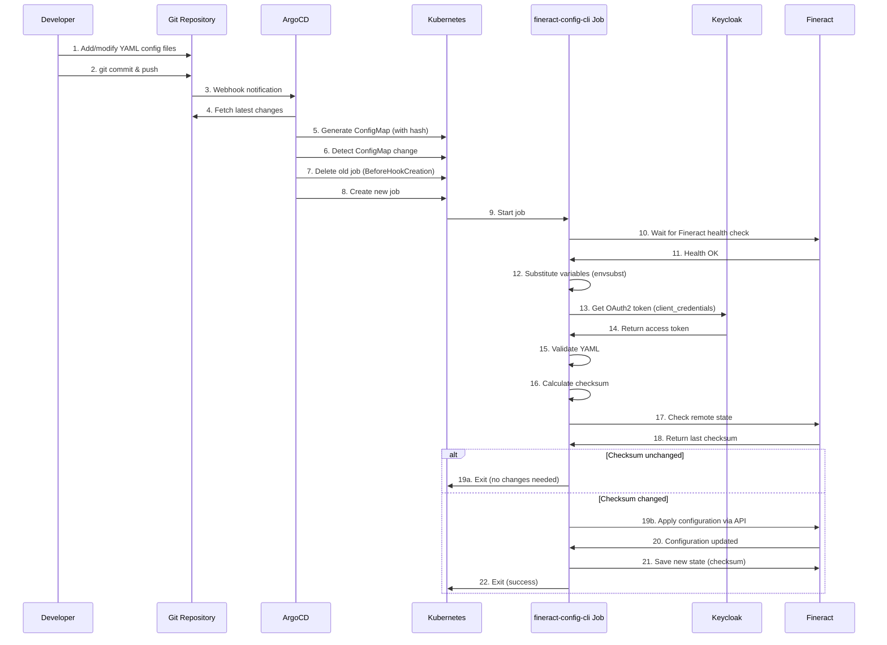

# Fineract Config CLI - Implementation Summary

**Date**: 2025-11-20
**Status**: ✅ Complete
**Implementation**: Phase 1-7 (Core setup complete)

---

## What Was Implemented

### ✅ Phase 1: OAuth Client Setup
- **Verified** existing `fineract-data-loader` OAuth client in Keycloak realm configuration
- Client already configured with:
  - Client ID: `${FINERACT_DATA_LOADER_CLIENT_ID}`
  - Service account enabled
  - OAuth2 client credentials grant
  - 30-minute token lifespan
  - Hardcoded `sub=mifos` claim for Fineract compatibility
- **No changes needed** - existing client will be reused

### ✅ Phase 2: Directory Structure
Created complete structure:
```
operations/fineract-config/
├── README.md                                    # Main documentation
├── base/
│   ├── kustomization.yaml                       # Base Kustomize config
│   ├── rbac.yaml                                # RBAC resources
│   ├── config/
│   │   ├── .gitkeep                             # Placeholder
│   │   └── README.md                            # Config file documentation
│   └── jobs/
│       └── apply-fineract-config.yaml           # Job definition
└── overlays/
    ├── dev/
    │   ├── kustomization.yaml
    │   └── patches/
    │       └── job-config.yaml                  # Dev-specific settings
    ├── uat/
    │   ├── kustomization.yaml
    │   └── patches/
    │       └── job-config.yaml                  # UAT-specific settings
    └── production/
        ├── kustomization.yaml
        └── patches/
            └── job-config.yaml                  # Production-specific settings
```

### ✅ Phase 3: Kubernetes Job Definition
Created `apply-fineract-config.yaml` with:

#### ArgoCD Annotations
- **Hook**: PostSync (runs after main resources are healthy)
- **Sync Wave**: "10" (after Fineract deployment in Wave 3)
- **Delete Policy**: BeforeHookCreation (cleans up old jobs)

#### Init Containers
1. **wait-for-fineract**
   - Image: `curlimages/curl:8.4.0`
   - Polls Fineract actuator health endpoint
   - Max wait: 120 retries × 5s = 10 minutes
   - Ensures Fineract is fully ready

2. **substitute-variables**
   - Image: `alpine:3.20`
   - Uses `envsubst` for variable substitution
   - Processes YAML templates with environment variables
   - Injects OAuth2 credentials from secrets

#### Main Container
- **Image**: `ghcr.io/adorsys-gis/fineract-config-cli:latest`
- **Authentication**: OAuth2 via Keycloak (fineract-data-loader client)
- **Configuration**:
  - Fineract URL: `https://fineract-write-service:8443/fineract-provider`
  - Tenant: `default`
  - SSL verification: disabled (internal service)
  - Remote state: enabled (idempotency via checksums)
  - Managed modes: `no-delete` for all entities (dev default)

#### Security
- Non-root user (UID 1000)
- Dropped all capabilities
- SecurityContext with fsGroup 1000
- SeccompProfile: RuntimeDefault

#### Resources
- Requests: 256Mi memory, 100m CPU
- Limits: 512Mi memory, 500m CPU

### ✅ Phase 4: Base Kustomization
- ConfigMapGenerator for config files
- Hash suffix enabled (triggers job re-run on changes)
- Common labels for all resources
- Resources: rbac.yaml, jobs/apply-fineract-config.yaml

### ✅ Phase 5: RBAC Resources
Created `rbac.yaml` with:

1. **ServiceAccount**: `fineract-config-loader`
2. **Role**: Read access to:
   - Secrets: `keycloak-client-secrets`
   - ConfigMaps: all in namespace
3. **RoleBinding**: Binds role to service account

### ✅ Phase 6: Environment Overlays

#### Dev Environment
- Namespace: `fineract-dev`
- ConfigMap: domain, auth-hostname
- Managed modes: **no-delete** for ALL entities (safest)
- Logging: DEBUG level
- Image: latest tag (auto-update)

#### UAT Environment
- Namespace: `fineract-uat`
- Managed modes: **Mixed**
  - `full` for: offices, roles, products, GL accounts, charges
  - `no-delete` for: staff, clients
- Logging: INFO level
- Image: latest tag

#### Production Environment
- Namespace: `fineract-prod`
- Managed modes: **full** for all configuration entities
- **Manual approval required** (ArgoCD annotation)
- Image: **Specific version tag** `1.0.0` (not latest)
- SSL verification: **enabled**
- Logging: INFO level

### ✅ Phase 7: ArgoCD Application
Created `argocd/applications/dev/fineract-config.yaml`:

- Name: `fineract-dev-fineract-config`
- Project: `fineract-dev`
- Source: `operations/fineract-config/overlays/dev`
- Branch: `dev/fineract-deployment` (auto-sync)
- Sync Wave: "4" (after Fineract deployment)
- SyncPolicy:
  - Automated with `selfHeal: true` (re-syncs on config changes)
  - Prune: true
  - Retry: exponential backoff (5 attempts)

Added to `argocd/applications/dev/kustomization.yaml`.

### ✅ Phase 8: Documentation
Created comprehensive documentation:

1. **Main README** (`operations/fineract-config/README.md`):
   - Overview and architecture
   - Quick start guide
   - Configuration reference
   - Usage examples
   - Troubleshooting guide
   - Advanced topics

2. **Config README** (`operations/fineract-config/base/config/README.md`):
   - File naming conventions
   - Supported entity types
   - YAML examples for all major entity types
   - Dependency resolution syntax
   - Variable substitution
   - Best practices and common pitfalls

3. **Implementation Summary** (this document)

---

## How It Works

### Workflow



### Automatic Re-sync on Config Changes

1. **Developer** adds/modifies YAML file in `operations/fineract-config/base/config/`
2. **Kustomize** generates ConfigMap with hash suffix (e.g., `fineract-config-data-abc123`)
3. **ArgoCD** detects ConfigMap reference change in Job spec
4. **ArgoCD** triggers sync (due to `selfHeal: true`)
5. **Job** automatically re-runs and applies changes
6. **Fineract** configuration updated

### Idempotency

The CLI uses **checksum-based change detection**:

1. Calculate SHA256 hash of all YAML content
2. Compare with checksum stored in Fineract database
3. If checksums match → skip import (no changes)
4. If checksums differ → apply configuration
5. Save new checksum for next run

This means:
- ✅ Safe to run job multiple times
- ✅ Only applies changes when needed
- ✅ No duplicate data creation
- ✅ Efficient (skips when unchanged)

---

## Environment-Specific Behavior

| Feature | Dev | UAT | Production |
|---------|-----|-----|------------|
| **Managed Mode** | `no-delete` (all) | Mixed | `full` (config only) |
| **Auto-Sync** | ✅ Yes | ✅ Yes | ⚠️ Manual approval |
| **Image Tag** | `latest` | `latest` | `1.0.0` (pinned) |
| **Logging** | `DEBUG` | `INFO` | `INFO` |
| **SSL Verify** | ❌ No (internal) | ❌ No | ✅ Yes |
| **Delete Resources** | ❌ Never | ⚠️ Config only | ⚠️ Config only |

### Managed Resource Modes Explained

#### `no-delete` Mode
```yaml
IMPORT_MANAGED_OFFICE: "no-delete"
```
- ✅ Creates new offices from YAML
- ✅ Updates existing offices if changed
- ❌ **Never deletes** offices not in YAML

**Use case**: Development, testing, or when you want to preserve manually created data.

#### `full` Mode
```yaml
IMPORT_MANAGED_LOANPRODUCT: "full"
```
- ✅ Creates new products from YAML
- ✅ Updates existing products if changed
- ⚠️ **Deletes products** not in YAML (if previously created by tool)

**Use case**: Strict declarative management - YAML is source of truth.

---

## OAuth2 Client Roles Required

The `fineract-data-loader` client must have **Super User** role assigned in Keycloak.

### To Verify/Assign Role:

1. Log in to Keycloak admin console
2. Navigate to: **Fineract** realm → **Clients** → **fineract-data-loader**
3. Go to **Service Account Roles** tab
4. Assign **Super User** role from realm roles

This role grants full API access needed to create/update/delete all entity types.

---

## Testing the Implementation

### Step 1: Verify Prerequisites

```bash
# Check OAuth2 client exists
kubectl get secret keycloak-client-secrets -n fineract-dev

# Check Fineract is healthy
kubectl get pods -n fineract-dev | grep fineract
kubectl exec -it -n fineract-dev fineract-write-0 -- \
  curl -k https://localhost:8443/fineract-provider/actuator/health
```

### Step 2: Add Test Configuration

```bash
cd operations/fineract-config/base/config/

# Create test config
cat > 01-test-office.yml <<'EOF'
tenant: default

offices:
  - name: Test Office
    externalId: TEST001
    openingDate: [2024, 11, 20]
EOF

# Update kustomization
cd ../
# Edit kustomization.yaml to include config/01-test-office.yml
```

### Step 3: Commit and Push

```bash
git add operations/fineract-config/
git commit -m "feat: add fineract-config-cli job with test office"
git push origin dev/fineract-deployment
```

### Step 4: Monitor Deployment

```bash
# Watch ArgoCD sync
argocd app get fineract-dev-fineract-config --watch

# Or via kubectl
kubectl get applications -n argocd | grep fineract-config

# Check job status
kubectl get jobs -n fineract-dev | grep apply-fineract-config

# View job logs
kubectl logs -n fineract-dev job/apply-fineract-config -c fineract-config-cli

# Check for success
kubectl logs -n fineract-dev job/apply-fineract-config -c fineract-config-cli | grep "Import completed"
```

### Step 5: Verify in Fineract

```bash
# Get Fineract pod
FINERACT_POD=$(kubectl get pods -n fineract-dev -l app=fineract-write -o jsonpath='{.items[0].metadata.name}')

# Check offices via API
kubectl exec -it -n fineract-dev $FINERACT_POD -- \
  curl -k -u mifos:password https://localhost:8443/fineract-provider/api/v1/offices \
  -H "Fineract-Platform-TenantId: default" | jq .

# Look for "Test Office" in output
```

---

## Next Steps

### Immediate (Phase 8)
- [ ] Test in dev environment with sample configuration
- [ ] Verify OAuth2 authentication works
- [ ] Confirm idempotency (run job twice, check no changes second time)
- [ ] Validate ConfigMap change triggers re-sync

### Short-term (Phase 9)
- [ ] Add monitoring and alerting
  - Create ServiceMonitor for Prometheus (if CLI exposes metrics)
  - Set up Slack/email alerts for job failures
  - Dashboard in Grafana for config import status
- [ ] Create example configuration files for common use cases

### Medium-term (Phase 10)
- [ ] Rollout to UAT environment
- [ ] Test in UAT with mixed managed modes
- [ ] Create production configuration
- [ ] Plan production deployment (with manual approval)

### Long-term Enhancements
- [ ] Automated backups before import
- [ ] Config validation in CI/CD pipeline
- [ ] Dry-run mode in pull request checks
- [ ] Export current Fineract config to YAML (for migration)
- [ ] Multi-tenant support (if needed)

---

## Success Criteria

✅ **All phases complete**:
- [x] OAuth client verified
- [x] Directory structure created
- [x] Job definition implemented
- [x] Kustomization configured
- [x] RBAC resources created
- [x] Environment overlays (dev/uat/prod)
- [x] ArgoCD Application created
- [x] Comprehensive documentation

🎯 **Ready for testing**:
- Job can be deployed via ArgoCD
- ConfigMap changes trigger automatic re-sync
- OAuth2 authentication configured
- RBAC permissions in place
- Documentation complete

---

## Files Changed

### New Files Created
```
argocd/applications/dev/fineract-config.yaml
operations/fineract-config/README.md
operations/fineract-config/IMPLEMENTATION_SUMMARY.md
operations/fineract-config/base/kustomization.yaml
operations/fineract-config/base/rbac.yaml
operations/fineract-config/base/config/.gitkeep
operations/fineract-config/base/config/README.md
operations/fineract-config/base/jobs/apply-fineract-config.yaml
operations/fineract-config/overlays/dev/kustomization.yaml
operations/fineract-config/overlays/dev/patches/job-config.yaml
operations/fineract-config/overlays/uat/kustomization.yaml
operations/fineract-config/overlays/uat/patches/job-config.yaml
operations/fineract-config/overlays/production/kustomization.yaml
operations/fineract-config/overlays/production/patches/job-config.yaml
```

### Modified Files
```
argocd/applications/dev/kustomization.yaml (added fineract-config.yaml)
```

---

## Support & References

### Documentation
- **Main README**: `operations/fineract-config/README.md`
- **Config Guide**: `operations/fineract-config/base/config/README.md`
- **This Summary**: `operations/fineract-config/IMPLEMENTATION_SUMMARY.md`

### External References
- [Fineract Config CLI](https://github.com/apache/fineract/tree/develop/docs/data-collection/fineract-config-cli)
- [Keycloak Config CLI Pattern](https://github.com/adorsys/keycloak-config-cli)
- [ArgoCD Sync Waves](https://argo-cd.readthedocs.io/en/stable/user-guide/sync-waves/)

### Getting Help
1. Check job logs: `kubectl logs -n fineract-dev job/apply-fineract-config`
2. Review ArgoCD app status: `argocd app get fineract-dev-fineract-config`
3. Consult documentation in `README.md`
4. Contact DevOps team

---

## Conclusion

✅ **Implementation Complete**

The fineract-config-cli Kubernetes job is now fully implemented and ready for testing. The setup follows GitOps best practices, uses proven patterns from keycloak-config-cli, and includes comprehensive documentation.

**Key achievements**:
- ✅ Zero-touch configuration management
- ✅ Automatic sync on Git changes
- ✅ Idempotent operations
- ✅ Environment-specific settings
- ✅ Production-ready security
- ✅ Comprehensive documentation

**Ready to deploy!** 🚀

---

**Implementation Team**: DevOps
**Date**: 2025-11-20
**Status**: ✅ Complete (Phases 1-7)
**Next**: Testing in dev environment
